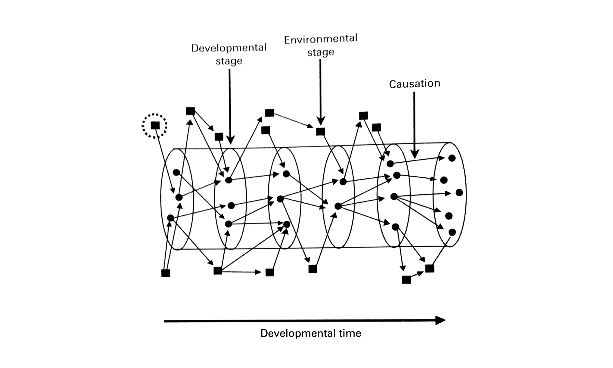

# Causality

Causality is an integrated toolchain for distributed program development that enables cross-chain operations with causal consistency, resource safety, and verifiable execution. The system compiles high-level algebraic effects into optimized RISC-V instructions for zk-provable execution.



## Core Features

- **Algebraic Effects System**: Compositional approach to distributed computation
- **Causal Time Model**: Unified representation of time across multiple chains
- **Verifiable Execution**: Zero-knowledge proof generation for private computation
- **Content-Addressed Code**: Immutable, verifiable program representation
- **Resource-Safe Concurrency**: Deterministic resource handling with explicit locking
- **Temporal Effect Language (TEL)**: DSL for expressing time-bound effects and causal dependencies
- **Program Account UI Models**: Serializable views for frontend integration
- **Capability-Based Resource API**: Secure, unforgeable access control with delegation and composition
- **Effect Adapter System**: Bridging abstract effects to domain-specific implementations with automatic code generation
- **Cross-Domain Relationships**: Type-safe relationships between resources across different domains with efficient querying and automated synchronization

## Status

Under heavy development. The core logic is coming together but I'm still refactoring substantially. Once I'm happy with the core data structures and their relationship I plan to implement an extensive test suite. Only when that's finished will I split out node types and implement the P2P system.

## System Architecture

### Time

The time system ensures causal consistency across disparate execution environments. It provides an abstract representation of time that works across multiple chains through Lamport clocks that track causal relationships between distributed events. Time synchronization enables cross-chain mapping and temporal ordering, while flexible time windows support operations with temporal constraints. The system can identify and compensate for clock drift between domains to maintain consistency.

### Effects

The effect system takes an algebraic approach to distributed computation. Effects are compositional, allowing complex operations to be built from simple, reusable components. Context-specific effect handlers interpret abstract operations based on their execution environment. Causality's effect model provides consistent, structured outcomes that preserve execution context, enabling interoperability across the system.

### Effect Adapters and Code Generation

The effect adapter system connects abstract effects to concrete implementations. Domain adapters provide connectivity to external blockchains, APIs, and systems, while schema-driven code generation automatically produces adapter code from high-level schema definitions. The system ensures consistent interfaces across different domains through protocol standardization, verifies adapter implementations against schemas at runtime, and deploys adapters using immutable, content-addressed deployment with hash-based addressing.

### Resources

The resource model provides deterministic concurrency control through explicit resource-scoped locks for acquisition and release of named resources. The unified resource system features a consistent lifecycle manager with well-defined state transitions, a capability-based authorization system, and integrated time map verification for temporal consistency.

The new unified `ResourceRegister` model consolidates the previous `Resource` and `Register` classes into a single abstraction with integrated lifecycle management, relationship tracking, and proof generation support.

### Cross-Domain Relationships

The cross-domain relationship system enables type-safe relationships between resources residing in different domains. It supports various relationship types such as Mirror (identical resources across domains), Reference (resource references), Ownership (hierarchical ownership), Derived (derived data), Bridge (domain-spanning connections), and Custom relationships. The system includes an efficient query engine with path-finding capabilities, relationship caching, and a domain-aware indexing system.

### Temporal Effect Language

TEL is a domain-specific language for time-aware, causal computation. It enables time-bound operations with explicit temporal constraints and declarative specification of causal relationships between effects. The language incorporates temporal logic for reasoning about past, present, and future states, supports effect composition with temporal sequencing guarantees, and includes a temporal type system for static verification of temporal properties.

### Verifiable Execution

The system enables verifiable computation by translating high-level effects to RISC-V instructions and providing a zero-knowledge VM optimized for ZK proof generation. The unified verification framework integrates different verification mechanisms (ZK execution, time map verification, controller label verification, and effect validation) into a unified verification pipeline.

### Content-Addressed Code

Content-addressed code ensures immutable, verifiable program representation through cryptographic hashing of code for unique identification. The system supports deterministic builds for reproducible artifacts, cryptographic verification of code integrity, dependency resolution through hash-based linking, and tamper-proof deployment of program logic. A standardized `ContentId` type is used throughout the codebase, with helper scripts available to maintain consistent usage patterns.

### Fact System

The fact system provides a standardized representation of blockchain state using unified fact types that present common interfaces for different blockchain data. Domain-specific methods enable fact observation from various sources, while cryptographic verification ensures fact integrity. The system explicitly tracks data dependencies to maintain causal consistency.

## Development

### Building with Nix

Causality is built using Nix and managed with a flake:

```bash
# Enter development shell
nix develop

# Build the project
cargo build --release

# Run examples
cargo run --example program_account_serialization
cargo run --example program_account_api
cargo run --example cross_domain_relationships
```

### Testing

```bash
# Run all tests
cargo test

# Run specific test groups
./scripts/test_cross_domain.sh
```

### Utility Scripts

The project includes utility scripts to maintain code quality and standards:

```bash
# Fix double semicolons in ContentId imports
./scripts/fix_double_semicolons.sh

# Fix ContentId imports to use canonical source
./scripts/fix_contentid_imports.sh

# Check for any remaining legacy Resource/Register usage patterns
./scripts/check_legacy_resource_usage.sh
```

### ResourceRegister REPL

The project includes a REPL for interactively working with the new unified `ResourceRegister` system:

```bash
# Build and run the REPL
cargo run --bin repl

# Commands available in the REPL
help                                # Show available commands
create <name> <type> [data]         # Create a new Resource
register <id> <logic_type> [qty]    # Create a new ResourceRegister
list                                # List all registers
get <id>                            # Get a register by ID
update <id> <state>                 # Update a register's state
remove <id>                         # Remove a register
consume <id>                        # Consume a register
```

## Documentation

### Core Concepts & Guides
- [System Boundaries](docs/SYSTEM_BOUNDARIES.md)
- [Effect System](docs/EFFECT_SYSTEM.md)
- [Effect Adapters](docs/adr_002_effect_adapters.md)
- [Domain Adapters](docs/domain_adapters.md)
- [Migration Guides](docs/migrations/)

### Technical Specifications
- [Time Module](docs/time_module.md) 
- [Content Addressing](docs/adr_007_content_addressing.md)
- [ContentId Standard](docs/src/content_id_standard.md)
- [Fact Management](docs/adr_008_fact_management.md)
- [TEL Integration](docs/tel_integration.md)
- [ZK VM Integration](docs/zk_vm_integration.md)

### Implementation & Development
- [Building and Running](docs/BUILD.md)
- [Nix Environment](docs/nix-environment.md)
- [Resource Capability Guide](docs/resource_capability_guide.md)
- [ResourceRegister Unification](docs/src/resource_register_unification_summary.md)
- [ResourceRegister Migration Issues](docs/src/resource_register_migration_issues.md)
- [TEL API Reference](docs/tel_api_reference.md)
- [Glossary](docs/glossary.md)

