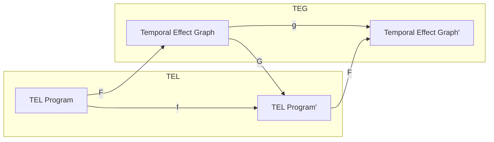
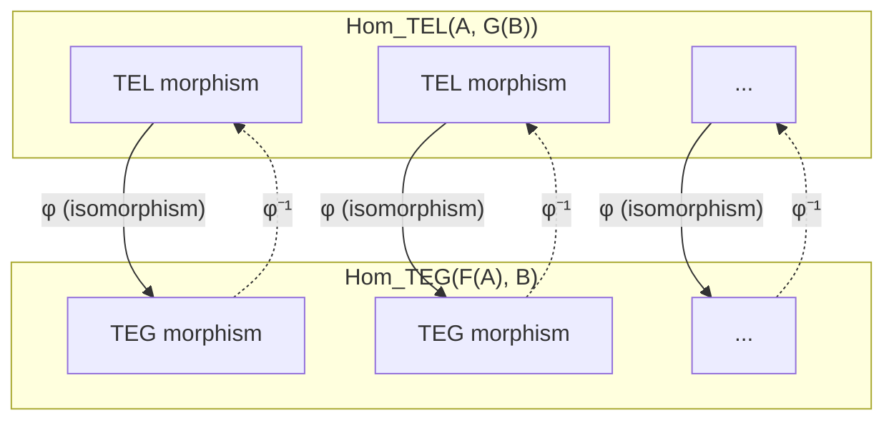
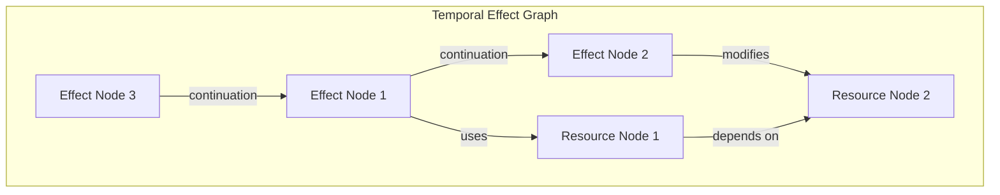
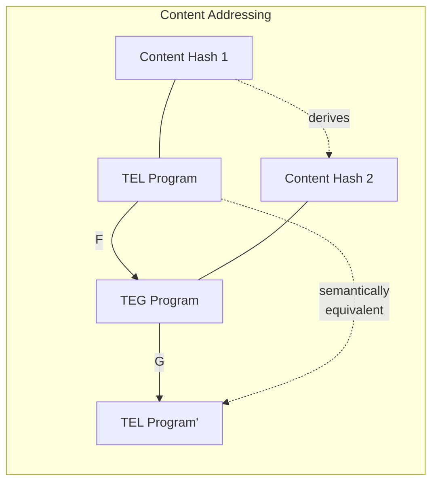
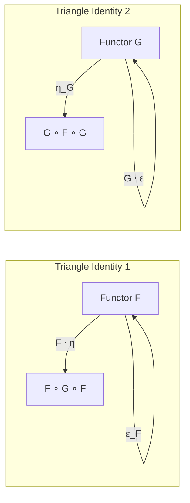

# TEL-TEG Adjunction

This document illustrates the categorical adjunction between the Temporal Effect Language (TEL) and the Temporal Effect Graph (TEG) intermediate representation.

## Functors F and G

The TEL-TEG adjunction involves two functors:
- `F: TEL → TEG` translates TEL programs to TEG
- `G: TEG → TEL` translates TEG back to TEL programs



## Natural Isomorphism

The key property of the adjunction is the natural isomorphism between the morphism sets:



## Adjunction Unit and Counit

The adjunction is characterized by its unit and counit natural transformations:

```mermaid
graph LR
    subgraph "Unit: η: 1_TEL ⟹ G ∘ F"
        A1[TEL Program]
        B1[G(F(TEL Program))]
        A1 -- "η_A" --> B1
    end
    
    subgraph "Counit: ε: F ∘ G ⟹ 1_TEG"
        A2[F(G(TEG Program))]
        B2[TEG Program]
        A2 -- "ε_B" --> B2
    end
```

## TEG Structure

The internal structure of a TEG includes effect nodes, resource nodes, and the edges connecting them:



## Content Addressing

The content addressing property ensures semantic equivalence:



## Triangle Identities

The triangle identities validate the adjunction:

