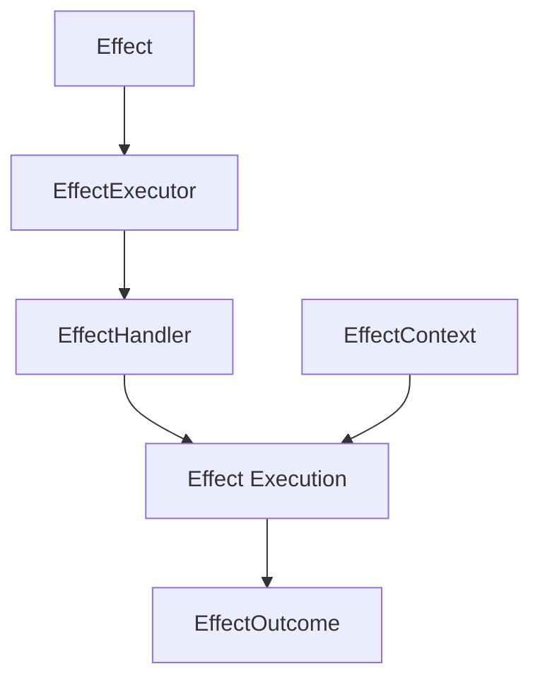

# Effect-Based Programming Demo

This project demonstrates a simple implementation of effect-based programming in Rust. Effect-based programming is a pattern for decoupling the description of operations from their execution, providing better testability, reusability, and separation of concerns.

## Core Concepts

### Effects

An effect represents an operation that may have side effects on the system. Effects are defined as traits with methods to:
- Get the effect type and description
- Execute the effect in a given context
- Access the effect through type casting

### Effect Types

The demo implements several effect types:
- Resource operations: Create, Read, Write, Delete
- Custom operations: Archive, Time management
- Each effect type represents a specific category of operations

### Effect Context

The context provides the environment in which effects are executed:
- Manages capabilities (permissions)
- Stores data and metadata
- Controls access to resources

### Effect Outcomes

The result of an effect execution:
- Success: The operation completed successfully
- Failure: The operation failed with an error
- Pending: The operation is still in progress

### Effect Handlers and Executors

- Handlers: Register which effect types they can process
- Executors: Match effects to handlers and manage the execution

## Architecture

The demo implements the following components:



## Example Usage

### Resource Effects

```rust
// Create a resource effect
let effect = ResourceEffect::new("document", "doc-123", EffectType::Create);

// Execute the effect
match executor.execute(effect.as_ref(), &context) {
    Ok(EffectOutcome::Success { result, data }) => {
        println!("Success: {}", result.unwrap_or_default());
        println!("Data: {:?}", data);
    },
    // Handle other outcomes...
}
```

### Time Effects

```rust
// Create a time effect
let effect = TimeEffect::new(TimeOperation::GetCurrentTime);

// Execute the effect
match executor.execute(effect.as_ref(), &context) {
    Ok(EffectOutcome::Success { result, data }) => {
        println!("Success: {}", result.unwrap_or_default());
        println!("Data: {:?}", data);
    },
    // Handle other outcomes...
}
```

## Benefits

1. **Separation of Concerns**: Effects describe what to do, handlers determine how to do it
2. **Testability**: Effects can be tested independently of their execution
3. **Extensibility**: New effect types can be added without modifying existing code
4. **Capability-based Security**: Operations require explicit capabilities
5. **Abstraction**: Implementation details are hidden behind the effect interface

## Use Cases

- Resource management
- Time-based operations
- Permission-controlled actions
- Transaction-like operations
- Testing with mocked effects

## Running the Demo

```bash
cargo run
```

The demo executes a series of resource and time effects, showing their outcomes. 