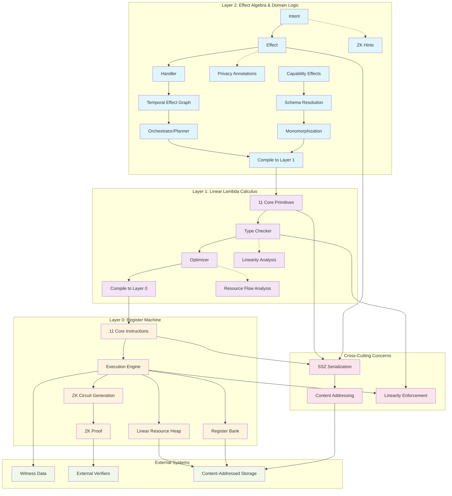

# 002: Causality's Three-Layer Architecture

Causality employs a sophisticated three-layer architecture, designed to separate concerns and provide a clear progression from low-level execution to high-level domain logic. This layered approach enhances modularity, verifiability, and the overall robustness of the system. Each layer builds upon the capabilities of the one below it, creating a powerful yet manageable framework for modeling complex causal interactions.

The Causality system is organized into three distinct layers, each with specific responsibilities, primitives, and categorical underpinnings, ensuring a clear separation of concerns from the lowest-level execution to high-level domain logic.

## Fundamental Architectural Principles

Before diving into the layer-specific details, it's crucial to understand the cross-cutting concerns that permeate all layers of the Causality architecture. These foundational systems ensure consistency, verifiability, and interoperability across the entire stack.

### Content Addressing System

**Content addressing is the foundational identity system for all data in Causality.** Every piece of data—from Layer 0 values to Layer 2 effects—is identified by the cryptographic hash of its canonical SSZ-serialized representation. This creates a unified addressing scheme with powerful properties:

- **Immutability**: Content-addressed data cannot be modified without changing its identity
- **Deduplication**: Identical logical structures share the same identifier regardless of context
- **Integrity**: Any tampering with data is immediately detectable
- **Verifiability**: All references can be cryptographically verified
- **ZK Compatibility**: Deterministic identifiers enable efficient circuit generation

#### Content-Addressed Value System

The value system throughout Causality is built around content addressing. Rather than simple primitive values, the system operates with:

```
LispValue = 
  | CoreValue(Unit | Bool | Int | Symbol)    -- Traditional primitive values
  | ResourceRef(EntityId)                    -- Content-addressed resource reference
  | ExprRef(EntityId)                        -- Content-addressed expression reference  
  | EffectRef(EntityId)                      -- Content-addressed effect reference
  | ValueRef(EntityId)                       -- Content-addressed value reference
```

This design enables:
- **Global Identity**: Any value can be referenced globally by its content hash
- **Structural Sharing**: Complex data structures can efficiently share subcomponents
- **Lazy Evaluation**: Large or expensive computations can be represented by their hash until needed
- **Distributed Systems**: Content addressing enables seamless data exchange across network boundaries

#### Entity Identification Types

The content addressing system defines several specialized identifier types:

- **`EntityId`**: Universal content-based identifier (32-byte SHA-256 hash)
- **`ResourceId(EntityId)`**: References to heap-allocated linear resources
- **`ExprId(EntityId)`**: References to Layer 1 expressions and AST nodes
- **`EffectId(EntityId)`**: References to Layer 2 effects and handlers  
- **`ValueExprId(EntityId)`**: References to evaluated value expressions
- **`DomainId(EntityId)`**: References to capability domains and contexts

#### Content Store Architecture

Content addressing requires a global content store that maps identifiers to their corresponding data:

```
ContentStore : EntityId -> Option<SSZ_Bytes>
```

This store provides:
- **Content Retrieval**: Fetch data by its content hash
- **Content Verification**: Ensure retrieved data matches its claimed hash
- **Storage Optimization**: Automatic deduplication and compression
- **Distributed Access**: Enable content sharing across network nodes

### SSZ Serialization Integration

Content addressing relies on SSZ (Simple Serialize) as the canonical serialization format. SSZ provides:
- **Deterministic Encoding**: Identical logical structures always produce identical byte sequences
- **Merkleization**: Natural tree structure for efficient content addressing
- **Cross-Language Compatibility**: Consistent serialization across Rust and OCaml implementations
- **ZK Circuit Compatibility**: Fixed-size field representations suitable for proof generation

## System Architecture Overview

The following diagram illustrates the complete system architecture and interactions between layers:



## Layer 0: The Register Machine - Foundation of Execution

Layer 0 is the bedrock of Causality, defining a minimal, deterministic register machine. This layer is concerned with the most fundamental aspects of computation and state transition, operating entirely within the content-addressed value system.

- **Mathematical Basis**: Symmetric Monoidal Closed Category with coproducts.
- **Role**: Minimal, verifiable execution substrate that operates on content-addressed values. This layer provides the absolute foundation for computation.
- **Components**:
    - **Base Types**: `Unit`, `Bool`, `Int`, `Symbol` (embedded within content-addressed values).
    - **Machine-level Types**: `RegisterId` (for addressing registers), `EntityId` (for content-addressed references), `Label` (for control flow), `Effect` (opaque representation of an effect to be performed).
    - **Content-Addressed Values**: All machine values are either core primitive values or content-addressed references (`ResourceRef`, `ExprRef`, `EffectRef`, `ValueRef`) that point to heap-allocated data.
    - **Register File**: Fixed set of registers that can hold either primitive values or content-addressed references.
    - **Linear Resource Heap**: Content-addressed storage for linear resources with consumption tracking.
    - **State Management**: Machine state comprises registers, content-addressed heap, program counter, call stack, and nullifier set for tracking consumed resources.

### Self-Describing Machine Values

Layer 0 operates on a unified value system where all data is either primitive or content-addressed:

```
MachineValue = 
  | Primitive(CoreValue)                     -- Direct primitive values (Unit, Bool, Int, Symbol)
  | ResourceRef(EntityId)                    -- Reference to heap-allocated linear resource
  | ExprRef(EntityId)                        -- Reference to compiled expression
  | EffectRef(EntityId)                      -- Reference to effect data
  | ValueRef(EntityId)                       -- Reference to computed value
```

This enables:
- **Uniform Reference Model**: All complex data accessed through content-addressed pointers
- **Linear Resource Management**: Resources tracked by reference with consumption state
- **Zero-Copy Operations**: Large data structures manipulated by reference, not copying
- **Verifiable State**: All machine state can be merkleized and verified

### Resource Heap and Linearity

The resource heap stores content-addressed linear resources:

```
ResourceHeap : EntityId -> Option<(ResourceValue, ConsumedFlag)>
NullifierSet : Set<EntityId>  -- Tracks consumed resources to prevent double-spending
```

Key properties:
- **Content Addressing**: Resources stored by hash of their content
- **Linear Tracking**: Each resource can be consumed exactly once
- **Deduplication**: Identical resources automatically share storage
- **Immutability**: Resources cannot be modified, only consumed and replaced

### The 11 Core Instructions

The power of Layer 0 lies in its radical simplicity. Rather than providing hundreds of instructions like traditional processors, Causality's register machine operates with just eleven carefully chosen instructions. This minimalism isn't a limitation—it's a feature that enables complete formal verification while remaining expressive enough to compile any higher-level computation.

Each instruction serves a specific purpose in the linear resource model, ensuring that resources can be safely managed at the lowest level. The instruction set is designed around three core principles: preserving linearity (resources used exactly once), maintaining determinism (same inputs always produce same outputs), and enabling verification (each operation can be formally proven correct).

Two additional instructions (`LabelMarker` and `Return`) were added beyond the original minimal set of 9 to support user-defined function calls in a zero-knowledge proof compatible manner, enabling functions to reference code locations via labels rather than embedding instructions directly.

| Instruction | Purpose | Description |
|-------------|---------|-------------|
| `move r_src r_dest` | Register transfer | Copies value from `r_src` to `r_dest` |
| `apply r_fn r_arg r_out` | Function application | Applies function in `r_fn` to argument in `r_arg`, result in `r_out` |
| `match r_sum r_l r_r l_label r_label` | Sum type elimination | Inspects sum type; branches based on `inl`/`inr` variant |
| `alloc r_val r_out` | Resource allocation | Allocates `r_val` on heap, `r_out` receives `ResourceId` |
| `consume r_res r_out` | Resource consumption | Marks resource as consumed, extracts value (key to linearity) |
| `check r_bool` | Assertion | Halts with error if value is not true |
| `perform effect_data r_out` | Effect execution | Triggers external effect, result in `r_out` |
| `select r_cond r_true r_false r_out` | Conditional selection | Selects value based on boolean condition |
| `witness r_out` | External data input | Reads external witness value (for untrusted data) |
| `labelmarker label` | Control flow label | Marks a location in the program for function calls and jumps |
| `return result_reg` | Function return | Returns from function call, optionally with result value |

These instructions form a complete computational basis—any program that can be expressed in higher layers ultimately reduces to sequences of these eleven operations. The `alloc` and `consume` instructions are particularly crucial as they implement the core linearity guarantees that make Causality's resource model possible. The `labelmarker` and `return` instructions enable efficient user-defined function calls that are compatible with zero-knowledge proof generation, where functions reference code locations rather than embedding instruction sequences. Together, they ensure that every resource has a clear lifecycle: allocation, potential transformation, and eventual consumption.

- **Minimal Instruction Set:** The register machine operates with a small, carefully chosen set of instructions. This minimalism is key to its verifiability and makes it a suitable target for formal analysis.
- **Deterministic Execution:** Every operation at Layer 0 is strictly deterministic, ensuring that given the same initial state and inputs, the outcome is always identical. This predictability is crucial for a system designed around verifiable causality.
- **State Primitives:** Layer 0 defines the most basic units of state and the rules for their transformation. It provides the raw computational power upon which higher layers build more abstract concepts.
- **Target for Compilation:** Higher-level languages and constructs within Causality are ultimately compiled down to Layer 0 instructions for execution. This makes the register machine the ultimate arbiter of what can and cannot happen within the system.

Think of Layer 0 as the CPU of Causality, providing the raw, unopinionated processing power. Its simplicity is its strength, offering a solid, auditable foundation.

## Layer 1: The Linear Lambda Calculus - Expressing Resource Flow

Building upon Layer 0, Layer 1 introduces a Linear Lambda Calculus that operates entirely within the content-addressed value system. This layer leverages the principles of linear logic to provide a powerful and safe way to express computations that involve resources, while maintaining the content-addressed identity system throughout.

Layer 1 represents the mathematical heart of Causality—where the abstract principles of linear logic meet practical programming within a content-addressed architecture. While Layer 0 provides the mechanical execution model, Layer 1 gives us the conceptual tools to reason about resource flow and transformation in a type-safe manner while preserving content addressability.

The choice of Linear Lambda Calculus isn't arbitrary. Linear logic naturally captures the idea that resources should be used exactly once, making it impossible to accidentally duplicate valuable assets or leave them unused. Combined with content addressing, this mathematical foundation provides strong guarantees about resource identity and usage that we can rely on when building more complex systems.

- **Mathematical Basis**: Term model of linear type theory operating over content-addressed values; initial object in the category of models of linear type theory with content addressing.
- **Role**: Provides a pure functional programming model with content-addressed expressions. This layer focuses on linear lambda calculus foundations with rich AST structure supporting row types and record operations.
- **Components**:
    - **Core Types**: Unit, Bool, Int, Symbol (base types from Layer 0)
    - **Type Constructors**: Tensor products (A ⊗ B), Sum types (A ⊕ B), Linear functions (A ⊸ B), Row types for records
    - **Content-Addressed Expressions**: All AST nodes are content-addressed via `ExprId(EntityId)`
    - **Extended AST**: Beyond the 11 core primitives, includes row type operations, field access, and convenience forms
    - **Linearity System**: Complete linear type theory with resource tracking
    - **Resource Primitives**: Allocation and consumption operations that bridge to Layer 0
    - **Structural Sharing**: Content addressing enables automatic sharing of identical subexpressions

### Extended AST Structure

While the theoretical foundation rests on 11 core primitives, the actual implementation includes additional constructs to support practical programming patterns:

#### Core Linear Lambda Calculus (11 Primitives)
| Category | Primitive | Purpose | Content-Addressed |
|----------|-----------|---------|-------------------|
| **Unit Type** | `unit` | Unit introduction | ✓ |
| | `letunit` | Unit elimination | ✓ |
| **Tensor Product (⊗)** | `tensor` | Creates pairs/tuples | ✓ |
| | `lettensor` | Destructures pairs | ✓ |
| **Sum Type (⊕)** | `inl` | Left injection | ✓ |
| | `inr` | Right injection | ✓ |
| | `case` | Pattern matching | ✓ |
| **Linear Functions (⊸)** | `lambda` | Function definition | ✓ |
| | `apply` | Function application | ✓ |
| **Resource Management** | `alloc` | Resource allocation | ✓ |
| | `consume` | Resource consumption | ✓ |

#### Row Types and Record Operations
Layer 1 includes sophisticated support for row types and record manipulation:

| Operation | Purpose | Content-Addressed |
|-----------|---------|-------------------|
| `ReadField` | Safe field access from records | ✓ |
| `UpdateField` | Functional field updates | ✓ |
| `Project` | Row type projection | ✓ |
| `Restrict` | Row type restriction | ✓ |
| `Extend` | Row type extension | ✓ |
| `Diff` | Row type difference | ✓ |

#### Convenience Forms
Additional constructs that compile to core primitives:

| Form | Purpose | Content-Addressed |
|------|---------|-------------------|
| `Symbol` | Symbol literals | ✓ |
| `Int` | Integer literals | ✓ |
| `Bool` | Boolean literals | ✓ |
| `Quote` | Quoted expressions | ✓ |
| `List` | List construction | ✓ |
| `Let` | Local bindings | ✓ |
| `If` | Conditional expressions | ✓ |

### Content-Addressed Expression System

All Layer 1 expressions are content-addressed, enabling powerful optimization and verification:

```
Expression = ExprId(EntityId)  -- All expressions identified by content hash

ExprValue = 
  | CorePrimitive(Unit | LetUnit | Tensor | LetTensor | ...)
  | RowOperation(ReadField | UpdateField | Project | ...)
  | ConvenienceForm(Symbol | Int | Bool | Quote | ...)
  | CompoundExpr(op, subexpr_ids: List<ExprId>)
```

Benefits:
- **Automatic Memoization**: Identical expressions computed once, shared globally
- **Structural Sharing**: Complex expressions can share subcomponents efficiently
- **Deterministic Compilation**: Same logical expression always produces same compiled output
- **Global Optimization**: Cross-function optimization through shared expression recognition

### Resource Management in Content-Addressed Context

Resource operations work seamlessly with content addressing:

- **`alloc expr`**: Allocates the value computed by `expr`, returns `ResourceRef(EntityId)`
- **`consume resource_ref`**: Consumes resource referenced by `ResourceRef`, returns underlying value
- **Resource Tracking**: Linear resources tracked by their content-addressed identifier
- **Zero-Copy Resource Passing**: Large resources passed by reference, not value

## Layer 2: Effect Algebra & Domain Logic - Modeling Complex Interactions

Layer 2 is the most abstract and application-focused layer, operating entirely within the content-addressed ecosystem. It introduces an Effect Algebra and provides the tools for defining sophisticated domain-specific logic, including capability-based access control, complex data operations, and a rich Intent system for declarative programming.

Where Layers 0 and 1 focus on the "how" of computation—the mechanics of execution and the mathematics of resource flow—Layer 2 is concerned with the "what"—the actual business logic and real-world effects that applications need to perform. This layer provides the conceptual tools for modeling complex interactive systems while maintaining the guarantees established by the lower layers and preserving content addressability throughout.

The key insight of Layer 2 is the separation between describing what you want to happen (effects and intents) and deciding how it should happen (handlers and interpreters). This separation enables powerful composition patterns and makes it possible to verify high-level properties of your application without getting lost in implementation details.

- **Mathematical Basis**: Kleisli category for an effect monad operating over content-addressed values. Models effects, handlers, and proofs as categorical constructs (e.g., functors, natural transformations).
- **Role**: Manages domain-specific effects, resource transformations, causality, transaction orchestration, capability-based access control, and high-level program intent through a sophisticated Intent system.
- **Components**:
    - **Content-Addressed Effects**: All effects identified by `EffectId(EntityId)` for global reference and deduplication
    - **Intent System**: Rich declarative programming model with input/output bindings, constraints, and optimization
    - **Effects (`Effect`)**: Typed descriptions of operations, including parameters, pre-conditions, post-conditions, and optimization hints. Effects are pure data.
    - **Handlers (`Handler`)**: Pure functions that transform effects (effect-to-effect composition). They define the interpretation of effects.
    - **Capability System**: Fine-grained access control for resource fields and operations, including record schema management and field-level permissions based on row types.
    - **Object Model**: Linear objects with capability-based access patterns and linearity enforcement (Linear, Affine, Relevant, Unrestricted).
    - **Record Operations**: Row polymorphism and record manipulation that compiles to static Layer 1 structures through capability resolution.
    - **Temporal Effect Graph (TEG)**: A data structure representing a computation as a graph of effect nodes and resource-flow edges, capturing causal and temporal dependencies.

### Intent System - Declarative Programming Model

The Intent system is a major feature of Layer 2 that enables declarative specification of computational goals with automatic planning and optimization:

```rust
Intent {
    // Input/Output Bindings
    input_bindings: HashMap<BindingName, ResourceConstraint>,
    output_bindings: HashMap<BindingName, ResourceConstraint>,
    
    // Constraint System
    resource_constraints: Vec<ResourceConstraint>,
    conservation_constraints: Vec<ConservationConstraint>,
    temporal_constraints: Vec<TemporalConstraint>,
    
    // Effect Sequence
    effects: Vec<EffectId>,
    
    // Optimization Hints
    optimization_hints: Vec<OptimizationHint>,
}
```

#### Resource Constraints and References

The Intent system includes sophisticated constraint solving:

- **Resource References**: Content-addressed references to specific resources with linearity tracking
- **Conservation Constraints**: Ensure resource conservation laws (e.g., total value preservation)
- **Temporal Constraints**: Specify before/after relationships and causality requirements
- **Access Constraints**: Capability-based restrictions on resource field access

#### Intent Compilation Process

Intents undergo a sophisticated compilation process:

1. **Constraint Analysis**: Solve resource and temporal constraints to determine feasible execution plans
2. **Capability Resolution**: Resolve field access requirements into concrete row type operations
3. **Effect Ordering**: Establish causal ordering of effects based on resource dependencies
4. **Monomorphization**: Convert polymorphic operations to concrete field access patterns
5. **Layer 1 Generation**: Compile resolved intent to content-addressed Layer 1 expressions
6. **Optimization**: Apply optimizations based on content addressing and structural sharing

### Content-Addressed Effect System

All effects in Layer 2 are content-addressed, enabling sophisticated composition and optimization:

```
Effect = EffectId(EntityId)  -- All effects identified by content hash

EffectValue = 
  | BuiltinEffect(ResourceAccess | FieldUpdate | CapabilityCheck | ...)
  | CustomEffect(effect_type, parameters: List<Value>)
  | CompoundEffect(composition_op, subeffect_ids: List<EffectId>)
```

Benefits of content-addressed effects:
- **Effect Deduplication**: Identical effects automatically share implementation
- **Global Effect Registry**: Effects can be referenced across application boundaries
- **Deterministic Execution**: Same effect always produces same result
- **Caching and Memoization**: Effect results can be cached by effect ID

### Core Layer 2 Operations

Layer 2's operations fall into several categories, all operating within the content-addressed value system:

| Category | Operation | Purpose | Content-Addressed |
|----------|-----------|---------|-------------------|
| **Effect Monad** | `pure v` | Lifts value into effectful computation | ✓ |
| | `bind m f` | Sequences effectful computations | ✓ |
| **Effect Execution** | `perform effect_id` | Submits content-addressed effect for execution | ✓ |
| | `handle effect_id with handler_id` | Applies content-addressed handler to computation | ✓ |
| **Resource Algebra** | `produce`, `transform`, `combine`, `split` | Common resource transformations | ✓ |
| **Capability System** | `access_field`, `update_field`, `require_capability`, `grant_capability` | Safe field access with capability checking | ✓ |
| **Intent Operations** | `declare_intent`, `solve_constraints`, `execute_plan` | Declarative programming interface | ✓ |
| **Verification** | `check constraint`, `depend e₁ e₂`, `verify proof` | Causality and conservation checks | ✓ |
| **Orchestration** | `transact`, `atomic`, `commit` | Transaction management | ✓ |
| **Combinators** | `parallel`, `race`, `sequence` | Effect composition | ✓ |

### Capability-Based Access Control with Row Types

Layer 2 includes a sophisticated capability system built on row types that provides fine-grained access control over resource fields:

#### Capability Effects
| Capability Effect | Type | Purpose | Content-Addressed |
|------------------|------|---------|-------------------|
| `AccessField` | `ResourceRef × FieldName ⊸ Effect (Option B)` | Safe field access with capability checking | ✓ |
| `UpdateField` | `ResourceRef × FieldName × B × Capability ⊸ Effect ResourceRef` | Capability-controlled field updates | ✓ |
| `RequireCapability` | `CapabilityName ⊸ Effect Capability` | Demand capability for subsequent operations | ✓ |
| `GrantCapability` | `ResourceRef × CapabilityName ⊸ Effect Capability` | Extract capability from resource ownership | ✓ |

#### Row Type Integration

The capability system is deeply integrated with Layer 1's row type system:

- **Schema Resolution**: Capability requirements determine static record schemas
- **Monomorphization**: Polymorphic row operations become concrete field access patterns
- **Compile-Time Verification**: All field access patterns resolved before execution
- **ZK Circuit Compatibility**: Fixed record structures enable efficient circuit generation

### Temporal Effect Graphs (TEGs)

TEGs represent computations as directed graphs with content-addressed nodes:

```
TEGNode = EffectId(EntityId)          -- Content-addressed effect nodes
TEGEdge = (source: TEGNode, target: TEGNode, resource_flow: ResourceRef)

TEG = {
    nodes: Set<TEGNode>,
    edges: Set<TEGEdge>,
    temporal_constraints: Set<TemporalConstraint>
}
```

TEG properties:
- **Causal Ordering**: Edges represent causal dependencies between effects
- **Resource Flow**: Resources tracked as they flow between effects
- **Parallel Execution**: Independent subgraphs can execute concurrently
- **Verification**: TEG structure enables formal verification of temporal properties

By clearly delineating responsibilities across these three layers, Causality achieves a remarkable balance of expressive power, formal rigor, and practical usability.