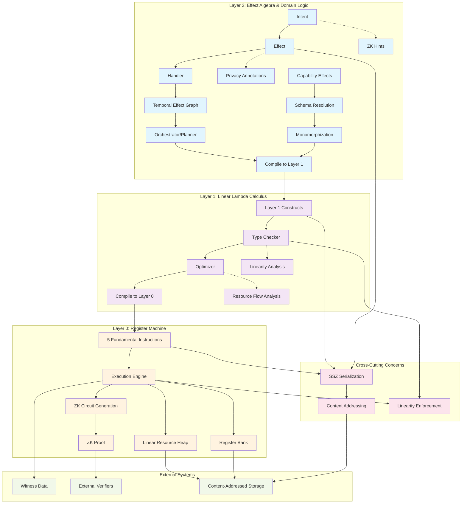

# 002: Causality's Three-Layer Architecture

Causality employs a three-layer architecture, designed to separate concerns and provide a clear progression from low-level execution to high-level domain logic. This layered approach enhances modularity, verifiability, and the overall robustness of the system. Each layer builds upon the capabilities of the one below it, creating an expressive framework for modeling complex causal interactions.

The Causality system is organized into three distinct layers, each with specific responsibilities, primitives, and categorical underpinnings, ensuring a clear separation of concerns from the lowest-level execution to high-level domain logic.

## Fundamental Architectural Principles

Before diving into the layer-specific details, it's important to understand the cross-cutting concerns throughout the Causality architecture. These foundational systems ensure consistency, verifiability, and interoperability across the entire stack.

### Content Addressing System

Content addressing is the foundational identity system for all data in Causality. Every piece of data—from Layer 0 values to Layer 2 effects—is identified by the cryptographic hash of its canonical SSZ-serialized representation. This creates a unified addressing scheme with useful properties:

- **Immutability**: Content-addressed data cannot be modified without changing its identity
- **Deduplication**: Identical logical structures share the same identifier regardless of context
- **Integrity**: Any tampering with data is immediately detectable
- **Verifiability**: All references can be cryptographically verified
- **ZK Compatibility**: Deterministic identifiers enable efficient circuit generation

#### Content-Addressed Value System

The value system throughout Causality is built around content addressing. Rather than simple primitive values, the system operates with:

```
LispValue = 
  | CoreValue(Unit | Bool | Int | Symbol)    -- Traditional primitive values
  | ResourceRef(EntityId)                    -- Content-addressed resource reference
  | ExprRef(EntityId)                        -- Content-addressed expression reference  
  | EffectRef(EntityId)                      -- Content-addressed effect reference
  | ValueRef(EntityId)                       -- Content-addressed value reference
```

This design enables:
- **Global Identity**: Any value can be referenced globally by its content hash
- **Structural Sharing**: Complex data structures can efficiently share subcomponents
- **Lazy Evaluation**: Large or expensive computations can be represented by their hash until needed
- **Distributed Systems**: Content addressing enables seamless data exchange across network boundaries

#### Entity Identification Types

The content addressing system defines several specialized identifier types:

- **`EntityId`**: Universal content-based identifier (32-byte SHA-256 hash)
- **`ResourceId(EntityId)`**: References to heap-allocated linear resources
- **`ExprId(EntityId)`**: References to Layer 1 expressions and AST nodes
- **`EffectId(EntityId)`**: References to Layer 2 effects and handlers  
- **`ValueExprId(EntityId)`**: References to evaluated value expressions
- **`DomainId(EntityId)`**: References to capability domains and contexts

#### Content Store Architecture

Content addressing requires a global content store that maps identifiers to their corresponding data:

```
ContentStore : EntityId -> Option<SSZ_Bytes>
```

This store provides:
- **Content Retrieval**: Fetch data by its content hash
- **Content Verification**: Ensure retrieved data matches its claimed hash
- **Storage Optimization**: Automatic deduplication and compression
- **Distributed Access**: Enable content sharing across network nodes

### SSZ Serialization Integration

Content addressing relies on SSZ (Simple Serialize) as the canonical serialization format. SSZ provides:
- **Deterministic Encoding**: Identical logical structures always produce identical byte sequences
- **Merkleization**: Natural tree structure for efficient content addressing
- **Cross-Language Compatibility**: Consistent serialization across Rust and OCaml implementations
- **ZK Circuit Compatibility**: Fixed-size field representations suitable for proof generation

## System Architecture Overview

The following diagram illustrates the complete system architecture and interactions between layers:



## Layer 0: The Register Machine - Foundation of Execution

Layer 0 is the bedrock of Causality, defining a minimal, deterministic register machine. This layer is concerned with the most fundamental aspects of computation and state transition, operating entirely within the content-addressed value system.

- **Mathematical Basis**: Symmetric Monoidal Closed Category with coproducts.
- **Role**: Minimal, verifiable execution substrate that operates on content-addressed values. This layer provides the absolute foundation for computation.
- **Components**:
    - **Base Types**: `Unit`, `Bool`, `Int`, `Symbol` (embedded within content-addressed values).
    - **Machine-level Types**: `RegisterId` (for addressing registers), `EntityId` (for content-addressed references), `Label` (for control flow), `Effect` (opaque representation of an effect to be performed).
    - **Content-Addressed Values**: All machine values are either core primitive values or content-addressed references (`ResourceRef`, `ExprRef`, `EffectRef`, `ValueRef`) that point to heap-allocated data.
    - **Register File**: Fixed set of registers that can hold either primitive values or content-addressed references.
    - **Linear Resource Heap**: Content-addressed storage for linear resources with consumption tracking.
    - **State Management**: Machine state comprises registers, content-addressed heap, program counter, call stack, and nullifier set for tracking consumed resources.

### Self-Describing Machine Values

Layer 0 operates on a unified value system where all data is either primitive or content-addressed:

```
MachineValue = 
  | Primitive(CoreValue)                     -- Direct primitive values (Unit, Bool, Int, Symbol)
  | ResourceRef(EntityId)                    -- Reference to heap-allocated linear resource
  | ExprRef(EntityId)                        -- Reference to compiled expression
  | EffectRef(EntityId)                      -- Reference to effect data
  | ValueRef(EntityId)                       -- Reference to computed value
```

This enables:
- **Uniform Reference Model**: All complex data accessed through content-addressed pointers
- **Linear Resource Management**: Resources tracked by reference with consumption state
- **Zero-Copy Operations**: Large data structures manipulated by reference, not copying
- **Verifiable State**: All machine state can be merkleized and verified

### Resource Heap and Linearity

The resource heap stores content-addressed linear resources:

```
ResourceHeap : EntityId -> Option<(ResourceValue, ConsumedFlag)>
NullifierSet : Set<EntityId>  -- Tracks consumed resources to prevent double-spending
```

Key properties:
- **Content Addressing**: Resources stored by hash of their content
- **Linear Tracking**: Each resource can be consumed exactly once
- **Deduplication**: Identical resources automatically share storage
- **Immutability**: Resources cannot be modified, only consumed and replaced

### The 5 Fundamental Instructions

The strength of Layer 0 lies in its simplicity. Rather than providing hundreds of instructions like traditional processors, Causality's register machine operates with just 5 carefully chosen instructions based on symmetric monoidal closed category theory. This minimal approach enables complete formal verification while remaining expressive enough to compile any higher-level computation.

Each instruction serves a specific purpose in the unified transform model, ensuring that all operations - whether local computation or distributed communication - can be expressed through the same mathematical framework.

| Instruction | Purpose | Description |
|-------------|---------|-------------|
| `transform morph input output` | Apply morphism | Unifies function application, effects, session operations |
| `alloc type init output` | Allocate resource | Unifies data allocation, channel creation, function creation |
| `consume resource output` | Consume resource | Unifies deallocation, channel closing, function disposal |
| `compose f g output` | Sequential composition | Unifies control flow, session sequencing, protocol chaining |
| `tensor left right output` | Parallel composition | Unifies parallel data, concurrent sessions, resource pairing |

These instructions form a complete computational basis—any program that can be expressed in higher layers ultimately reduces to sequences of these five operations. The mathematical foundation ensures that computation and communication are unified as transformations that differ only in their source and target locations.

- **Minimal Instruction Set:** The register machine operates with a small, carefully chosen set of instructions. This minimalism is key to its verifiability and makes it a suitable target for formal analysis.
- **Deterministic Execution:** Every operation at Layer 0 is strictly deterministic, ensuring that given the same initial state and inputs, the outcome is always identical. This predictability is essential for a system designed around verifiable causality.
- **State Primitives:** Layer 0 defines the most basic units of state and the rules for their transformation. It provides the raw computational power upon which higher layers build more abstract concepts.
- **Target for Compilation:** Higher-level languages and constructs within Causality are ultimately compiled down to Layer 0 instructions for execution. This makes the register machine the ultimate arbiter of what can and cannot happen within the system.

Think of Layer 0 as the CPU of Causality, providing the raw, unopinionated processing power. Its simplicity is its strength, offering a solid, auditable foundation.

## Layer 1: The Linear Lambda Calculus - Expressing Resource Flow

Building upon Layer 0, Layer 1 introduces a Linear Lambda Calculus that operates entirely within the content-addressed value system. This layer leverages the principles of linear logic to provide a safe way to express computations that involve resources, while maintaining the content-addressed identity system throughout.

Layer 1 represents the mathematical heart of Causality—where the abstract principles of linear logic meet practical programming within a content-addressed architecture. While Layer 0 provides the mechanical execution model, Layer 1 gives us the conceptual tools to reason about resource flow and transformation in a type-safe manner while preserving content addressability.

The choice of Linear Lambda Calculus isn't arbitrary. Linear logic naturally captures the idea that resources should be used exactly once, making it impossible to accidentally duplicate valuable assets or leave them unused. Combined with content addressing, this mathematical foundation provides strong guarantees about resource identity and usage that we can rely on when building more complex systems.

- **Mathematical Basis**: Term model of linear type theory operating over content-addressed values; initial object in the category of models of linear type theory with content addressing.
- **Role**: Provides a pure functional programming model with content-addressed expressions. This layer focuses on linear lambda calculus foundations with rich AST structure supporting row types and record operations.
- **Components**:
    - **Core Types**: Unit, Bool, Int, Symbol (base types from Layer 0)
    - **Type Constructors**: Tensor products (A ⊗ B), Sum types (A ⊕ B), Linear functions (A ⊸ B), Row types for records
    - **Content-Addressed Expressions**: All AST nodes are content-addressed via `ExprId(EntityId)`
    - **Extended AST**: Beyond the 11 core primitives, includes row type operations, field access, and convenience forms
    - **Linearity System**: Complete linear type theory with resource tracking
    - **Resource Primitives**: Allocation and consumption operations that bridge to Layer 0
    - **Structural Sharing**: Content addressing enables automatic sharing of identical subexpressions

### Extended AST Structure

While the theoretical foundation rests on 11 core primitives, the actual implementation includes additional constructs to support practical programming patterns:

#### Core Linear Lambda Calculus (11 Primitives)
| Category | Primitive | Purpose |
|----------|-----------|---------|
| **Unit Type** | `unit` | Unit introduction |
| | `letunit` | Unit elimination |
| **Tensor Product (⊗)** | `tensor` | Creates pairs/tuples |
| | `lettensor` | Destructures pairs |
| **Sum Type (⊕)** | `inl` | Left injection |
| | `inr` | Right injection |
| | `case` | Pattern matching |
| **Linear Functions (⊸)** | `lambda` | Function definition |
| | `apply` | Function application |
| **Resource Management** | `alloc` | Resource allocation |
| | `consume` | Resource consumption |

#### Row Types and Record Operations
Layer 1 includes comprehensive support for row types and record manipulation:

| Operation | Purpose |
|-----------|---------|
| `ReadField` | Safe field access from records |
| `UpdateField` | Functional field updates |
| `Project` | Row type projection |
| `Restrict` | Row type restriction |
| `Extend` | Row type extension |
| `Diff` | Row type difference |

#### Convenience Forms
Additional constructs that compile to core primitives:

| Form | Purpose |
|------|---------|
| `Symbol` | Symbol literals |
| `Int` | Integer literals |
| `Bool` | Boolean literals |
| `Quote` | Quoted expressions |
| `List` | List construction |
| `Let` | Local bindings |
| `If` | Conditional expressions |

### Content-Addressed Expression System

All Layer 1 expressions are content-addressed, enabling effective optimization and verification:

```
Expression = ExprId(EntityId)  -- All expressions identified by content hash

ExprValue = 
  | CorePrimitive(Unit | LetUnit | Tensor | LetTensor | ...)
  | RowOperation(ReadField | UpdateField | Project | ...)
  | ConvenienceForm(Symbol | Int | Bool | Quote | ...)
  | CompoundExpr(op, subexpr_ids: List<ExprId>)
```

Benefits:
- **Automatic Memoization**: Identical expressions computed once, shared globally
- **Structural Sharing**: Complex expressions can share subcomponents efficiently
- **Deterministic Compilation**: Same logical expression always produces same compiled output
- **Global Optimization**: Cross-function optimization through shared expression recognition

### Resource Management in Content-Addressed Context

Resource operations work seamlessly with content addressing:

- **`alloc expr`**: Allocates the value computed by `expr`, returns `ResourceRef(EntityId)`
- **`consume resource_ref`**: Consumes resource referenced by `ResourceRef`, returns underlying value
- **Resource Tracking**: Linear resources tracked by their content-addressed identifier
- **Zero-Copy Resource Passing**: Large resources passed by reference, not value

## Layer 2: Transform-Based Effects & Intents

**Purpose**: Declarative programming through unified transformations that eliminate the distinction between computation and communication.

**Key Innovation**: All operations are transformations - local computation and distributed communication are unified under a single mathematical framework based on symmetric monoidal closed category theory.

### Computation/Communication Symmetry

The key design principle of Layer 2 is the recognition that computation and communication are the same operation**, differing only by location:

```rust
// Local computation - same transform applied locally
Effect::new(
    Location::Local,
    Location::Local,        // Same location = computation
    input_type,
    output_type,
    transform_definition
)

// Distributed communication - same transform across locations  
Effect::new(
    Location::Local,
    Location::Remote("server"),  // Different location = communication
    input_type,
    output_type,
    transform_definition         // Same transform!
)
```

This unification eliminates artificial distinctions and provides:
- **Single API**: No separate interfaces for computation vs communication
- **Location Transparency**: Operations work the same locally and remotely
- **Automatic Protocols**: Communication protocols derived from transform patterns
- **Mathematical Elegance**: Perfect symmetry through category theory
- **Zero Overhead**: Local operations maintain full performance

### Unified Transform Model

All Layer 2 operations are expressed as transformations `T: A → B` where:

#### Transform Types
```rust
enum TransformDefinition {
    // Function application (local computation)
    FunctionApplication { function: String, argument: String },
    
    // Communication operations (distributed)
    CommunicationSend { message_type: TypeInner },
    CommunicationReceive { expected_type: TypeInner },
    
    // Resource management (unified)
    StateAllocation { initial_value: String },
    ResourceConsumption { resource_type: String },
}
```

#### Effect Composition
Transforms compose naturally through category theory:
- **Sequential**: `f.then(g)` creates `g ∘ f`
- **Parallel**: `f.parallel_with(g)` creates `f ⊗ g`
- **Mixed**: Local and distributed transforms compose seamlessly

#### Location-Aware Type System

The type system extends to include location information:

```rust
// Base types remain the same
TypeInner::Base(BaseType::Int)

// Located types carry location information
TypeInner::Located(
    Box::new(TypeInner::Base(BaseType::Int)),
    Location::Remote("database")
)

// Transform types unify functions and protocols
TypeInner::Transform {
    input: Box::new(TypeInner::Base(BaseType::String)),
    output: Box::new(TypeInner::Base(BaseType::Int)),
    location: Location::Remote("compute_cluster"),
}
```

**Location-Aware Row Types** enable the same field operations on both local and remote data:

```rust
// Local row access
row.project_local("field_name")

// Remote row access - same API, different location
row.project_remote("field_name", Location::Remote("server"))

// Distributed update across locations
row.distributed_update(field_updates, target_locations)

// Automatic migration when needed
row.migrate(from_location, to_location, migration_strategy)
```

### Protocol Derivation from Transforms

Communication protocols are **automatically derived** from data access patterns:

#### Field Access Patterns → Protocols
```rust
// Field read access pattern
field_access_pattern = ReadField { 
    field: "balance", 
    location: Remote("database") 
}

// Automatically derives protocol:
protocol = SessionType::Send(
    Box::new(TypeInner::Base(BaseType::Symbol)), // Field query
    Box::new(SessionType::Receive(
        Box::new(TypeInner::Base(BaseType::Int)), // Field value
        Box::new(SessionType::End)
    ))
)
```

#### Transform Composition → Protocol Composition
```rust
// Composed transforms
let workflow = preprocess
    .then(remote_compute)
    .then(postprocess);

// Automatically derives composed protocol:
// 1. Send preprocessed data
// 2. Receive computation request
// 3. Send computation result  
// 4. Receive final output
```

#### Migration Patterns → Migration Protocols
```rust
// Data migration specification
migration_spec = MigrationSpec {
    from: Location::Local,
    to: Location::Remote("fast_storage"),
    strategy: MigrationStrategy::Copy,
    fields: vec!["large_dataset"],
}

// Automatically derives migration protocol:
// 1. Send migration request
// 2. Stream data chunks
// 3. Receive confirmation
// 4. Update location metadata
```

### Core Components

1. **Unified Transform System**
   - `Effect<From, To>` where location determines operation type:
     - Local computation: `Effect<Local, Local>`  
     - Remote communication: `Effect<Local, Remote>`
     - Data migration: `Effect<LocationA, LocationB>`
   - Single constraint language for all operations
   - Automatic protocol derivation from data access patterns

2. **Transform Constraint System**
   ```rust
   enum TransformConstraint {
       LocalTransform { source_type, target_type, transform },
       RemoteTransform { source_location, target_location, protocol, .. },
       DataMigration { from_location, to_location, migration_strategy, .. },
       DistributedSync { locations, consistency_model, .. },
       ProtocolRequirement { required_protocol, capability },
       CapabilityAccess { resource, required_capability, .. },
   }
   ```

3. **Intent-Based Programming**
   - Declarative specification of desired outcomes
   - Transform constraints replace separate constraint types
   - Location requirements and migration specifications
   - Cost estimation and execution planning

4. **Location-Aware Capabilities**
   - Distributed access control with session delegation
   - Cross-location verification
   - Time-limited capability delegation
   - Field-level location constraints

### Mathematical Foundation

Based on **Symmetric Monoidal Closed Category Theory**:
- **Objects**: Linear resources (data, channels, functions, protocols)
- **Morphisms**: Transformations between resources
- **Monoidal Structure**: Parallel composition (⊗)
- **Symmetry**: Resource braiding/swapping
- **Closure**: Internal hom (→) for functions and protocols

### Compilation Pipeline

Layer 2 transforms compile to Layer 1 through a unified pipeline:

```
Intent (Layer 2)
    ↓ constraint analysis
Location-Aware Transform Constraints
    ↓ capability resolution  
Distributed Capability Requirements
    ↓ protocol derivation
Local Functions + Communication Protocols
    ↓ monomorphization
Concrete Row Operations + Session Operations
    ↓ Layer 1 compilation
Linear Lambda Terms + Session Terms
    ↓ Layer 0 compilation
5 Fundamental Instructions
```

### Benefits of Unification

- **Location Transparency**: Operations work the same locally and remotely
- **Automatic Protocols**: Communication protocols derived from transform patterns
- **Single API**: No separate interfaces for computation vs communication
- **Mathematical Elegance**: Perfect symmetry through category theory
- **Zero Overhead**: Local operations maintain full performance
- **Seamless Composition**: Local and distributed operations compose naturally
- **Unified Constraints**: Same constraint language for all operation types
- **Simplified Programming**: No need to distinguish computation from communication