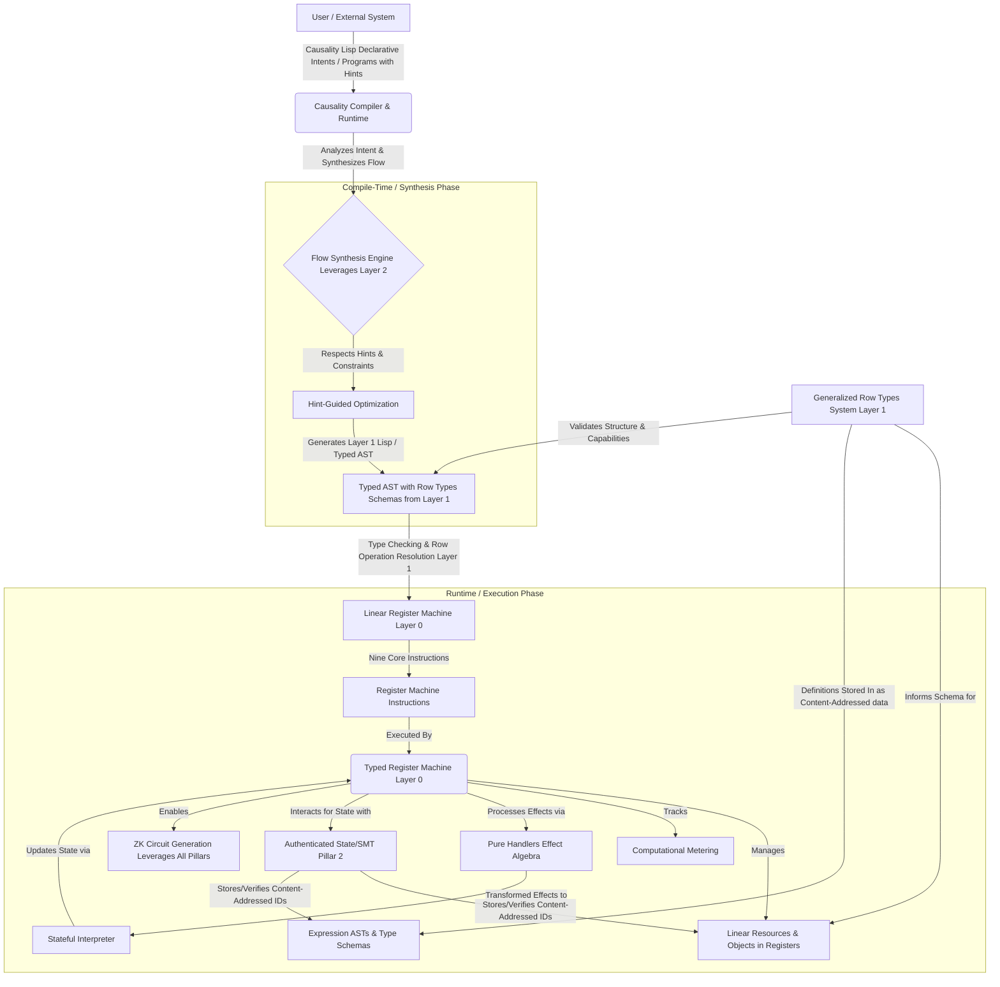

# Causality: System Overview and Architecture

> Note this project is at an experimental stage and thus still rapidly evolving.

Causality is a programming language and system engineered for the precise and verifiable management of digital resources. It fundamentally re-imagines resource interaction through a **linear resource language**, where resources are consumed exactly once by default. This core tenet, combined with a sophisticated type system and a novel execution model, enables static verification of resource safety, protocol compliance, and conservation laws, paving the way for highly secure and auditable systems, especially in zero-knowledge contexts.

This document outlines the overarching architecture of the Causality system, its guiding principles, and how its components interact to deliver these guarantees.

## Core Principles

The design and architecture of Causality are built upon the following interconnected principles:

1.  **Linearity, Immutability, and One-Time Use**: All resources within Causality are treated as linear—they must be consumed exactly once. An instance of a resource (a `Resource`) is immutable; transformations consume existing resources and produce *new* instances. This is not an optional feature but a foundational aspect of the type system and runtime, eliminating common errors like double-spending or use-after-free by construction. The system supports four levels of linearity qualifiers (Linear, Affine, Relevant, Unrestricted) through the generalized `Object` type, allowing fine-grained control over resource usage patterns while maintaining safety.

2.  **Universal Resource Representation & Algebraic Effects for State Changes**: All significant entities within the system—data, code, computational processes, and even effects themselves—are represented as **Resources** or **Objects** (generalized resources with configurable linearity). State changes are exclusively managed through **algebraic effects**. These effects are themselves typed resources (often sum types representing different operations) and are processed by pure handlers that transform effects, while a separate interpreter manages stateful execution. This ensures that all side effects are explicit, typed, tracked, and managed within the resource model.

3.  **Static Verifiability**: The system is designed to catch errors at compile time. Through a combination of linear typing, generalized row types, and an understanding of the core operational semantics of its layered architecture (including Layer 0's 9 instructions and Layer 1's 11 primitives), Causality aims to prove resource safety, adherence to defined protocols, and conservation properties before execution.

4.  **Canonical Serialization, Content Addressing, and Authenticated State**: All system types and data structures (including `Resource` states, `RowType` definitions, `Value`/`Expr` ASTs) are **canonically serialized using SSZ (Simple Serialize)**. The cryptographic hash (Merkle root) of this SSZ representation serves as the entity's **content-addressed ID**. This is fundamental for determinism, global verifiability, and efficient storage. The entire system state, including resource states, transformations, and dependencies, can be backed by a **unified authenticated data structure, such as a Sparse Merkle Tree (SMT)**, mapping these IDs to their data. This allows for compact proofs of state, verifiable state transitions, and efficient ZK integration.

5.  **Zero-Knowledge (ZK) Friendliness**: Linearity, determinism, content addressing, and the SMT-backed state model make Causality exceptionally well-suited for integration with zero-knowledge proof systems. The architecture facilitates the compilation of resource transformations into ZK circuits that can operate on compact proofs and commitments.

6.  **Declarative Intent with Structured Hints**: Users can interact with Causality by specifying *what* they want to achieve (the desired state transformation, along with constraints and guarantees) rather than dictating the precise sequence of low-level operations. They can also provide **structured optimization hints** (such as batching preferences, minimize/maximize directives, domain preferences, and deadlines) that guide execution without affecting correctness. The system can then synthesize an optimal, provably correct execution path that respects both hard constraints and soft preferences.

7.  **Data IS Computation IS Resources**: Causality Lisp, the system's primary interface, embodies Lisp's homoiconicity. Code and data are s-expressions; these expressions are also resources, and their evaluation (consumption) leads to new resources or state changes. This unification is key to the system's expressiveness and its ability to reason about programs themselves.

## Three-Layer Architecture

The Causality system is organized into three distinct layers, each with specific responsibilities, primitives, and categorical underpinnings, ensuring a clear separation of concerns from the lowest-level execution to high-level domain logic:

### Layer 0: Register Machine
- **Mathematical Basis**: Symmetric Monoidal Closed Category with coproducts.
- **Role**: Minimal, verifiable execution substrate. This layer provides the absolute foundation for computation.
- **Components**:
    - Base Types: `Unit`, `Bool`, `Int`, `Symbol`.
    - Machine-level Types: `RegisterId` (for addressing registers), `ResourceId` (for uniquely identifying heap-allocated resources), `Label` (for control flow), `Effect` (opaque representation of an effect to be performed).
    - Values: Tagged unions representing all possible data that can reside in registers or on the heap.
    - State: Comprises registers (a fixed set of storage locations), a heap (for dynamic allocation of resources), a program counter, and a call stack.
- **Instructions (9)**: The instruction set is minimal and precisely defined:
    1.  `move r_src r_dest`: Copies value from `r_src` to `r_dest`.
    2.  `apply r_fn r_arg r_out`: Applies function in `r_fn` to argument in `r_arg`, result in `r_out`.
    3.  `match r_sum r_l r_r l_label r_label`: Inspects a sum type value in `r_sum`; if `inl`, assigns payload to `r_l` and jumps to `l_label`; if `inr`, assigns to `r_r` and jumps to `r_label`.
    4.  `alloc r_val r_out`: Allocates `r_val` on the heap, `r_out` receives the `ResourceId`.
    5.  `consume r_res r_out`: Marks resource `r_res` as consumed, `r_out` receives its value. Key to linearity.
    6.  `check r_bool`: Halts with error if value in `r_bool` is not true. Used for assertions.
    7.  `perform effect_data r_out`: Triggers an external effect described by `effect_data`, `r_out` receives result.
    8.  `select r_cond r_true r_false r_out`: If `r_cond` is true, `r_out` gets `r_true`, else `r_false`.
    9.  `witness r_out`: Reads an external witness value into `r_out`. Used for interacting with untrusted external data.
    - These instructions have precise operational semantics and form a minimal basis for expressiveness, focusing on linearity preservation, determinism, and verification-friendliness.
- **Purpose**: Provides the fundamental, low-level execution model. Enforces linear resource semantics at the most basic level. All higher-level constructs ultimately compile down to these Layer 0 instructions.

### Layer 1: Linear Lambda Calculus
- **Mathematical Basis**: Term model of linear type theory; initial object in the category of models of linear type theory.
- **Role**: Provides a type-safe functional programming model with first-class linear resources and algebraic data types (ADTs). This is the primary layer for defining reusable, verifiable program logic.
- **Components**:
    - Types: Builds upon Layer 0 base types. Introduces:
        - Linearity Qualifiers: `Linear` (must be used exactly once), `Affine` (at most once), `Relevant` (at least once if an unrestricted function using it is called), `Unrestricted` (can be used any number of times).
        - Structured Types: Records (named product types), sum types (tagged unions), and row-polymorphic records (`RowType`).
    - Resources: Typed entities with explicit ownership and consumption semantics, enforced by the type system.
    - Objects: A generalization of `Resource`, allowing data to be tagged with specific linearity qualifiers and capabilities.
- **Primitives (11 Core Operations)**: These correspond to type constructors and eliminators for linear types, forming the core of Causality Lisp at this layer:
    - Unit Type:
        1.  `unit`: Introduces the unit value.
        2.  `letunit`: Eliminates the unit value.
    - Tensor Product (⊗, for creating pairs/tuples):
        3.  `tensor r₁ r₂`: Creates a pair from values in `r₁` and `r₂`.
        4.  `lettensor r_pair (r_x r_y => body)`: Destructures a pair from `r_pair` into `r_x`, `r_y` for use in `body`.
    - Sum Type (⊕, for variants/enums):
        5.  `inl r_val`: Injects `r_val` into the left side of a sum type.
        6.  `inr r_val`: Injects `r_val` into the right side of a sum type.
        7.  `case r_sum (r_l => body_l) (r_r => body_r)`: Branches on a sum type value in `r_sum`.
    - Linear Functions (⊸, for defining functions that respect linearity):
        8.  `lambda (arg => body)`: Defines a linear function (a meta-operation, forms a closure).
        9.  `apply r_fn r_arg`: Applies the linear function in `r_fn` to `r_arg`.
    - Resource Management (higher-level abstractions over Layer 0 concepts):
        10. `alloc r_val`: Allocates `r_val` as a distinct resource.
        11. `consume r_res`: Consumes resource `r_res`, making its value available.
- **Row Type Operations**: Compile-time operations like `project`, `restrict`, `extend`, `diff` for managing extensible records. These are crucial for defining capabilities, effect signatures, and enabling privacy-preserving projections.
- **Purpose**: Enforces linearity and resource safety at the type level. Enables rich data structuring and provides a functional core for expressing computations. All Layer 1 primitives compile to sequences of Layer 0 instructions.

### Layer 2: Effect Algebra & Domain Logic
- **Mathematical Basis**: Kleisli category for an effect monad. Models effects, handlers, and proofs as categorical constructs (e.g., functors, natural transformations).
- **Role**: Manages domain-specific effects, resource transformations, causality, transaction orchestration, and high-level program intent.
- **Components**:
    - Effects (`Effect`): Typed descriptions of operations, including parameters, pre-conditions, post-conditions, and optimization `hints`. Effects are pure data.
    - Handlers (`Handler`): Pure functions that transform effects (effect-to-effect composition). They define the interpretation of effects.
    - Interpreter: A stateful component that executes the (potentially transformed) effects, interacting with Layer 0 for actual state changes.
    - Intents (`Intent`): Declarative specifications of desired outcomes, comprising input/output resources, constraints, a sequence of effects, and optimization hints.
    - Temporal Effect Graph (TEG): A data structure representing a computation as a graph of effect nodes and resource-flow edges, capturing causal and temporal dependencies.
- **Core Primitives/Operations (Conceptual & Concrete)**:
    - Effect Monad:
        1.  `pure v`: Lifts a value `v` into an effectful computation.
        2.  `bind m f`: Sequences effectful computation `m` with function `f` (which produces another effectful computation).
    - Effect Execution & Handling:
        3.  `perform effect_data`: Submits an effect for execution (conceptually linked to Layer 0 `perform`).
        4.  `handle effect_computation with handler_logic`: Applies a handler to an entire effectful computation.
    - Resource Algebra (abstractions for common resource transformations, often realized as specific effects):
        5.  `produce`: Create a new resource.
        6.  `transform`: Modify an existing resource.
        7.  `combine`: Merge multiple resources.
        8.  `split`: Divide a resource.
    - Causality & Conservation Verification:
        9.  `check constraint_expr`: Verifies a constraint (e.g., conservation law, reusing Layer 0 `check` for assertion).
        10. `depend e₁ e₂`: Declares that effect `e₂` causally depends on `e₁`.
        11. `sequence [e₁, e₂, ...eₙ]`: Defines a sequential execution of effects.
        12. `verify proof_data`: Verifies a proof related to a computation or state.
    - Transaction Orchestration:
        13. `transact [...]`: Defines a transactional block of operations.
        14. `atomic [...]`: Defines an atomic block.
        15. `commit`: Commits a transaction.
    - Effect Combinators:
        16. `parallel [eff₁, eff₂]`: Executes effects concurrently if possible.
        17. `race [eff₁, eff₂]`: Executes effects concurrently, completes with the first one to finish.
- **Purpose**: Provides a high-level, declarative programming model for complex workflows. Enables modular effect management, optimization through hints, and verification of domain-specific logic (like causality and conservation). Layer 2 operations are compiled into Layer 1 expressions and subsequently into Layer 0 instructions.

## Architectural Pillars

The Causality system is built upon three fundamental architectural pillars that enable its unique guarantees and capabilities:

1.  **Fundamental Linearity, Immutability, and Verifiable Resource Control**:
    This is the bedrock of the system. Every resource instance (`Resource`) is treated as strictly linear—it must be consumed exactly once in any transformation—and is immutable; operations consume old instances and produce entirely new ones. The generalized `Object` type extends this with configurable linearity qualifiers (Linear, Affine, Relevant, Unrestricted), enabling more nuanced resource management patterns while maintaining safety. These foundational properties are not merely features but the very basis upon which **Static Verification & Type-Safe Resource Control** are built. Through a synergistic combination of a rigorous linear type system (enforced by Causality Lisp), Generalized Row Types (for defining precise resource structures, capabilities, and state machine shapes), and the well-defined semantics of its layered primitives and instructions (particularly Layer 1's linear lambda calculus primitives and Layer 0's register machine instructions), the system ensures that resource protocols are adhered to, capabilities are correctly managed, state transitions are valid, and resource safety (e.g., preventing double-spends or use-after-free) is proven at compile-time, drastically reducing runtime errors and enhancing system reliability.

2.  **Global Authenticated Data Graph & ZK-Verifiable Execution**:
    All significant entities within Causality—resource states (`Resource`), executable logic (Lisp `Expr` ASTs), type definitions (`RowType` schemas), and even effect representations—are subject to canonical serialization (typically SSZ). The cryptographic hash of this serialized form serves as the entity's globally unique, content-addressed ID. This system creates a **global, interconnected graph of authenticated data**, where the state of all addressable entities and their relationships can be maintained and verified within a unified authenticated data structure, such as a Sparse Merkle Tree (SMT). This pillar ensures determinism, global verifiability of data and code, and efficient storage. Crucially, this authenticated data graph, combined with the deterministic execution model (stemming from linearity and the core primitives), provides a strong foundation for **ZK-verifiable execution**. Entire computational processes and resource transformations can be proven to have occurred correctly via zero-knowledge proofs that operate on compact proofs of state and transition derived from this graph.

3.  **Algebraic Effects for Composable Abstraction over Heterogeneous Execution**:
    Causality employs algebraic effects as a primary mechanism to cleanly abstract over potentially heterogeneous execution environments and to decouple behavioral specifications from their concrete implementations. Effects define *what* an operation achieves (its type signature, including inputs, outputs, capabilities consumed/produced, and optimization hints), while handlers provide pure effect-to-effect transformations. A separate interpreter manages the stateful execution of effects. This clean separation—handlers form an effect algebra where composition is just function composition, avoiding monad transformer complexity—is vital for building a composable system where complex, independently evolving functionalities or external systems can interact. The interactions remain flexible (as handlers can be updated or replaced) yet are precisely defined and type-checked through the effect and resource types. This enables the construction of sophisticated workflows from modular, verifiable components.

These three pillars—Linearity enabling Verifiable Control, a Global Authenticated Data Graph enabling ZK-Verifiable Execution, and Algebraic Effects enabling Composable Abstraction—interact to create a system for building **composable, expressive, and verifiable Temporal Effect Graphs**. Linearity and verification define the strong, auditable links of causality and transformation. The authenticated data graph provides the immutable, content-addressed nodes and the verifiable record of their evolution. Algebraic effects offer the expressive power to define complex interactions and transformations as typed resources within this graph. The result is a system where the flow of resources and effects over time can be explicitly modeled, statically checked, and cryptographically verified.

These pillars are realized and supported by key components and mechanisms:
*   **Causality Lisp**: Provides the expressive language to define and interact with resources according to these pillars.
*   **Typed Register Machine**: The execution model that enforces Pillar 1 (Linearity & Immutability) by managing resources in unique, single-use registers using a minimal instruction set.
*   **Generalized Row Types System**: A critical compile-time enabler for Pillar 3 (Static Verification), providing the schemas for type-safe resource definition and manipulation.
*   **Effect Algebra & Handler/Interpreter Separation**: Pure handlers compose via function composition; stateful interpreter manages execution.

## System Components and Interaction

1.  **Input (Causality Lisp)**: Users or external systems define their objectives using Causality Lisp. This can be a declarative Layer 2 intent with optimization hints, an explicit program composed of Layer 1 primitives, or even direct interaction with Layer 0 concepts for specialized scenarios.

2.  **Compilation and Flow Synthesis (Compiler & Runtime)**:
    *   **Declarative Intents with Hints**: If an intent is provided, the **Flow Synthesis Engine** (Layer 2) analyzes it. It uses structured hints (batching preferences, metric optimization, domain preferences, deadlines) to guide synthesis while respecting hard constraints. Governed by the principles of Static Verification, it uses knowledge of available resources (identified by content-addressable IDs as per Pillar 2), their capabilities (defined via row types), and the semantics of the Layer 1 primitives and Layer 0 instructions to generate `ValidLinearFlows` that satisfy the intent while upholding Linearity (Pillar 1).
    *   **Type Checking & Row Operations**: The **Generalized Row Types System** (Layer 1) validates all data structures against their schemas (which are themselves content-addressable as per Pillar 2). It resolves compile-time row operations (e.g., for capability extraction) ensuring type safety and adherence to resource protocols.

3.  **Linear Intermediate Representation (IR)**: The type-checked program is translated into a **Linear Register IR** (Layer 0), using nine core instructions that explicitly reflect the linear, single-use nature of resources and interaction patterns (including conditional logic and witness handling) for the Typed Register Machine.

4.  **Execution (Typed Register Machine)**:
    *   Enforces **Fundamental Linearity & Immutability (Pillar 1)** by managing immutable `Resource` instances and `Object` instances (with their linearity qualifiers) in unique registers. The nine-instruction architecture (`move`, `apply`, `alloc`, `consume`, `match`, `select`, `witness`, `check`, `perform`) provides a minimal yet complete execution model, covering core computation, conditional logic, trust boundary interactions, and effects.
    *   **Effect Processing**: When a `perform` instruction is encountered, the effect is first processed by **pure handlers** (effect-to-effect transformations that compose via function composition). The transformed effect is then passed to the **stateful interpreter** which manages resource allocation, consumption, and state updates.
    *   Interacts with the **Authenticated Data Universe (Pillar 2)** via an Authenticated State Manager (e.g., an SMT). This SMT stores SSZ-serialized, content-addressed `Resource` states, `Object` states, `Expr` ASTs, and `RowType` schemas, mapping their IDs to their data and enabling verifiable state transitions.
    *   Tracks **Computational Metering** (itself often a linear resource).

5.  **Output & Verification**: Execution results in new resource states committed to the SMT. The entire process, from Lisp code to state changes, is designed for verifiability, supporting the generation of ZK proofs that leverage the guarantees of all three pillars.

### Key Data Structures (Reflecting the Pillars and Layers):

*   **Base Types (Layer 0)**: `Unit`, `Bool`, `Int`, `Symbol` - the fundamental value types
*   **`Resource`** (Layer 1): The immutable state of a strictly linear resource, defined by its content-addressed `id` (Pillar 2), and structured by `RowType`s for its data fields
*   **`Object`** (Layer 1): Generalization of `Resource` with configurable linearity (`Linear`, `Affine`, `Relevant`, `Unrestricted`), enabling more flexible resource patterns
*   **`RowType`** (Layer 1): Compile-time definitions for extensible record types, whose schemas are content-addressable (Pillar 2)
*   **`Effect`** (Layer 2): Tagged operations with `pre`/`post` conditions and optimization `hints`
*   **`Handler`** (Layer 2): Pure functions implementing effect-to-effect transformations, composable via function composition
*   **`Intent`** (Layer 2): Declarative specifications with resources, constraints, effects, and hints
*   **`Expr`**: Lisp ASTs, representing code as data, content-addressed via `ExprId` and stored in the SMT (Pillar 2)
