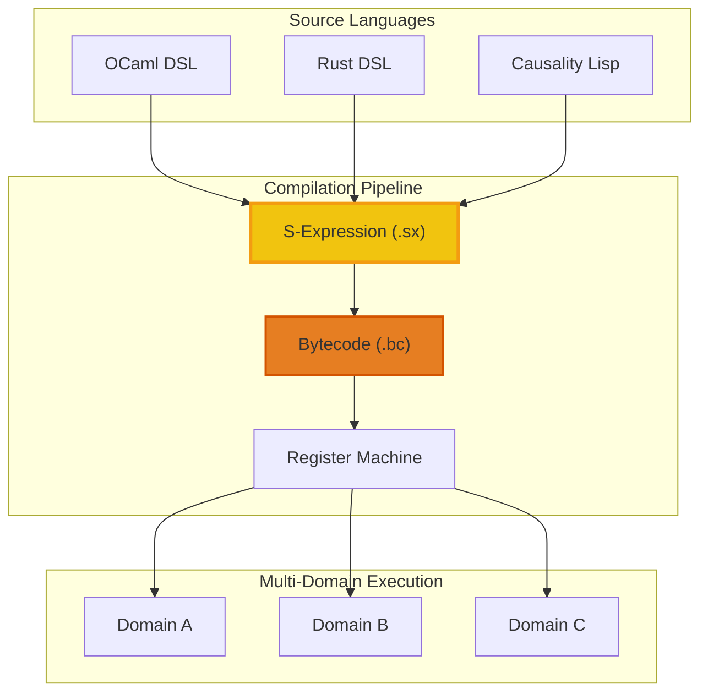

# 106: S-Expression Intermediate Format Specification

## Overview

The S-expression intermediate format (`.sx`) serves as the canonical representation for multi-domain programs in the Causality compilation pipeline. This format bridges the gap between high-level domain-specific languages and the low-level register machine instructions, providing a structured, human-readable, and verifiable intermediate representation.

### Purpose and Design Goals

The S-expression format is designed to:

1. **Enable Multi-Domain Composition**: Support programs that span multiple execution domains with different resource types and capabilities
2. **Provide Compilation Target**: Serve as a stable intermediate representation for various source languages (OCaml DSL, Rust DSL, etc.)
3. **Support Verification**: Enable static analysis, type checking, and formal verification of program properties
4. **Facilitate Debugging**: Provide human-readable representation for inspection and debugging
5. **Enable Optimization**: Support compiler optimizations through structured representation

### Architecture Integration



## 1. Format Specification

### 1.1 Basic Syntax

S-expressions follow standard Lisp syntax with Causality-specific extensions:

```lisp
;; Basic forms
(operator operand1 operand2 ...)

;; Atomic values
42                    ; Integer literal
#t                    ; Boolean true
#f                    ; Boolean false
"hello"               ; String literal (when supported)
symbol-name           ; Symbol/identifier
```

### 1.2 Core Expression Types

#### 1.2.1 Pure Values

Pure expressions represent immutable computations:

```lisp
;; Pure integer
(pure 42)

;; Pure boolean
(pure #t)

;; Pure symbol
(pure success)
```

#### 1.2.2 Resource Operations

Linear resource allocation and consumption:

```lisp
;; Allocate a new resource
(alloc resource-type value)
(alloc TokenA 100)

;; Consume an existing resource
(consume resource-id)
(consume r1)
```

#### 1.2.3 Function Definitions and Applications

Lambda functions with linear parameter handling:

```lisp
;; Lambda definition
(lambda (param1 param2) body-expression)
(lambda (amount) (alloc TokenA amount))

;; Function application  
(apply function arg1 arg2)
(apply transfer-fn 100 recipient-id)
```

#### 1.2.4 Control Flow

Conditional execution and sequencing:

```lisp
;; Conditional execution
(if condition then-expr else-expr)
(if (> balance amount) 
    (pure success)
    (pure insufficient-funds))

;; Let bindings for variable scope
(let ((var1 expr1) (var2 expr2)) body)
(let ((balance (consume token))) 
  (if (>= balance 100) 
      (alloc TokenA (- balance 100))
      (pure error)))
```

#### 1.2.5 Monadic Operations

Sequencing computations with bind:

```lisp
;; Bind for sequencing effectful computations
(bind computation continuation)
(bind (get-balance account)
      (lambda (balance) 
        (if (> balance 0) 
            (pure success) 
            (pure failure))))
```

### 1.3 Multi-Domain Extensions

#### 1.3.1 Domain Declarations

Programs can declare multiple execution domains:

```lisp
;; Domain declaration
(domain domain-id 
  (capabilities cap1 cap2 ...)
  (resources res1 res2 ...)
  (interfaces interface1 interface2 ...))

;; Example: DEX domain
(domain ethereum-mainnet
  (capabilities token-transfer liquidity-provision)
  (resources ETH USDC DAI)
  (interfaces uniswap-v3 curve))
```

#### 1.3.2 Cross-Domain Operations

Operations that span multiple domains:

```lisp
;; Cross-domain resource transfer
(cross-domain-transfer 
  (from-domain source-domain)
  (to-domain target-domain)
  (resource resource-type amount)
  (conditions condition-list))

;; Example: Bridge operation
(cross-domain-transfer
  (from-domain ethereum)
  (to-domain polygon)
  (resource USDC 1000)
  (conditions (minimum-confirmations 12)))
```

#### 1.3.3 Domain-Specific Effects

Effects that are specific to particular domains:

```lisp
;; Domain-scoped effect
(domain-effect domain-id effect-type parameters)

;; Example: Ethereum smart contract call
(domain-effect ethereum 
  (contract-call 
    (address "0x1234...")
    (function "transfer")
    (args recipient amount)))
```

### 1.4 Intent and Effect Composition

#### 1.4.1 Intent Declarations

High-level intentions that can be fulfilled across domains:

```lisp
;; Intent declaration
(intent intent-id
  (description "Human readable description")
  (inputs (resource-flow type amount domain))
  (outputs (resource-flow type amount domain))
  (constraints constraint-list)
  (fulfillment-logic expression))

;; Example: Token swap intent
(intent swap-eth-for-usdc
  (description "Swap 1 ETH for USDC at best available rate")
  (inputs (resource-flow ETH 1 ethereum))
  (outputs (resource-flow USDC 0 ethereum)) ; Amount determined by market
  (constraints (minimum-output 1500) (max-slippage 0.01))
  (fulfillment-logic 
    (find-best-dex-route ETH USDC 1)))
```

#### 1.4.2 Effect Composition

Combining multiple effects into atomic transactions:

```lisp
;; Sequential effect composition
(sequence effect1 effect2 effect3)

;; Parallel effect composition  
(parallel effect1 effect2)

;; Conditional effect execution
(conditional condition effect1 effect2)

;; Example: Multi-step DeFi operation
(sequence
  (domain-effect ethereum (approve-token USDC dex-address 1000))
  (domain-effect ethereum (add-liquidity ETH USDC 1 1000))
  (domain-effect ethereum (stake-lp-tokens lp-amount farming-contract)))
```


## 2. Multi-Domain Program Structure

### 2.1 Program Organization

A complete multi-domain program consists of:

```lisp
;; Complete program structure
(program program-name
  ;; Domain definitions
  (domains
    (domain domain1 ...)
    (domain domain2 ...))
  
  ;; Global type definitions
  (types
    (type-def type-name definition)
    ...)
  
  ;; Intent definitions
  (intents
    (intent intent1 ...)
    (intent intent2 ...))
  
  ;; Effect definitions  
  (effects
    (effect effect1 ...)
    (effect effect2 ...))
  
  ;; Main execution logic
  (main
    main-expression))
```

### 2.2 Example: Cross-Chain DeFi Strategy

```lisp
(program cross-chain-yield-farming
  ;; Define execution domains
  (domains
    (domain ethereum
      (capabilities token-transfer defi-protocols)
      (resources ETH USDC DAI AAVE-ATOKEN)
      (interfaces aave-v3 uniswap-v3))
    
    (domain polygon  
      (capabilities token-transfer defi-protocols)
      (resources MATIC USDC DAI QUICKSWAP-LP)
      (interfaces quickswap aave-polygon)))
  
  ;; Define resource types
  (types
    (type Position
      (fields
        (token-type symbol)
        (amount integer)
        (domain symbol)
        (protocol symbol)))
    
    (type Strategy
      (fields
        (target-yield rational)
        (max-risk-level integer)
        (rebalance-threshold rational))))
  
  ;; Define intents
  (intents
    (intent maximize-yield
      (description "Maximize yield across multiple chains")
      (inputs (resource-flow USDC 10000 ethereum))
      (outputs (resource-flow yield-tokens 0 multi-domain))
      (constraints 
        (minimum-apy 0.05)
        (maximum-risk 3))
      (fulfillment-logic
        (find-optimal-yield-strategy available-protocols))))
  
  ;; Define effects
  (effects
    (effect bridge-to-polygon
      (type cross-domain-transfer)
      (from-domain ethereum)
      (to-domain polygon)
      (implementation
        (lambda (amount token)
          (sequence
            (domain-effect ethereum (approve-bridge token amount))
            (domain-effect ethereum (initiate-bridge token amount))
            (wait-for-confirmation 12)
            (domain-effect polygon (claim-bridged-tokens))))))
    
    (effect provide-liquidity
      (type defi-operation)
      (domain-agnostic #t)
      (implementation
        (lambda (token1 token2 amount1 amount2 domain)
          (domain-effect domain
            (add-liquidity token1 token2 amount1 amount2))))))
  
  ;; Main execution logic
  (main
    (let ((initial-capital (alloc USDC 10000)))
      (bind (analyze-yield-opportunities)
            (lambda (opportunities)
              (let ((best-strategy (select-optimal-strategy opportunities)))
                (execute-strategy best-strategy initial-capital)))))))
```

### 2.3 Resource Flow Tracking

Multi-domain programs must track resource flows across domains:

```lisp
;; Resource flow specification
(resource-flow
  (type token-type)
  (amount quantity)
  (source-domain domain-id)
  (target-domain domain-id)
  (flow-constraints constraint-list))

;; Example: Complex multi-hop flow
(sequence
  ;; Step 1: Ethereum → Polygon bridge
  (cross-domain-transfer
    (from-domain ethereum)
    (to-domain polygon)
    (resource USDC 5000)
    (conditions (bridge-fee-max 10)))
  
  ;; Step 2: Polygon DeFi operations
  (bind (provide-liquidity USDC MATIC 5000 2000)
        (lambda (lp-tokens)
          ;; Step 3: Stake LP tokens
          (stake-tokens lp-tokens quickswap-farm)))
  
  ;; Step 4: Monitor and rebalance
  (periodic-rebalance
    (interval 86400) ; Daily
    (conditions (yield-drop-threshold 0.01))))
```

### 2.4 Domain Decomposition and Compilation Artifacts

A key feature of the S-expression format is its ability to decompose multi-domain programs into domain-specific compilation artifacts. This enables each domain to execute its portion of the program using its native execution environment while maintaining overall program coherence.

#### 2.4.1 Compilation Artifact Structure

Each domain receives a specialized compilation artifact containing:

```lisp
;; Domain-specific compilation artifact
(domain-artifact domain-id
  ;; Local bytecode for this domain
  (bytecode local-instructions)
  
  ;; Cross-domain interface definitions
  (interfaces
    (incoming-flows flow-definitions)
    (outgoing-flows flow-definitions)
    (synchronization-points sync-definitions))
  
  ;; Resource management for this domain
  (resource-context
    (local-resources resource-list)
    (imported-resources import-list)
    (exported-resources export-list))
  
  ;; Execution dependencies
  (dependencies
    (prerequisite-domains domain-list)
    (parallel-domains domain-list)
    (completion-signals signal-list)))
```

#### 2.4.2 Decomposition Process

The compilation process breaks down a multi-domain program through several phases:

**Phase 1: Domain Analysis**
- Identify all domain-specific operations
- Extract cross-domain dependencies
- Build domain interaction graph

**Phase 2: Resource Flow Partitioning**
- Partition resources by owning domain
- Identify cross-domain resource transfers
- Generate resource synchronization points

**Phase 3: Code Generation per Domain**
- Generate domain-specific bytecode
- Create cross-domain communication stubs
- Establish synchronization protocols

**Phase 4: Artifact Assembly**
- Package domain artifacts with metadata
- Generate coordination instructions
- Create deployment manifests

#### 2.4.3 Example: Cross-Chain DeFi Decomposition

Consider this multi-domain program:

```lisp
(program arbitrage-bot
  (domains
    (domain ethereum (resources ETH USDC))
    (domain polygon (resources MATIC USDC))
    (domain arbitrum (resources ETH USDC)))
  
  (main
    (let ((initial-capital (alloc USDC 10000)))
      (sequence
        ;; Step 1: Check prices across all domains
        (parallel
          (domain-effect ethereum (get-price USDC ETH uniswap))
          (domain-effect polygon (get-price USDC MATIC quickswap))
          (domain-effect arbitrum (get-price USDC ETH gmx)))
        
        ;; Step 2: Find best arbitrage opportunity
        (bind (find-best-arbitrage prices)
              (lambda (opportunity)
                (if (profitable? opportunity)
                    ;; Step 3: Execute arbitrage
                    (execute-arbitrage opportunity initial-capital)
                    (pure no-opportunity))))))))
```

This decomposes into three domain artifacts:

**Ethereum Artifact:**
```lisp
(domain-artifact ethereum
  (bytecode
    ;; Local price checking
    (get-price-local USDC ETH uniswap)
    ;; Conditional arbitrage execution
    (if-signal arbitrage-ethereum
      (execute-swap USDC ETH amount)
      (noop)))
  
  (interfaces
    (incoming-flows
      (signal arbitrage-ethereum from-coordinator))
    (outgoing-flows
      (price-data to-coordinator)
      (execution-result to-coordinator)))
  
  (resource-context
    (local-resources (USDC ETH))
    (imported-resources (USDC-from-coordinator))
    (exported-resources (ETH-to-coordinator)))
  
  (dependencies
    (prerequisite-domains ())
    (parallel-domains (polygon arbitrum))
    (completion-signals (price-ready execution-complete))))
```

**Polygon Artifact:**
```lisp
(domain-artifact polygon
  (bytecode
    ;; Local price checking
    (get-price-local USDC MATIC quickswap)
    ;; Conditional arbitrage execution
    (if-signal arbitrage-polygon
      (execute-swap USDC MATIC amount)
      (noop)))
  
  (interfaces
    (incoming-flows
      (signal arbitrage-polygon from-coordinator))
    (outgoing-flows
      (price-data to-coordinator)
      (execution-result to-coordinator)))
  
  (resource-context
    (local-resources (USDC MATIC))
    (imported-resources (USDC-from-coordinator))
    (exported-resources (MATIC-to-coordinator)))
  
  (dependencies
    (prerequisite-domains ())
    (parallel-domains (ethereum arbitrum))
    (completion-signals (price-ready execution-complete))))
```

**Coordinator Artifact:**
```lisp
(domain-artifact coordinator
  (bytecode
    ;; Aggregate price data
    (wait-for-all (ethereum-price polygon-price arbitrum-price))
    ;; Calculate arbitrage opportunity
    (calculate-best-arbitrage prices)
    ;; Coordinate execution
    (if profitable
        (sequence
          (signal-domain target-domain arbitrage-execute)
          (wait-for-completion)
          (aggregate-results))
        (signal-all-domains no-arbitrage)))
  
  (interfaces
    (incoming-flows
      (price-data from-all-domains)
      (execution-results from-all-domains))
    (outgoing-flows
      (arbitrage-signals to-all-domains)
      (resource-allocations to-all-domains)))
  
  (resource-context
    (local-resources (coordination-state))
    (imported-resources (all-domain-data))
    (exported-resources (execution-commands)))
  
  (dependencies
    (prerequisite-domains (ethereum polygon arbitrum))
    (parallel-domains ())
    (completion-signals (all-executions-complete))))
```

#### 2.4.4 Cross-Domain Communication Protocols

The decomposition process generates specific communication protocols between domains:

**Synchronous Communication:**
```lisp
;; Blocking cross-domain call
(cross-domain-call target-domain function-name args
  (timeout 30000)  ; 30 second timeout
  (retry-policy exponential-backoff))

;; Example: Get price from another domain
(bind (cross-domain-call ethereum get-current-price USDC ETH)
      (lambda (price)
        (if (> price threshold)
            (execute-local-trade)
            (wait-for-better-price))))
```

**Asynchronous Communication:**
```lisp
;; Non-blocking cross-domain message
(cross-domain-send target-domain message-type payload
  (delivery-guarantee at-least-once)
  (ordering-guarantee fifo))

;; Example: Notify other domains of state change
(cross-domain-send all-domains price-update 
  (price-data token price timestamp))
```

**Event-Driven Coordination:**
```lisp
;; Event subscription across domains
(cross-domain-subscribe source-domain event-type handler
  (filter-condition condition)
  (batch-size 10))

;; Example: React to price changes
(cross-domain-subscribe ethereum price-change
  (lambda (event)
    (when (significant-change? event)
      (recalculate-arbitrage-opportunity))))
```

#### 2.4.5 Resource Synchronization

Cross-domain resource movements require careful synchronization:

**Two-Phase Commit for Resource Transfers:**
```lisp
;; Phase 1: Prepare transfer
(cross-domain-prepare-transfer
  (from-domain ethereum)
  (to-domain polygon)
  (resource USDC 1000)
  (escrow-timeout 300)) ; 5 minutes

;; Phase 2: Commit or abort
(if all-domains-ready
    (cross-domain-commit-transfer transaction-id)
    (cross-domain-abort-transfer transaction-id))
```

**Atomic Multi-Domain Operations:**
```lisp
;; Atomic operation across multiple domains
(atomic-cross-domain
  (participants (ethereum polygon arbitrum))
  (operations
    (ethereum (swap USDC ETH 1000))
    (polygon (bridge ETH 1 ethereum))
    (arbitrum (provide-liquidity ETH USDC 1 1000)))
  (compensation-actions
    (ethereum (reverse-swap ETH USDC))
    (polygon (reverse-bridge ETH 1))
    (arbitrum (remove-liquidity))))
```

#### 2.4.6 Deployment and Execution Coordination

The compilation artifacts include deployment metadata:

**Deployment Manifest:**
```lisp
(deployment-manifest
  (program-id arbitrage-bot-v1.2.3)
  (domains
    (ethereum 
      (artifact-hash "0xabc123...")
      (deployment-address "0x456def...")
      (gas-limit 500000)
      (dependencies (uniswap-v3)))
    (polygon
      (artifact-hash "0xdef456...")
      (deployment-address "0x789abc...")
      (gas-limit 300000)
      (dependencies (quickswap)))
    (arbitrum
      (artifact-hash "0x123789...")
      (deployment-address "0xcdefab...")
      (gas-limit 400000)
      (dependencies (gmx))))
  
  (coordination
    (coordinator-type centralized) ; or decentralized
    (consensus-mechanism proof-of-stake)
    (finality-requirements
      (ethereum 12-confirmations)
      (polygon 256-confirmations)
      (arbitrum 1-confirmation))))
```

**Execution Schedule:**
```lisp
(execution-schedule
  (trigger-conditions
    (time-based (interval 60)) ; Every minute
    (event-based (price-deviation 0.05)) ; 5% price difference
    (manual-trigger admin-command))
  
  (execution-phases
    (phase-1 
      (domains (ethereum polygon arbitrum))
      (operation price-collection)
      (timeout 10))
    (phase-2
      (domains (coordinator))
      (operation arbitrage-calculation)
      (timeout 5))
    (phase-3
      (domains (target-domain))
      (operation arbitrage-execution)
      (timeout 30))))
```

#### 2.4.7 Error Handling and Recovery

Multi-domain programs require sophisticated error handling:

**Domain Failure Recovery:**
```lisp
(error-handling-policy
  (domain-failures
    (ethereum
      (fallback-domains (arbitrum))
      (recovery-strategy retry-with-backoff)
      (max-retries 3))
    (polygon
      (fallback-domains (bsc))
      (recovery-strategy circuit-breaker)
      (cooldown-period 300)))
  
  (partial-execution-handling
    (strategy compensating-transactions)
    (rollback-order (reverse-dependency-order))
    (compensation-timeout 600)))
```

**State Reconciliation:**
```lisp
(state-reconciliation
  (inconsistency-detection
    (method merkle-tree-comparison)
    (frequency periodic)
    (interval 3600)) ; Every hour
  
  (resolution-strategy
    (consensus-mechanism voting)
    (quorum-requirement 2-of-3)
    (tie-breaking trusted-oracle)))
```

This domain decomposition approach ensures that multi-domain S-expression programs can be efficiently compiled, deployed, and executed across heterogeneous blockchain environments while maintaining strong consistency and error recovery guarantees.

## 3. Compilation Semantics

### 3.1 Type System Integration

S-expressions must be well-typed according to Causality's linear type system:

```lisp
;; Type annotations (optional but recommended)
(: expression type)
(: (alloc TokenA 100) (Resource TokenA))
(: (lambda (x) (+ x 1)) (-> Integer Integer))

;; Linearity constraints
;; Each resource must be consumed exactly once
(let ((token (alloc TokenA 100)))
  (consume token)) ; OK: token consumed exactly once

;; This would be a linearity violation:
;; (let ((token (alloc TokenA 100)))
;;   (sequence (consume token) (consume token))) ; ERROR: double consumption
```

### 3.2 Compilation Phases

The compilation pipeline processes S-expressions through several phases:

#### Phase 1: Parsing and Syntax Validation
- Parse S-expression syntax
- Validate structural correctness
- Build abstract syntax tree

#### Phase 2: Type Checking and Linearity Analysis
- Verify type correctness
- Check linear resource usage
- Validate domain constraints

#### Phase 3: Effect Analysis and Planning
- Analyze cross-domain dependencies
- Plan execution order
- Optimize resource flows

#### Phase 4: Code Generation
- Generate register machine instructions
- Optimize instruction sequences
- Produce bytecode artifact

### 3.3 Multi-Domain Bytecode Generation

The compilation process for multi-domain programs produces multiple bytecode artifacts, each tailored for its target execution environment:

#### 3.3.1 Domain-Specific Bytecode Structure

Each domain artifact contains specialized bytecode optimized for that domain's execution model:

```lisp
;; Bytecode artifact structure
(bytecode-artifact
  (metadata
    (domain-id ethereum)
    (program-version "1.2.3")
    (compilation-timestamp 1672531200)
    (compiler-version "causality-cli-2.1.0")
    (optimization-level 2))
  
  (instructions
    ;; Domain-specific register machine instructions
    (instruction-sequence local-operations))
  
  (cross-domain-stubs
    ;; Communication interface code
    (incoming-message-handlers handler-list)
    (outgoing-message-senders sender-list)
    (synchronization-primitives sync-list))
  
  (resource-manifest
    ;; Resource type definitions for this domain
    (local-resource-types type-definitions)
    (cross-domain-resource-mappings mapping-list))
  
  (verification-data
    ;; Data for runtime verification
    (type-constraints constraint-list)
    (linearity-proofs proof-list)
    (security-assertions assertion-list)))
```

#### 3.3.2 Cross-Domain Instruction Extensions

Multi-domain programs require specialized instructions for cross-domain operations:

**Cross-Domain Communication Instructions:**
```rust
// Extended instruction set for multi-domain operations
pub enum CrossDomainInstruction {
    // Send message to another domain
    SendMessage {
        target_domain: DomainId,
        message_type: MessageType,
        payload_register: RegisterId,
        callback_register: RegisterId,
    },
    
    // Wait for message from another domain
    ReceiveMessage {
        source_domain: DomainId,
        message_type: MessageType,
        result_register: RegisterId,
        timeout_ms: u32,
    },
    
    // Synchronize with other domains
    Synchronize {
        sync_point: SyncPointId,
        participant_domains: Vec<DomainId>,
        timeout_ms: u32,
    },
    
    // Transfer resource to another domain
    CrossDomainTransfer {
        target_domain: DomainId,
        resource_register: RegisterId,
        amount_register: RegisterId,
        escrow_timeout: u32,
    },
    
    // Create cross-domain atomic transaction
    BeginAtomicCrossDomain {
        transaction_id: TransactionId,
        participant_domains: Vec<DomainId>,
    },
    
    // Commit or abort cross-domain transaction
    CommitCrossDomain {
        transaction_id: TransactionId,
        success: bool,
    },
}
```

**Resource Synchronization Instructions:**
```rust
pub enum ResourceSyncInstruction {
    // Lock resource for cross-domain transfer
    LockResource {
        resource_register: RegisterId,
        lock_duration: u32,
        lock_id: LockId,
    },
    
    // Release resource lock
    UnlockResource {
        lock_id: LockId,
        success: bool,
    },
    
    // Create escrow for cross-domain transfer
    CreateEscrow {
        resource_register: RegisterId,
        target_domain: DomainId,
        conditions: Vec<EscrowCondition>,
        escrow_id: EscrowId,
    },
    
    // Release escrowed resource
    ReleaseEscrow {
        escrow_id: EscrowId,
        recipient_register: RegisterId,
    },
}
```

#### 3.3.3 Compilation Example: Multi-Domain Arbitrage

Consider how the arbitrage bot example compiles to domain-specific bytecode:

**Original S-Expression:**
```lisp
(domain-effect ethereum (get-price USDC ETH uniswap))
```

**Compiled Ethereum Bytecode:**
```assembly
; Ethereum domain bytecode
witness r0              ; Contract address for Uniswap
witness r1              ; USDC token address  
witness r2              ; ETH token address
call_contract r0 "getAmountsOut" r1 r2 → r3  ; Get price data
send_message coordinator price-data r3       ; Send to coordinator
wait_message coordinator arbitrage-signal → r4  ; Wait for decision
conditional r4 execute_arbitrage noop        ; Execute if profitable

execute_arbitrage:
  witness r5            ; Trade amount
  call_contract r0 "swapExactTokensForTokens" r1 r2 r5 → r6
  send_message coordinator execution-result r6
  return r6

noop:
  pure unit → r7
  return r7
```

**Compiled Polygon Bytecode:**
```assembly
; Polygon domain bytecode  
witness r0              ; Contract address for QuickSwap
witness r1              ; USDC token address
witness r2              ; MATIC token address
call_contract r0 "getAmountsOut" r1 r2 → r3  ; Get price data
send_message coordinator price-data r3       ; Send to coordinator
wait_message coordinator arbitrage-signal → r4  ; Wait for decision
conditional r4 execute_arbitrage noop        ; Execute if profitable

execute_arbitrage:
  witness r5            ; Trade amount
  call_contract r0 "swapExactTokensForTokens" r1 r2 r5 → r6
  send_message coordinator execution-result r6
  return r6

noop:
  pure unit → r7
  return r7
```

**Compiled Coordinator Bytecode:**
```assembly
; Coordinator domain bytecode
wait_message ethereum price-data → r0        ; Wait for Ethereum price
wait_message polygon price-data → r1         ; Wait for Polygon price  
wait_message arbitrum price-data → r2        ; Wait for Arbitrum price

; Calculate best arbitrage opportunity
call calculate_arbitrage r0 r1 r2 → r3       ; Returns (domain, profitable)
extract_field r3 "domain" → r4               ; Target domain
extract_field r3 "profitable" → r5           ; Profitability flag

conditional r5 execute_arbitrage abort_arbitrage

execute_arbitrage:
  send_message r4 arbitrage-signal true      ; Signal target domain
  wait_message r4 execution-result → r6      ; Wait for completion
  return r6

abort_arbitrage:
  send_message ethereum arbitrage-signal false
  send_message polygon arbitrage-signal false  
  send_message arbitrum arbitrage-signal false
  pure "no-opportunity" → r7
  return r7
```

#### 3.3.4 Bytecode Optimization for Multi-Domain Programs

The compiler applies domain-specific optimizations:

**Communication Batching:**
```assembly
; Before optimization: Multiple separate sends
send_message domain1 price-update data1
send_message domain1 state-update data2  
send_message domain1 config-update data3

; After optimization: Batched message
batch_message domain1 
  (price-update data1)
  (state-update data2)
  (config-update data3)
```

**Parallel Execution:**
```assembly
; Before: Sequential cross-domain calls
call_domain ethereum get-price → r0
call_domain polygon get-price → r1
call_domain arbitrum get-price → r2

; After: Parallel execution
parallel_call
  (ethereum get-price)
  (polygon get-price) 
  (arbitrum get-price)
→ (r0 r1 r2)
```

**Resource Prefetching:**
```assembly
; Prefetch resources that will be needed cross-domain
prefetch_resource USDC amount domain-list
; This reserves resources across domains before they're needed
```

#### 3.3.5 Runtime Coordination Bytecode

A special coordinator runtime manages cross-domain execution:

```assembly
; Coordinator runtime bytecode
coordinator_init domain-list → coordinator_state

; Execution orchestration
execution_phase phase1
  parallel_execute domain-list operation-list → results1
  
execution_phase phase2  
  sequential_execute dependency-order operation-list → results2
  
execution_phase phase3
  conditional_execute condition operation-list → results3

; Aggregate final results
aggregate_results results1 results2 results3 → final_result
coordinator_finalize final_result
```

#### 3.3.6 Verification and Security Bytecode

Each domain artifact includes verification instructions:

```assembly
; Resource linearity verification
verify_linearity resource_usage_map
assert_no_double_spend resource_id

; Cross-domain consistency checks  
verify_cross_domain_state state_hash domain-list
assert_resource_conservation total_before total_after

; Security policy enforcement
check_access_control operation caller_id permissions
assert_rate_limits operation_count time_window
```

This multi-domain bytecode generation ensures that complex cross-chain programs can be efficiently executed while maintaining security, consistency, and performance across heterogeneous blockchain environments.

### 3.3 Error Handling

S-expressions must handle various error conditions:

```lisp
;; Error propagation
(try expression
     (catch error-type handler-expression))

;; Example: Handle insufficient balance
(try (transfer-tokens sender recipient 1000)
     (catch InsufficientBalance
       (pure (error "Not enough tokens"))))

;; Resource cleanup on error
(with-cleanup cleanup-expression
  main-expression)

;; Example: Ensure resource cleanup
(with-cleanup (return-unused-tokens)
  (complex-defi-operation))
```


## 4. Optimization Opportunities

### 4.1 Cross-Domain Optimization

The S-expression format enables several optimization strategies:

#### Batching Operations
```lisp
;; Before optimization: Multiple separate calls
(sequence
  (domain-effect ethereum (transfer TokenA alice 100))
  (domain-effect ethereum (transfer TokenA bob 200))
  (domain-effect ethereum (transfer TokenA charlie 300)))

;; After optimization: Batched transaction
(domain-effect ethereum
  (batch-transfer TokenA
    ((alice 100) (bob 200) (charlie 300))))
```

#### Cross-Domain Netting
```lisp
;; Before: Unnecessary round-trip
(sequence
  (cross-domain-transfer ethereum polygon USDC 1000)
  (cross-domain-transfer polygon ethereum USDC 500))

;; After: Net transfer
(cross-domain-transfer ethereum polygon USDC 500)
```

### 4.2 Resource Optimization

#### Resource Pooling
```lisp
;; Optimize resource allocation patterns
(resource-pool pool-id
  (resources TokenA TokenB ETH)
  (allocation-strategy lazy)
  (cleanup-policy automatic))
```

#### Lazy Evaluation
```lisp
;; Defer expensive computations
(lazy-eval
  (expensive-yield-calculation market-data))
```

## 5. Verification and Formal Properties

### 5.1 Static Analysis

S-expressions enable powerful static analysis:

- **Linearity Verification**: Ensure all resources are consumed exactly once
- **Domain Constraint Checking**: Verify operations are valid within their domains  
- **Resource Flow Analysis**: Track resource movements across domains
- **Effect Dependency Analysis**: Identify potential conflicts or optimizations

### 5.2 Formal Verification

The structured format supports formal verification of program properties:

```lisp
;; Property annotations
(property property-name
  (type invariant | pre-condition | post-condition)
  (expression boolean-expression))

;; Example: Conservation property
(property token-conservation
  (type invariant)
  (expression
    (= (total-supply-before) (total-supply-after))))

;; Example: Access control
(property authorized-transfer
  (type pre-condition)
  (expression
    (has-permission sender transfer-permission)))
```

## 6. Tooling and Development Support

### 6.1 Language Server Protocol

The S-expression format supports rich development tooling:

- Syntax highlighting
- Error reporting
- Type information
- Cross-references
- Refactoring support

### 6.2 Testing Framework

```lisp
;; Unit test definitions
(test test-name
  (description "Test description")
  (setup setup-expression)
  (assertion assertion-expression)
  (cleanup cleanup-expression))

;; Example test
(test token-transfer-test
  (description "Test basic token transfer")
  (setup 
    (let ((alice (create-account))
          (bob (create-account))
          (token (alloc TokenA 1000)))
      (give-token alice token)))
  (assertion
    (bind (transfer alice bob 100)
          (lambda (result)
            (and (= (balance alice) 900)
                 (= (balance bob) 100)))))
  (cleanup
    (cleanup-accounts alice bob)))
```

### 6.3 Debugging Support

```lisp
;; Debug annotations
(debug-point label expression)
(trace expression)
(assert condition message)

;; Example debugging
(let ((balance (debug-point "initial-balance" (get-balance account))))
  (trace (transfer account recipient amount))
  (assert (>= balance amount) "Insufficient balance"))
```

## 7. Security Considerations

### 7.1 Resource Safety

The S-expression format enforces several security properties:

- **Linear Resource Management**: Prevents double-spending and resource leaks
- **Domain Isolation**: Ensures operations respect domain boundaries
- **Type Safety**: Prevents category errors and invalid operations
- **Effect Tracking**: Makes all side effects explicit and verifiable

### 7.2 Validation Requirements

All S-expressions must pass validation:

```lisp
;; Validation rules
(validation-rules
  (syntax-rules lisp-grammar)
  (type-rules linear-type-system)
  (linearity-rules resource-linearity)
  (domain-rules cross-domain-constraints)
  (security-rules access-control-policies))
```

---

This specification defines the S-expression intermediate format as a powerful, flexible, and secure representation for multi-domain programs in the Causality ecosystem. The format balances expressiveness with simplicity, enabling both human developers and automated tools to work effectively with complex cross-domain applications.
