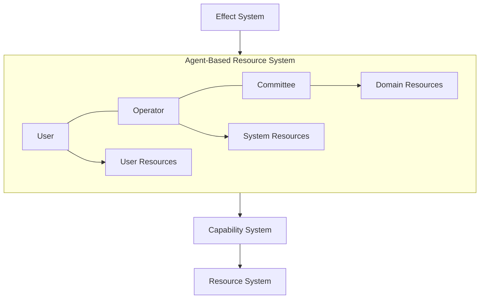
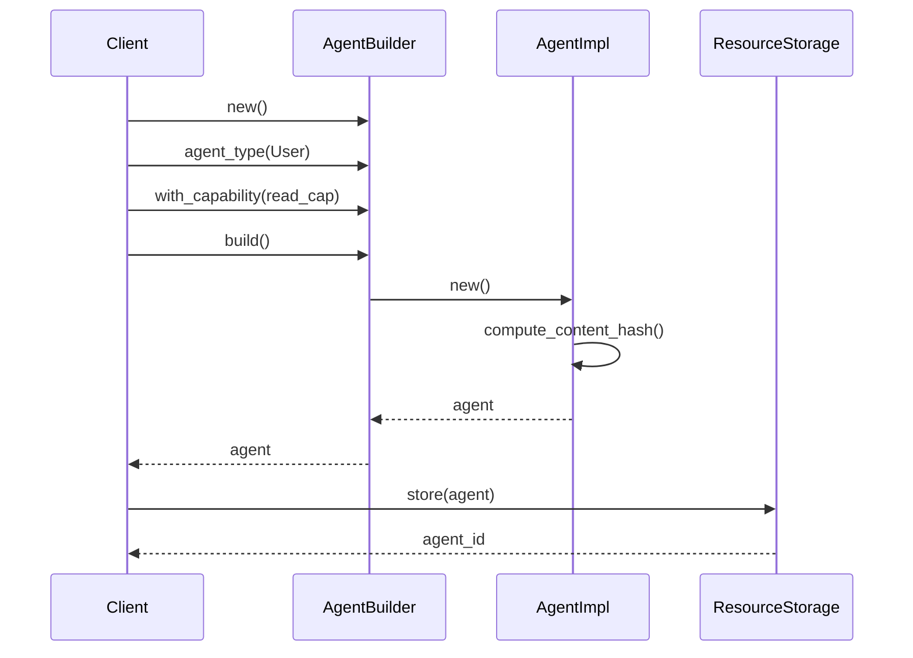
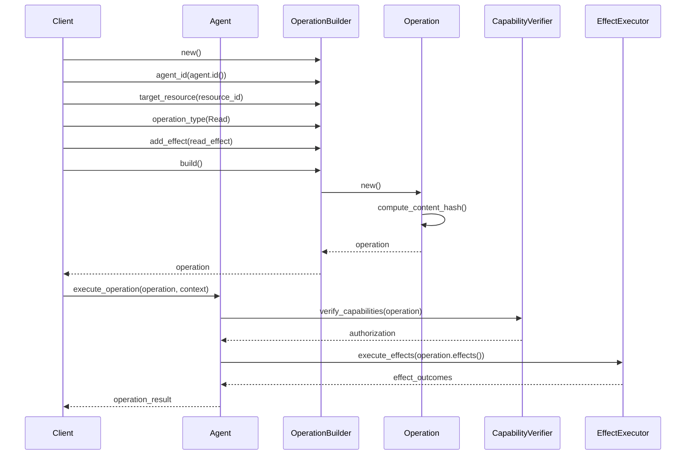
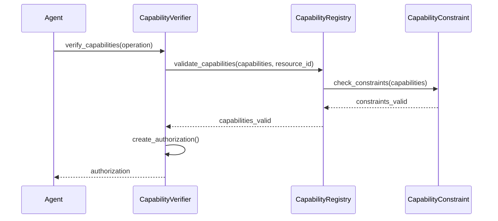
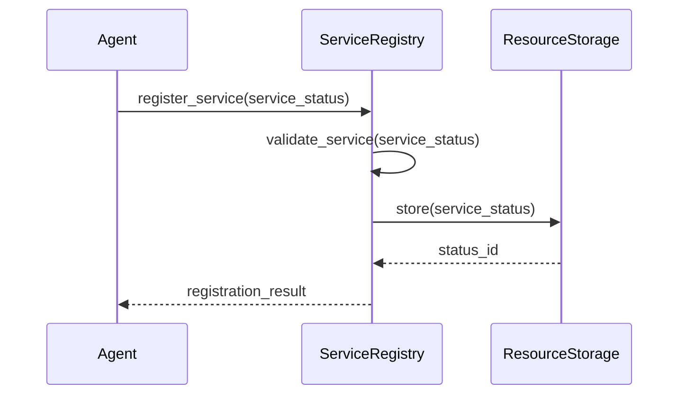

# Agent Resource System Architecture

*This document is derived from [ADR-032](../../../spec/adr_032_consolidated_agent_resource_system.md) and the [System Contract](../../../spec/system_contract.md).*

*Last updated: 2023-08-28*

## Overview

The Agent Resource System is a core architectural component of the Causality platform that implements entities with specific capabilities as specialized resources. It provides a unified approach to modeling agents (users, committees, and operators) as specialized resources, consolidating previously separate concepts into a cohesive model with clear separation of concerns.

## Architectural Goals

1. **Unified Architecture**: Integrate agents into the resource system for a consistent approach
2. **Content Addressing**: Ensure all entities use content addressing for immutability and verification
3. **Simplified Mental Model**: Provide a clear, unified model for all entity types
4. **Consistent Permissions**: Use a unified capability system for all entity types
5. **Clear State Machine**: Define well-specified state transitions for all agent resources
6. **Type-Safe Effects**: Enable type-safe, composable operations through the effect system

## Core Concepts

### Agents as Specialized Resources

In Causality, all agent-based entities are implemented as specialized resource types with specific capabilities. The Resource System provides mechanisms for content-addressed resource identification, capability-based access control, and state management, which all agents leverage.

### Agent Types

The Agent Resource System defines three primary agent types:

1. **User**: End users who interact with the system and own programs
2. **Operator**: System administrators who maintain the infrastructure and execute programs
3. **Committee**: Represents a validator group for a blockchain or data source 
   - Committees observe external facts, sign observation proofs, and validate external messages
   - Each committee is associated with a specific domain

### Domain & Agent Interaction Model

The domain-agent interaction model works as follows:

1. Each domain is associated with a committee of agents that observe and validate its state
2. Domain publication is implemented as transaction submission through the committee
3. Domain subscription is implemented as chain observation through the committee
4. Committee agents are responsible for verifying cross-domain content hashes

This model reflects the reality of blockchain-based systems where validators maintain definitive state while enabling cross-domain verification.

## Core Components

### Agent Resource Model

Agents are implemented as specialized resources:

```rust
/// An agent in the system
pub struct Agent {
    /// Agent's resource implementation
    resource: Box<dyn Resource>,
    
    /// Agent's identity
    identity: AgentId,
    
    /// Agent's capabilities
    capabilities: Vec<Capability>,
    
    /// Agent's current state
    state: AgentState,
    
    /// Agent's relationships with other resources
    relationships: Vec<ResourceRelationship>,
}
```

This approach ensures that agents can be managed consistently with other resources while providing specialized functionality for agent-specific needs.

### Agent States

Agents follow a well-defined state machine:

```rust
/// State transitions for agents
pub enum AgentState {
    /// Agent is active and can perform operations
    Active,
    
    /// Agent is inactive and cannot perform operations
    Inactive,
    
    /// Agent is suspended and cannot perform operations
    Suspended {
        /// Reason for suspension
        reason: String,
        
        /// Timestamp when suspension occurred
        timestamp: TimeStamp,
    },
}
```

### Agent Types

The system defines three specialized agent types:

```rust
pub enum AgentType {
    /// Human user of the system
    User,
    
    /// Multi-agent decision-making body
    Committee,
    
    /// Automated system operator
    Operator,
}
```

### Operations

Agents perform operations on resources, which are authorized through capabilities:

```rust
/// Operation to be executed by an agent
pub struct Operation {
    /// Unique ID for the operation
    id: OperationId,
    
    /// Agent that initiated the operation
    agent_id: AgentId,
    
    /// Target resource
    target_resource_id: ResourceId,
    
    /// Operation type
    operation_type: OperationType,
    
    /// Operation parameters
    parameters: HashMap<String, String>,
    
    /// Effects to be executed as part of this operation
    effects: Vec<Box<dyn Effect>>,
    
    /// Required capabilities for this operation
    required_capabilities: Vec<Capability>,
    
    /// Operation metadata
    metadata: HashMap<String, String>,
}
```

### Agent Authorization

Operations are authorized through a capability-based authorization system:

```rust
/// Authorization proof
pub struct Authorization {
    /// Agent that created the authorization
    agent_id: AgentId,
    
    /// Operation being authorized
    operation_id: OperationId,
    
    /// Capabilities being used
    capabilities: Vec<Capability>,
    
    /// Proof of authorization (e.g., signature)
    proof: Vec<u8>,
    
    /// Metadata
    metadata: HashMap<String, String>,
}
```

### Agent Relationships

Agents maintain relationships with other resources, defining ownership, delegation, and other types of connections:

```rust
/// A relationship between an agent and another resource
pub struct AgentRelationship {
    relationship_type: RelationshipType,
    target_resource_id: ResourceId,
    capabilities: Vec<Capability>,
    metadata: HashMap<String, String>,
}

/// Types of relationships between agents and resources
pub enum RelationshipType {
    Owns,
    Parent,
    Child,
    Peer,
    Delegate,
    DependsOn,
    Custom(String),
}
```

### Service Status

Agents can advertise services they offer:

```rust
/// Service status for an agent
pub struct ServiceStatus {
    /// Agent ID
    agent_id: AgentId,
    
    /// Service type
    service_type: String,
    
    /// Service state
    state: ServiceState,
    
    /// Metadata
    metadata: HashMap<String, String>,
}

/// State of a service
pub enum ServiceState {
    Available,
    Unavailable,
    Degraded,
}
```

### Obligation Manager

The obligation manager enforces usage-based expectations on capabilities:

```rust
/// Obligation for capability usage
pub struct Obligation {
    /// Capability ID
    capability_id: String,
    
    /// Agent ID
    agent_id: AgentId,
    
    /// Obligation type
    obligation_type: ObligationType,
    
    /// Deadline for fulfilling the obligation
    deadline: Option<TimeStamp>,
}
```

### Messaging

Agents can communicate through a secure messaging system:

```rust
/// Message between agents
pub struct Message {
    /// Sender agent ID
    sender_id: AgentId,
    
    /// Recipient agent ID
    recipient_id: AgentId,
    
    /// Message content
    content: Vec<u8>,
    
    /// Message metadata
    metadata: HashMap<String, String>,
}
```

## Integration with Other Systems

### Resource System

Agents are specialized resources, integrating with the resource system for:

- Content addressing
- State management
- Storage and retrieval
- Query and indexing
- Validation

### Capability System

Agents interact with the capability system for:

- Capability management
- Access control
- Capability verification
- Delegation
- Revocation

### Effect System

Agents use the effect system for:

1. Users initiate effects through user interfaces or API calls
2. Operators manage system infrastructure and perform maintenance tasks
3. Committees observe facts and validate cross-domain operations

Agents integrate with the effect system for:
- Operation execution
- Effect composition
- Cross-domain operations
- State changes
- Verification

## Agent-Based Security Model

The Agent Resource System provides a comprehensive security model:

1. **Identity Management**: Agents have cryptographic identities
2. **Authentication**: Agent resources authenticate through signatures with their public keys
3. **Authorization**: The Capability System governs access control based on agent capabilities
4. **Audit Trail**: All operations are logged with the initiating agent
5. **Delegation**: Agents can delegate capabilities to other agents within constraints

## System Diagram



## Architectural Benefits

1. **Unified Architecture**: All components are integrated into a cohesive system with clear interactions
2. **Content Addressing**: All entities use content addressing, eliminating UUID dependencies
3. **Simplified Mental Model**: Developers only need to understand one resource-based system
4. **Consistent Permissions**: Uses the unified capability system for all entity types
5. **Clear State Machine**: Provides well-defined state transitions for all agent resources
6. **Type-Safe Effects**: The effect system provides type-safe, composable operations

## Implementation Architecture

The implementation is divided across the following Rust crates:

| **Crate Name**            | **Responsibility**                                                                 |
|---------------------------|------------------------------------------------------------------------------------|
| `causality-core`          | Resources, agents, capabilities, operations, effects, interpreter                  |
| `causality-engine`        | Top-level orchestration: effect validation, operation execution, routing          |

Within the `causality-core` crate, the agent system is implemented in the following modules:

- `resource/agent/types.rs`: Core agent types (AgentId, AgentType, AgentState)
- `resource/agent/agent.rs`: Agent trait and implementation
- `resource/agent/operation.rs`: Operation system
- `resource/agent/authorization.rs`: Authorization system
- `resource/agent/registry.rs`: Agent registry
- `resource/agent/user.rs`: User agent implementation
- `resource/agent/committee.rs`: Committee agent implementation
- `resource/agent/operator.rs`: Operator agent implementation
- `resource/agent/service.rs`: Service status system
- `resource/agent/obligation.rs`: Obligation manager
- `resource/agent/messaging.rs`: Messaging system
- `resource/agent/capability.rs`: Capability bundle implementation

## Sequence Diagrams

### Agent Creation



### Operation Execution



### Capability Verification



### Service Status Registration



## Implementation Status

As per ADR-032, the Agent Resource System is currently being implemented with the following components:

- [x] Core agent types (AgentId, AgentType, AgentState)
- [x] Agent trait and implementation
- [x] Operation system for capability-checked resource operations
- [ ] Authorization system for capability verification
- [ ] Agent registry for managing agents
- [ ] Specialized agent types (User, Committee, Operator)
- [ ] Service status implementation for service advertisement
- [ ] Obligation manager for capability enforcement
- [ ] Messaging system for agent communication
- [ ] Capability bundle implementation for role-based capability sets

## Implementation Roadmap

The implementation follows the task list in the consolidated implementation plan:

1. **Core Agent Types** - Define the basic types needed for agent implementation
2. **Agent Resource Implementation** - Implement the `Agent` trait and resource integration
3. **Agent Operation System** - Define the operation execution model
4. **Agent Authorization System** - Implement capability-based authorization
5. **Agent Registry** - Create a registry for managing agent resources
6. **Specialized Agent Types** - Implement user, committee, and operator agents
7. **Service Status** - Add service advertisement functionality
8. **Obligation Manager** - Track capability usage and enforce obligations
9. **Messaging System** - Enable agent-to-agent communication
10. **Capability Bundle Implementation** - Create predefined capability sets
11. **Effect System Integration** - Integrate with the effect system
12. **Storage Implementation** - Optimize storage for agent resources
13. **Actor System Removal** - Replace the actor system with the agent-resource system
14. **Documentation** - Create comprehensive documentation

## API Usage Examples

### Agent Creation

```rust
// Create a new user agent
let agent = AgentBuilder::new()
    .agent_type(AgentType::User)
    .state(AgentState::Active)
    .with_capability(Capability::new("resource123", "read", None))
    .with_metadata("display_name", "Alice")
    .build()
    .unwrap();
```

### Capability Management

```rust
// Add a capability to an agent
let read_capability = Capability::new("resource123", "read", None);
agent.add_capability(read_capability).await?;

// Check if the agent has a capability
if agent.has_capability("resource123", "read") {
    // Perform operation
}
```

### Relationship Management

```rust
// Add a relationship between an agent and a resource
let relationship = AgentRelationship::new(
    RelationshipType::Owns,
    document_id,
    vec![write_capability],
    HashMap::new(),
);

agent.add_relationship(relationship).await?;
```

### Service Status Management

```rust
// Advertise a service
let service = ServiceStatus::new(
    agent.id(),
    "document_processor",
    ServiceState::Available,
);

agent.advertise_service(service).await?;

// Find agents offering a service
let providers = ServiceRegistry::find_providers("document_processor").await?;
```

### Messaging

```rust
// Send a message to another agent
let message = Message::new(
    agent.id(),
    recipient_id,
    "Request for capability delegation",
    request_data,
);

agent.send_message(message).await?;

// Receive and handle messages
let messages = agent.receive_messages().await?;
for message in messages {
    match message.content_type() {
        "capability_request" => handle_capability_request(message),
        "service_announcement" => handle_service_announcement(message),
        _ => handle_unknown_message(message),
    }
}
```

### Obligations

```rust
// Create an obligation for capability usage
let obligation = Obligation::new(
    capability_id,
    agent.id(),
    ObligationType::UseWithinTime(Duration::from_days(30)),
);

obligation_manager.add_obligation(obligation).await?;

// Check obligations
obligation_manager.check_obligations().await?;
```

## Integration with Effect System

The Agent Resource System integrates closely with the Effect System:

```rust
// Create an effect using an agent's capabilities
let read_effect = ReadEffect::new(resource_id, read_fields);

// Build an operation with the effect
let operation = agent.create_operation()
    .target_resource(resource_id)
    .operation_type(OperationType::Read)
    .add_effect(read_effect)
    .build()?;

// Execute the operation
let result = agent.execute_operation(operation, context).await?;
```

## Resource-Specific Authorization

Agents can perform resource-specific authorizations:

```rust
// Check if an agent is authorized for a specific resource operation
if resource.authorize_operation(agent.id(), operation_type)? {
    // Perform operation
}

// Grant agent-specific permissions on a resource
resource.grant_permission(agent.id(), permission_type)?;
```

## Future Directions

1. **Cross-Domain Agent Protocol**: Enable secure agent interaction across domains
2. **Agent Federation**: Support federated identity and capability delegation
3. **Pluggable Authentication**: Add support for different authentication methods
4. **Role-Based Capability Management**: Enhance capability bundles with role definitions
5. **Agent Lifecycle Management**: Add support for agent upgrades and migrations
6. **Reputation System**: Implement a trust and reputation system for agents
7. **Capability Marketplaces**: Enable discovery and exchange of capabilities
8. **Specialized Committee Protocols**: Implement domain-specific committee validation
9. **Dynamic Capability Constraints**: Support runtime-evaluated capability constraints
10. **Multi-Agent Coordination**: Implement protocols for coordinated multi-agent operations

## Conclusion

The Agent Resource System provides a unified approach to modeling agents (users, committees, and operators) as specialized resources. By integrating with the resource, capability, and effect systems, it creates a cohesive architecture with clear separation of concerns.

The implementation roadmap outlines a clear path forward, with progress already made on core components. As the system matures, it will provide a powerful foundation for secure, verifiable, and composable operations within Causality. 