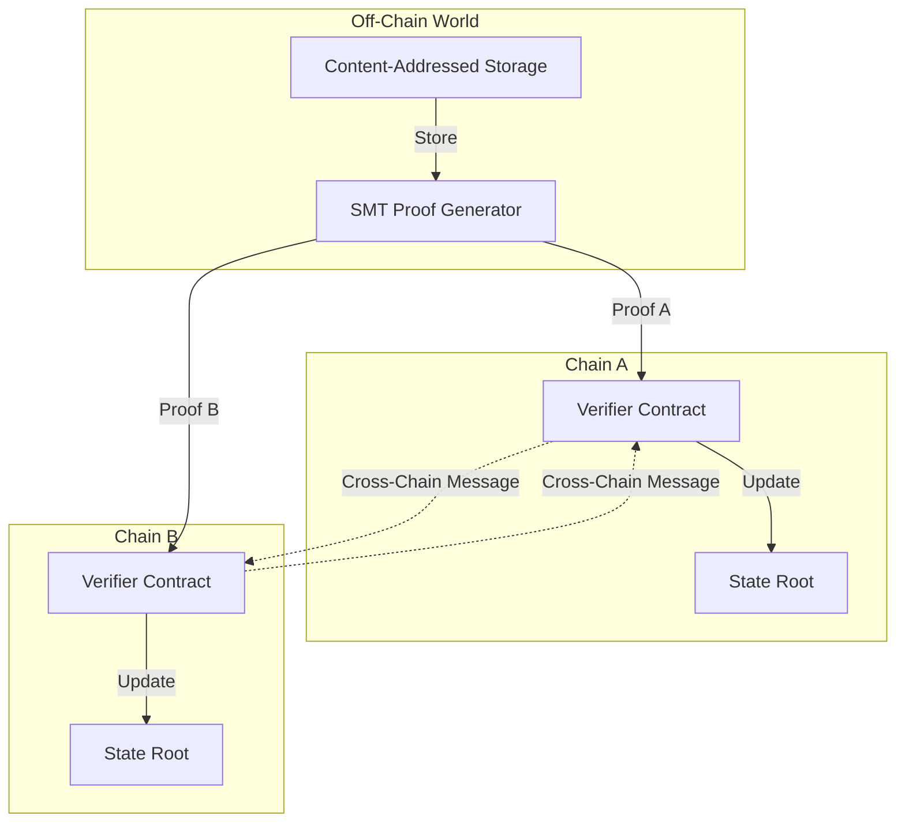
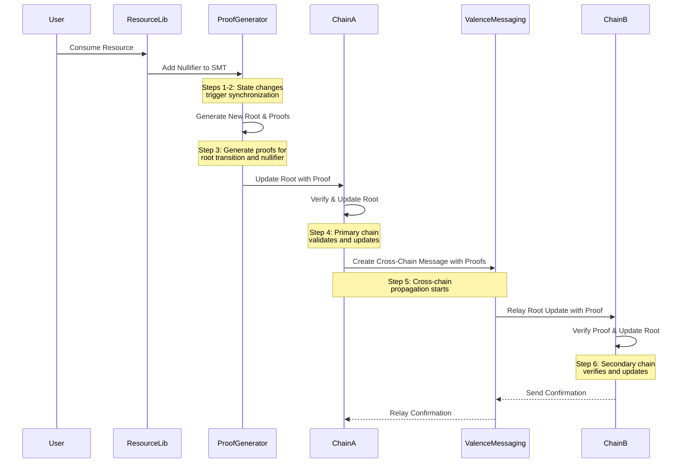
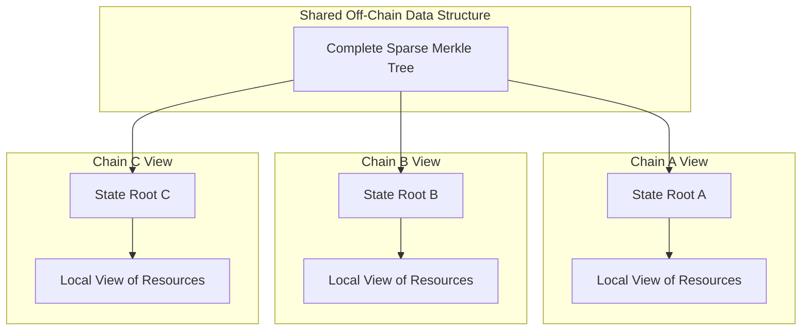
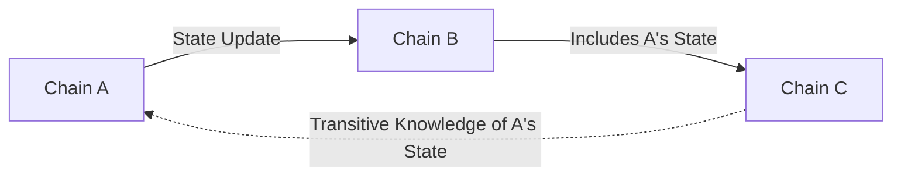
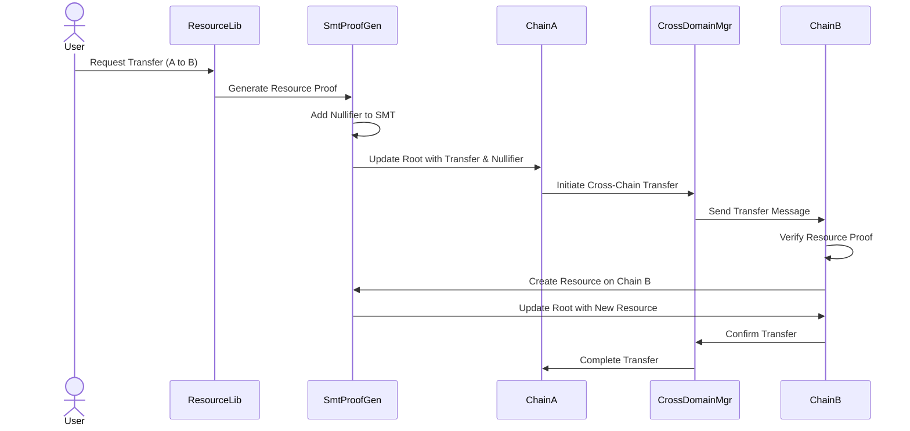

# Sparse Merkle Tree Synchronization

This document describes the architecture for synchronizing Sparse Merkle Trees (SMTs) across multiple chains in the Causality + Valence integration. It details the local data structures, shared data structures, and the mechanisms for maintaining consistency across distributed environments.

## Overview

The Sparse Merkle Tree (SMT) serves as the bridge between our content-addressed system and on-chain representation. By synchronizing SMTs across chains, we enable:

1. **Efficient Cross-Chain Verification**: Only Merkle roots and minimal proof data need to be transferred
2. **Content Consistency**: Content-addressed objects maintain consistent identities across chains
3. **Minimal On-Chain Footprint**: Most data remains off-chain while maintaining verifiability
4. **Cross-Domain Resource Operations**: Resources can be verified and transferred between domains



## Design Requirements

The SMT synchronization system must meet several critical requirements to function effectively across multiple blockchain environments:

### Security Requirements

The architecture must ensure:

1. **Double-Spending Prevention**: Nullifiers in the SMT must prevent resource reuse across chains
2. **Tampering Prevention**: Content addressing must ensure data integrity throughout the system
3. **Unauthorized Updates Protection**: Root updates must require proper authorization with cryptographic verification
4. **Cross-Chain Attack Resistance**: All proofs must be verified before accepting updates from other chains
5. **Replay Attack Prevention**: Nullifiers and nonces must prevent transaction replays

### Performance Requirements

The system must support:

1. **Low-Latency Operations**: DeFi applications on each chain require fast transaction processing
   - Proof generation must complete within acceptable timeframes for time-sensitive financial operations
   - Verification of proofs must be gas-efficient on all supported chains
   - Cross-chain synchronization must minimize latency for critical operations

2. **Scalability Under Load**: Performance must remain acceptable as activity increases
   - As program activity scales, state access frequency will increase
   - Proof sizes grow with tree depth and complexity
   - Contention for state updates becomes a bottleneck
   - The system must maintain responsiveness even under high transaction volumes

3. **Resource Efficiency**: The architecture must balance:
   - On-chain storage costs across multiple chains
   - Computational overhead for proof generation and verification
   - Network bandwidth for cross-chain communication
   - Client-side resource requirements for interacting with the system

4. **Graceful Degradation**: Under extreme load conditions, the system should:
   - Prioritize critical operations
   - Provide predictable performance degradation
   - Maintain security guarantees even when performance is impacted

## Local Data Structures

Each blockchain maintains its own local representation of the SMT state, consisting of:

### 1. State Root Contract

The state root contract is the primary on-chain representation of the entire SMT's state:

```solidity
contract ValenceCausalityVerifier {
    // Current state root
    bytes32 public stateRoot;
    
    // Root history for potential rollbacks (limited history)
    mapping(uint256 => bytes32) public rootHistory;
    uint256 public currentRootIndex;
    
    // Events
    event RootUpdated(bytes32 oldRoot, bytes32 newRoot, uint256 indexed updateIndex);
}
```

### 2. SMT Structure

All state elements, including resources and nullifiers, are stored in the same Merkle tree. Nullifiers use a special prefix in their keys to distinguish them from regular resources:

```solidity
contract ValenceCausalityVerifier {
    // Verify an SMT proof
    function verifyProof(
        bytes32 root,
        bytes32 key,
        bytes calldata value,
        bytes calldata proof
    ) public pure returns (bool) {
        return SmtVerifier.verify(root, key, value, proof);
    }
    
    // Check if a nullifier exists
    function isNullifierSpent(bytes32 nullifier) public view returns (bool) {
        // The key for a nullifier in the SMT has a special prefix
        bytes32 nullifierKey = keccak256(abi.encodePacked("nullifier:", nullifier));
        
        // In a real implementation, this would generate a proof and verify it
        // For efficiency, implementations may cache recent nullifier states
        bytes memory proof = proveInclusion(nullifierKey);
        bytes memory value = bytes("1"); // Any non-empty value indicates "spent"
        
        return verifyProof(stateRoot, nullifierKey, value, proof);
    }
    
    // Mark a nullifier as spent (requires authorized update of tree root)
    function markNullifier(
        bytes32 nullifier,
        bytes calldata proof,
        bytes32 newRoot
    ) external onlyAuthorized {
        // The key for a nullifier in the SMT has a special prefix
        bytes32 nullifierKey = keccak256(abi.encodePacked("nullifier:", nullifier));
        
        // Verify nullifier doesn't exist yet
        require(!isNullifierSpent(nullifier), "Nullifier already spent");
        
        // Verify proof creates a valid tree with the nullifier marked
        require(verifyRootTransition(stateRoot, newRoot, nullifierKey, bytes("1"), proof), 
                "Invalid state transition");
        
        // Update root
        bytes32 oldRoot = stateRoot;
        stateRoot = newRoot;
        
        // Record history and emit event
        rootHistory[++currentRootIndex] = newRoot;
        emit RootUpdated(oldRoot, newRoot, currentRootIndex);
        emit NullifierMarked(nullifier);
    }
}
```

## Shared Off-Chain Data Structures

The content-addressed data and SMT structure are maintained off-chain, with a Cross-Domain Resource Mangager responsible for tracking state synchronization activity:

### Content-Addressed Store

```rust
pub struct ContentAddressedStore {
    // Storage backends
    backends: Vec<Arc<dyn ContentAddressedStorage>>,
    
    // Content hash mapping
    hash_mapping: HashMap<ContentId, StorageLocation>,
    
    // Statistics
    stats: StoreStatistics,
}
```

### SMT Backend

```rust
pub struct SmtBackend {
    // Underlying sparse merkle tree
    tree: SparseMerkleTree<H256, SmtKeyValue, DefaultStore<SmtKeyValue>>,
    
    // Mapping from resource IDs to SMT keys
    resource_mapping: HashMap<ResourceId, H256>,
    
    // Domain information
    domains: HashSet<DomainId>,
}
```

### Cross-Domain Resource Manager

```rust
pub struct CrossDomainResourceManager {
    // Maps resources to domains
    resource_locations: HashMap<ResourceId, Vec<DomainId>>,
    
    // Tracks pending transfers
    pending_transfers: HashMap<TransferId, ResourceTransfer>,
    
    // Synchronization state per domain
    domain_sync_state: HashMap<DomainId, DomainSyncState>,
}
```

## Synchronization Mechanisms

The SMT synchronization process integrates several mechanisms that work together to maintain consistent state across multiple blockchain domains.

Synchronization follows these steps:

1. **Trigger Detection**:

    Synchronization begins when triggered by various actions such as scheduled periodic updates, cross-chain transactions requiring state verification, resource access across domains, or explicit synchronization requests. Upon activation, the system evaluates which domains need synchronization based on the specific trigger and its context.

2. **Root Computation**:
   
    The system batches all pending changes, including both resources and nullifiers, and computes a new Merkle root from this updated state. This single root serves as a comprehensive representation of both the resources and their nullification status, providing a unified view of the current state.

3. **Proof Generation**:
   
    After computing the new root, the system generates cryptographic proofs for state transitions from the previous root to the new root. These proofs cover resource inclusion or exclusion in the tree as well as nullifier status. The proof generation process is specifically optimized for efficient cross-chain verification to minimize computational overhead.

4. **Primary Chain Update**:
   
    The newly computed root is submitted to the primary chain along with its associated proofs. The chain performs validation to ensure proper state transition according to the system rules. Upon successful verification, the chain updates its local root to reflect the new state.

5. **Cross-Chain Propagation**:
   
    Following the primary chain update, the system prepares cross-chain messages containing the new root value, transition proofs, and when necessary, resource-specific proofs. These messages are transmitted to other chains via the Valence messaging protocol, ensuring secure and reliable delivery.

6. **Verification & Confirmation**:
   
    Recipient chains verify the received proofs against their current root to ensure validity. When verification succeeds, they update their local root to maintain consistency with the primary chain. Finally, confirmation messages are returned to the primary chain, completing the synchronization cycle and ensuring all chains have a consistent view of the state.

### Example: Resource Consumption and Cross-Chain Nullifier Synchronization

When a resource is consumed, the entire synchronization process is activated:



This approach ensures:

- **Consistency**: All chains maintain the same world state
- **Efficiency**: Only meaningful changes trigger synchronization
- **Security**: Cryptographic verification maintains trust
- **Scalability**: The process works across any number of chains

The on-demand nature of this process means that synchronization happens precisely when needed, optimizing performance while maintaining a consistent view of resources and nullifiers across all participating chains.

## Conflict Resolution

When multiple chains update the SMT concurrently, conflicts may arise. These conflicts occur because each chain maintains its own independent view of the global state while sharing an underlying data structure.

### Cross-Chain State Representation

Each blockchain in the system maintains its own representation of the global state:



- **Shared Data Structure**: The complete SMT exists off-chain and contains all resources and nullifiers
- **Chain-Specific Views**: Each chain only stores its current Merkle root, representing its view of the global state
- **Remote Chain Commitments**: Chains can also store commitments to other chains' state roots as a view of remote state

#### Namespaced State Updates

The SMT tree itself provides natural namespacing of state updates by domain directly within its structure, eliminating the need for separate mappings:

```solidity
contract ValenceCausalityVerifier {
    // Current state root (shared across all namespaces)
    bytes32 public stateRoot;
    
    // Event for root updates
    event RootUpdated(bytes32 oldRoot, bytes32 newRoot);
    event RemoteStateRecorded(uint256 domainId, bytes32 key, bytes value);
    
    // Compute namespaced key for any domain and resource
    function getNamespacedKey(uint256 domainId, bytes32 originalKey) public pure returns (bytes32) {
        // Prefix the key with domain ID to create namespaces within the SMT
        return keccak256(abi.encodePacked(domainId, originalKey));
    }
    
    // Record remote state within a domain namespace
    function recordRemoteState(
        uint256 domainId,
        bytes32 key,
        bytes calldata value,
        bytes calldata proof,
        bytes32 newRoot
    ) external onlyAuthorized {
        // Create namespaced key
        bytes32 namespacedKey = getNamespacedKey(domainId, key);
        
        // Verify proof creates a valid tree with this key-value pair
        require(verifyRootTransition(stateRoot, newRoot, namespacedKey, value, proof),
                "Invalid state transition");
        
        // Update root
        bytes32 oldRoot = stateRoot;
        stateRoot = newRoot;
        
        emit RootUpdated(oldRoot, newRoot);
        emit RemoteStateRecorded(domainId, key, value);
    }
    
    // Get state from a specific domain
    function getDomainState(
        uint256 domainId,
        bytes32 key,
        bytes calldata proof
    ) external view returns (bytes memory) {
        // Create namespaced key
        bytes32 namespacedKey = getNamespacedKey(domainId, key);
        
        // Retrieve and verify value from tree
        return verifyAndReturnValue(stateRoot, namespacedKey, proof);
    }
    
    // Record remote chain root within the SMT itself
    function recordRemoteRoot(
        uint256 domainId,
        bytes32 remoteRoot,
        bytes calldata proof,
        bytes32 newRoot
    ) external onlyAuthorized {
        // Create a special key for storing remote roots
        bytes32 remoteRootKey = getNamespacedKey(domainId, keccak256("ROOT"));
        
        // Verify proof creates a valid tree with the remote root stored
        require(verifyRootTransition(stateRoot, newRoot, remoteRootKey, abi.encodePacked(remoteRoot), proof),
                "Invalid state transition");
        
        // Update root
        bytes32 oldRoot = stateRoot;
        stateRoot = newRoot;
        
        emit RootUpdated(oldRoot, newRoot);
        emit RemoteStateRecorded(domainId, keccak256("ROOT"), abi.encodePacked(remoteRoot));
    }
}
```

This approach has several benefits:

1. **Unified Data Structure**: All data (local and remote) lives in a single SMT
2. **No Storage Conflicts**: Domain-based prefixing ensures no key collisions
3. **Efficient Querying**: Can query state from any domain using the same root
4. **Simplified Architecture**: Eliminates the need for separate mappings per domain
5. **Unified Proof Mechanism**: All state proofs use the same verification methodology

While each chain maintains its own unified tree containing namespaced state from multiple domains, the implied global data structure that would resolve all these separate views is still inherently contentious. Programs must resolve these contentions based on their application-specific requirements.

#### Transitive Knowledge Propagation

State knowledge can propagate transitively across chains:



When Chain A sends a message to Chain B (updating B's view of A's state), and then Chain B sends a message to Chain C, Chain C obtains knowledge of Chain A's state transitively through Chain B—even without direct communication between A and C.

This transitive propagation introduces trust assumptions:

1. **Trusted Intermediaries**: Chain C must trust Chain B's representation of Chain A's state
2. **Validation Requirements**: Chain C may need additional verification to ensure B hasn't misrepresented A's state
3. **Staleness Concerns**: B's view of A may be outdated when propagated to C

```rust
// Example of tracking transitive knowledge
struct StateKnowledgeGraph {
    // Direct knowledge (chain -> set of chains it directly knows about)
    direct_knowledge: HashMap<ChainId, HashSet<ChainId>>,
    
    // Knowledge paths (destination -> source -> path of intermediaries)
    knowledge_paths: HashMap<ChainId, HashMap<ChainId, Vec<Vec<ChainId>>>>,
    
    // Timestamps of knowledge acquisition
    knowledge_timestamps: HashMap<ChainId, HashMap<ChainId, u64>>,
}

impl StateKnowledgeGraph {
    // Record direct knowledge acquisition
    fn record_direct_knowledge(&mut self, from: ChainId, to: ChainId, timestamp: u64) {
        // Record direct knowledge
        self.direct_knowledge.entry(to).or_default().insert(from);
        
        // Record timestamp
        self.knowledge_timestamps.entry(to).or_default()
            .insert(from, timestamp);
            
        // Record direct path
        self.knowledge_paths.entry(to).or_default()
            .entry(from).or_default()
            .push(vec![]);
            
        // Update transitive knowledge paths
        self.update_transitive_knowledge(from, to, timestamp);
    }
    
    // Propagate transitive knowledge
    fn update_transitive_knowledge(&mut self, source: ChainId, through: ChainId, timestamp: u64) {
        // Find all chains that know about 'through'
        let knowers = self.find_knowers(through);
        
        for knower in knowers {
            // Add new transitive path
            let mut path = vec![through];
            self.knowledge_paths.entry(knower).or_default()
                .entry(source).or_default()
                .push(path);
                
            // Update timestamps (with degraded trust factor)
            // Lower timestamp value indicates older/less trusted knowledge
            let degraded_timestamp = timestamp.saturating_sub(10); // Simple degradation model
            self.knowledge_timestamps.entry(knower).or_default()
                .entry(source).or_default()
                .max(degraded_timestamp);
        }
    }
}
```

#### Recording and Using State Knowledge

All knowledge of state across chains is recorded and may be used by programs in their update and conflict resolution rules:

```rust
// Program-level conflict resolution using state knowledge
impl ConflictResolver for MyApplication {
    fn resolve_conflict(
        &self,
        local_chain: ChainId,
        resource_id: ResourceId,
        views: HashMap<ChainId, ResourceView>
    ) -> ResolvedState {
        // Get state knowledge graph
        let knowledge_graph = self.state_knowledge.clone();
        
        // Filter views based on trust assumptions
        let trusted_views = views.into_iter()
            .filter(|(chain_id, view)| {
                // Direct knowledge is always trusted
                if knowledge_graph.is_direct_knowledge(local_chain, *chain_id) {
                    return true;
                }
                
                // Check if transitive knowledge meets trust threshold
                if let Some(paths) = knowledge_graph.get_knowledge_paths(local_chain, *chain_id) {
                    // At least one path with length <= 2 (at most one intermediary)
                    return paths.iter().any(|path| path.len() <= 2);
                }
                
                false
            })
            .collect::<HashMap<_, _>>();
            
        // Apply application-specific resolution strategy to trusted views
        self.apply_resolution_strategy(local_chain, resource_id, trusted_views)
    }
}
```

This comprehensive recording of state knowledge—including direct updates, remote view commitments, and transitive knowledge paths—enables programs to make informed decisions about state resolution based on their specific trust and consistency requirements.

### What Constitutes a Conflict

Conflicts occur in several scenarios:

1. **Concurrent Resource Consumption**: Two chains attempt to consume the same resource
2. **Root Divergence**: Chains have different Merkle roots representing different "world states"
3. **Conflicting Updates**: Incompatible updates to the same resource from different chains
4. **Temporal Inconsistency**: Updates are processed in different orders on different chains

Since each chain maintains its own view of the global state through its root, these views can become inconsistent, requiring resolution.

### Program-Driven Conflict Resolution

Unlike traditional systems where a consensus mechanism resolves state contention, this architecture leaves conflict resolution as a program concern:

- **Chains Record State Views**: Each chain simply records commitments to remote chain states
- **No Chain-Level Resolution**: Chains don't decide how conflicts are handled apart beyond their implicit inclusion and ordering rules
- **Program-Level Resolution**: Applications/programs decide how to reconcile conflicts

This approach allows different applications to handle conflicts according to their specific requirements while working within the same blockchain ecosystem. The chains themselves remain agnostic to conflict resolution strategies.


## Synchronization Example: Cross-Chain Resource Transfer



This sequence diagram illustrates the process of transferring a resource from Chain A to Chain B:

1. A user initiates a transfer request through the ResourceLib, specifying that they want to transfer a resource from Chain A to Chain B.

2. The ResourceLib requests the SMT Proof Generator to create a cryptographic proof that the resource exists and is owned by the user on Chain A.

3. The Proof Generator adds a nullifier to the SMT to mark that the resource is being spent/transferred from Chain A.

4. The new SMT root (which includes the nullifier) is submitted to Chain A with proofs, effectively "locking" the resource on the source chain.

5. Chain A communicates with the Cross Domain Manager to initiate the transfer process to Chain B.

6. The Cross Domain Manager creates and sends a message to Chain B containing the resource data and cryptographic proofs.

7. Chain B verifies the resource proof against the latest root it has from Chain A, confirming the resource's validity.

8. Chain B instructs the SMT Proof Generator to create the resource in its local state.

9. The Proof Generator submits an updated root to Chain B that includes the new resource.

10. Chain B sends a confirmation to the Cross Domain Manager indicating successful receipt of the resource.

11. The Cross Domain Manager relays this confirmation back to Chain A, completing the transfer process.

## Performance Considerations

To ensure efficient SMT synchronization:

1. **Batched Updates**: Multiple changes are batched into single root updates
2. **Proof Reuse**: Generated proofs are cached and reused when possible
3. **Lazy Verification**: Only verify proofs when explicitly needed
4. **Incremental Updates**: Only synchronize changed subtrees rather than full trees
5. **Prioritized Synchronization**: Critical resources get priority synchronization
6. **Off-Chain Caching**: Extensive caching of proofs and intermediate results in off-chain components
7. **Optimized SMT Operations**: Specialized algorithms for common SMT operations

### Concurrent SMT Updates

The SMT system supports concurrent updates to the local tree with several mechanisms:

1. **Optimistic Batching**: Updates are queued and processed in batches
2. **Conflict Detection**: Overlapping resource access is detected
3. **Lock-Free Reads**: Reads can proceed without blocking during updates
4. **Atomic Root Updates**: Root transitions are atomic operations

Updating the SMT may face the following concurrency Limitations:

1. **Serial Root Updates**: While operations can be prepared concurrently, root updates are serialized
2. **Conflict Resolution Overhead**: Detecting and resolving conflicts adds computational overhead
3. **Proof Invalidation**: Concurrent root changes can invalidate in-progress proof generation
4. **Cache Coherence**: Maintaining consistent caches across concurrent operations will be challenging
5. **Contention with Scale**: As concurrent usage increases, lock contention becomes a limiting factor

Possible avenues for overcoming these limitations:

- Adaptive batch sizing based on system load
- Prioritized processing for critical operations
- Hierarchical locking for subtree operations
- Wait-free read operations using MVCC (Multi-Version Concurrency Control)
- Eventual consistency guarantees for cross-chain synchronization

## Conclusion

The SMT synchronization architecture provides a robust mechanism for maintaining consistent state across multiple blockchain domains while preserving the benefits of content addressing. By synchronizing Merkle roots rather than full data, the system achieves efficiency and scalability while enabling verifiable cross-chain operations.

This architecture uses a unified Sparse Merkle Tree structure that includes both resources and nullifiers, eliminating the need for separate state tracking systems. It leverages the strengths of both Causality and Valence systems while maintaining security, consistency, and performance.
