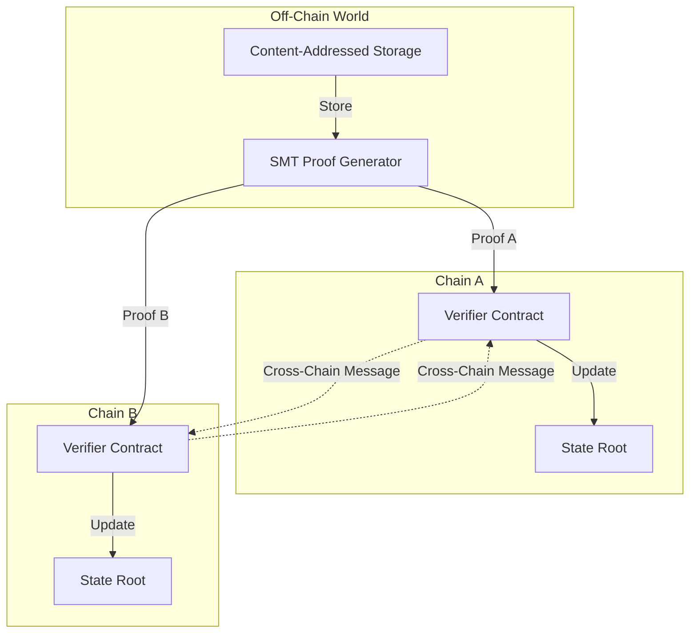
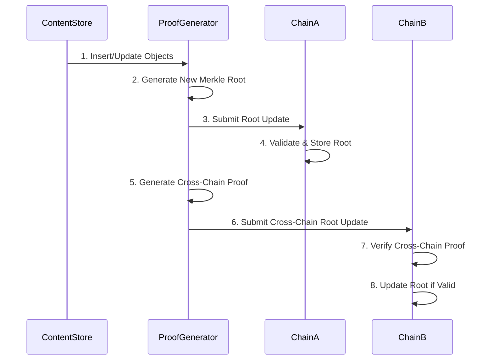
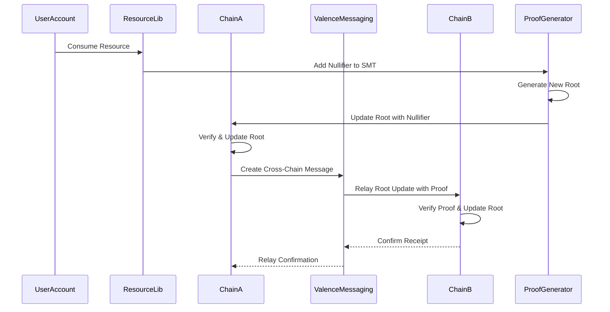
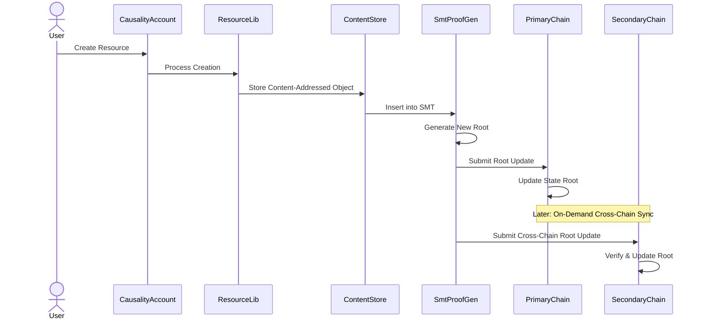
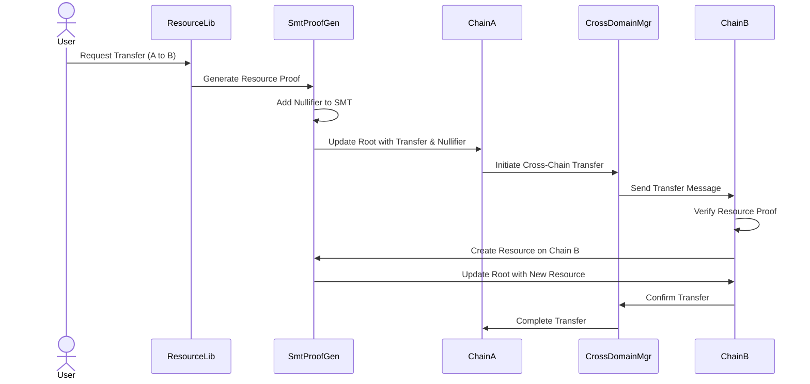

# Sparse Merkle Tree Synchronization

This document describes the architecture for synchronizing Sparse Merkle Trees (SMTs) across multiple chains in the Causality + Valence integration. It details the local data structures, shared data structures, and the mechanisms for maintaining consistency across distributed environments.

## Overview

The Sparse Merkle Tree (SMT) serves as the bridge between our content-addressed system and on-chain representation. By synchronizing SMTs across chains, we enable:

1. **Efficient Cross-Chain Verification**: Only Merkle roots and minimal proof data need to be transferred
2. **Content Consistency**: Content-addressed objects maintain consistent identities across chains
3. **Minimal On-Chain Footprint**: Most data remains off-chain while maintaining verifiability
4. **Cross-Domain Resource Operations**: Resources can be verified and transferred between domains



## Local Data Structures (Per Chain)

Each blockchain maintains its own local representation of the SMT state, consisting of:

### 1. State Root

The state root is the primary on-chain representation of the entire SMT's state:

```solidity
contract ValenceCausalityVerifier {
    // Current state root
    bytes32 public stateRoot;
    
    // Root history for potential rollbacks (limited history)
    mapping(uint256 => bytes32) public rootHistory;
    uint256 public currentRootIndex;
    
    // Events
    event RootUpdated(bytes32 oldRoot, bytes32 newRoot, uint256 indexed updateIndex);
}
```

### 2. Unified SMT Structure

All state elements, including resources and nullifiers, are stored in the same Merkle tree. Nullifiers use a special prefix in their keys to distinguish them from regular resources:

```solidity
contract ValenceCausalityVerifier {
    // Verify an SMT proof
    function verifyProof(
        bytes32 root,
        bytes32 key,
        bytes calldata value,
        bytes calldata proof
    ) public pure returns (bool) {
        return SmtVerifier.verify(root, key, value, proof);
    }
    
    // Check if a nullifier exists
    function isNullifierSpent(bytes32 nullifier) public view returns (bool) {
        // The key for a nullifier in the SMT has a special prefix
        bytes32 nullifierKey = keccak256(abi.encodePacked("nullifier:", nullifier));
        
        // In a real implementation, this would generate a proof and verify it
        // For efficiency, implementations may cache recent nullifier states
        bytes memory proof = proveInclusion(nullifierKey);
        bytes memory value = bytes("1"); // Any non-empty value indicates "spent"
        
        return verifyProof(stateRoot, nullifierKey, value, proof);
    }
    
    // Mark a nullifier as spent (requires authorized update of tree root)
    function markNullifier(
        bytes32 nullifier,
        bytes calldata proof,
        bytes32 newRoot
    ) external onlyAuthorized {
        // The key for a nullifier in the SMT has a special prefix
        bytes32 nullifierKey = keccak256(abi.encodePacked("nullifier:", nullifier));
        
        // Verify nullifier doesn't exist yet
        require(!isNullifierSpent(nullifier), "Nullifier already spent");
        
        // Verify proof creates a valid tree with the nullifier marked
        require(verifyRootTransition(stateRoot, newRoot, nullifierKey, bytes("1"), proof), 
                "Invalid state transition");
        
        // Update root
        bytes32 oldRoot = stateRoot;
        stateRoot = newRoot;
        
        // Record history and emit event
        rootHistory[++currentRootIndex] = newRoot;
        emit RootUpdated(oldRoot, newRoot, currentRootIndex);
        emit NullifierMarked(nullifier);
    }
}
```

## Shared Data Structures (Off-Chain)

The actual content-addressed data and SMT structure are maintained off-chain:

### 1. Content-Addressed Store

```rust
pub struct ContentAddressedStore {
    // Storage backends
    backends: Vec<Arc<dyn ContentAddressedStorage>>,
    
    // Content hash mapping
    hash_mapping: HashMap<ContentId, StorageLocation>,
    
    // Statistics
    stats: StoreStatistics,
}
```

### 2. SMT Backend

```rust
pub struct SmtBackend {
    // Underlying sparse merkle tree
    tree: SparseMerkleTree<H256, SmtKeyValue, DefaultStore<SmtKeyValue>>,
    
    // Mapping from resource IDs to SMT keys
    resource_mapping: HashMap<ResourceId, H256>,
    
    // Domain information
    domains: HashSet<DomainId>,
}
```

### 3. Cross-Domain Resource Manager

```rust
pub struct CrossDomainResourceManager {
    // Maps resources to domains
    resource_locations: HashMap<ResourceId, Vec<DomainId>>,
    
    // Tracks pending transfers
    pending_transfers: HashMap<TransferId, ResourceTransfer>,
    
    // Synchronization state per domain
    domain_sync_state: HashMap<DomainId, DomainSyncState>,
}
```

## Synchronization Mechanisms

Tree synchronization happens through several coordinated mechanisms:

### 1. Root Synchronization Protocol



When a new SMT root is computed after changes to the content store:

1. The proof generator creates a root update transaction for the primary chain
2. After confirmation, cross-chain messages are prepared for other chains
3. Each receiving chain verifies the cross-chain proof before updating its root

### 2. Lazy/On-Demand Synchronization

SMT root synchronization doesn't happen for every change, but follows these triggers:

- **Timer-Based**: Regular synchronization at set intervals (configurable per domain)
- **Transaction-Based**: When specific cross-chain transactions require synchronized state
- **Resource Access-Based**: When resources are accessed across domains
- **Explicit Request**: When a user/operation explicitly requests synchronization

```rust
pub enum SyncTrigger {
    // Regular synchronization interval elapsed
    TimerElapsed(Duration),
    
    // Specific transaction requires synchronized state
    TransactionRequired(TransactionId),
    
    // Resource accessed across domains
    ResourceAccess(ResourceId),
    
    // Explicit synchronization request
    ExplicitRequest(RequestId),
}
```

### 3. Proof-Based Resource Verification

When resources are accessed across domains, proofs are generated to verify their state:

```rust
// Generate inclusion proof for resource
fn generate_resource_proof(
    resource_id: &ResourceId, 
    current_root: &H256,
    smt: &SmtBackend
) -> Result<SmtProof, SmtError> {
    // Convert resource ID to SMT key
    let key = resource_id_to_smt_key(resource_id)?;
    
    // Get resource data
    let resource_data = get_resource_data(resource_id)?;
    
    // Generate proof
    smt.generate_inclusion_proof(current_root, &key, &resource_data)
}
```

Cross-chain verification leverages these proofs:

```solidity
// Verify resource existence on another chain
function verifyResourceFromChain(
    bytes32 resourceId,
    bytes32 sourceChainRoot,
    bytes calldata proof
) public view returns (bool) {
    // Verify this proof matches the provided sourceChainRoot
    return SmtVerifier.verify(
        sourceChainRoot,
        keccak256(abi.encodePacked(resourceId)),
        proof
    );
}
```

### 4. Nullifier Synchronization

Nullifiers (spent resources) are synchronized across chains using the same SMT mechanism:



The nullifier synchronization uses the unified SMT:

1. Nullifier is added to the SMT with a special prefix to distinguish it from resources
2. A new root is computed and submitted to the primary chain
3. Cross-chain messages include proofs that allow other chains to verify the new root
4. All chains store the same root, maintaining consistent nullifier state

## Synchronization Scenarios

### 1. Object Creation and Root Update



### 2. Cross-Chain Resource Transfer



## Update Conflict Resolution

When multiple chains update the SMT concurrently, conflicts may arise. The system resolves these using:

1. **Timestamp-Based Ordering**: Updates are applied in causal time order
2. **Domain Priority**: Each domain has a configurable priority for conflict resolution
3. **Merge Strategy**: Content-addressed nature allows non-destructive merging when possible
4. **Validation Rules**: Updates must meet validation rules for each domain

```rust
pub enum ConflictResolutionStrategy {
    // Use temporal ordering from the Map of Time
    TemporalOrdering,
    
    // Use configured domain priorities
    DomainPriority,
    
    // Merge non-conflicting updates when possible
    ContentMerge,
    
    // Apply domain-specific validation rules
    ValidationRules(Vec<ValidationRule>),
}
```

## Performance Considerations

To ensure efficient SMT synchronization:

1. **Batched Updates**: Multiple changes are batched into single root updates
2. **Proof Reuse**: Generated proofs are cached and reused when possible
3. **Lazy Verification**: Only verify proofs when explicitly needed
4. **Incremental Updates**: Only synchronize changed subtrees rather than full trees
5. **Prioritized Synchronization**: Critical resources get priority synchronization
6. **Off-Chain Caching**: Extensive caching of proofs and intermediate results in off-chain components
7. **Optimized SMT Operations**: Specialized algorithms for common SMT operations

## Security Considerations

The SMT synchronization architecture addresses these security concerns:

1. **Double-Spending Prevention**: Nullifiers in the SMT prevent resource reuse
2. **Tampering Prevention**: Content addressing ensures data integrity
3. **Unauthorized Updates**: Root updates require proper authorization
4. **Cross-Chain Attack Resistance**: Proofs are verified before accepting updates
5. **Replay Attack Prevention**: Nullifiers and nonces prevent replays

## Implementation and Deployment

The implementation follows a phased approach:

1. **Unified SMT Implementation**: All state elements (resources, nullifiers) in a single tree
2. **Cross-Chain Root Synchronization**: Enabling root verification across chains
3. **Resource Transfer Proofs**: Adding proof generation/verification for transfers
4. **Optimized Performance**: Adding batching, caching, and other optimizations

## Conclusion

The SMT synchronization architecture provides a robust mechanism for maintaining consistent state across multiple blockchain domains while preserving the benefits of content addressing. By synchronizing Merkle roots rather than full data, the system achieves efficiency and scalability while enabling verifiable cross-chain operations.

This architecture uses a unified Sparse Merkle Tree structure that includes both resources and nullifiers, eliminating the need for separate state tracking systems. It leverages the strengths of both Causality and Valence systems while maintaining security, consistency, and performance. 