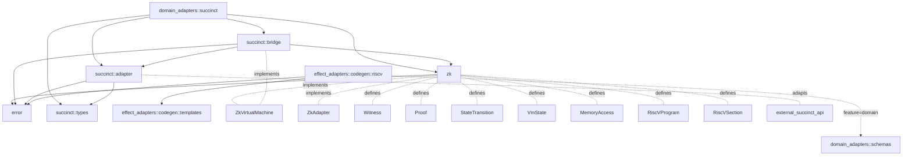
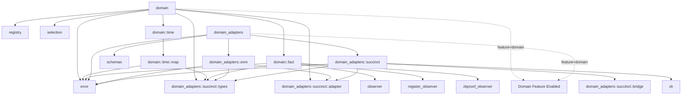

# Module Dependency Graph

This document visualizes the module dependencies in the Causality project.

## Core Module Dependencies

```mermaid
graph TD
    %% Core modules
    lib[lib] --> error
    lib --> types
    lib --> actor
    lib --> address
    lib --> effect_adapters
    lib --> effect
    lib --> tel
    lib --> resource
    lib --> ast
    lib --> execution
    lib --> snapshot
    lib --> timetravel
    lib --> zk
    lib --> log
    lib --> invocation
    lib --> concurrency
    lib --> interpreter
    lib --> builder
    lib --> program_account
    lib --> boundary

    %% Effect system dependencies
    effect --> error
    effect --> types
    effect --> continuation
    effect --> dependency
    effect --> factory
    effect_adapters --> error
    effect_adapters --> codegen
    effect_adapters --> schemas

    %% Code generation
    codegen[effect_adapters::codegen] --> templates
    codegen --> javascript
    codegen --> rust
    codegen --> riscv
    
    %% Feature-dependent modules
    lib -..-> |feature=domain| domain
    lib -..-> |feature=domain| domain_adapters
    lib -..-> |feature=code-repo| code
    
    %% Domain system
    domain --> error
    domain --> types
    domain --> time
    domain --> fact
    domain --> registry
    domain --> selection
    domain --> adapter
    
    %% Domain time and fact subsystem
    time[domain::time] --> map
    fact[domain::fact] --> observer
    fact --> register_observer
    fact --> zkproof_observer
    
    %% Domain adapters
    domain_adapters --> schemas
    domain_adapters --> evm
    domain_adapters --> succinct
    
    %% Succinct adapter
    succinct[domain_adapters::succinct] --> types[succinct::types]
    succinct --> adapter[succinct::adapter]
    succinct --> bridge[succinct::bridge]
    succinct --> zk
    
    %% Bridge dependencies
    bridge --> zk
    bridge --> error
    
    %% RISC-V generator dependencies
    riscv[effect_adapters::codegen::riscv] --> error
    riscv -..-> |feature=domain| schemas[domain_adapters::schemas]
    
    %% ZK system
    zk --> error
    
    %% AST system
    ast --> types
    ast --> resource_graph
    
    %% Execution system
    execution --> error
    execution --> context
    execution --> executor
    execution --> trace
    execution --> replay
    execution --> security
    
    %% Snapshot system
    snapshot --> error
    snapshot --> manager
    snapshot --> storage
    snapshot --> incremental
    snapshot --> checkpointing
    
    %% Timetravel system
    timetravel --> error
    timetravel --> navigator
    timetravel --> inspector
    timetravel --> fork
    
    %% Invocation system
    invocation --> error
    invocation --> context
    invocation --> registry
    invocation --> patterns
    
    %% Log system
    log --> error
    log --> entry
    log --> storage[log::storage]
    log --> segment
    log --> segment_manager
    log --> replay[log::replay]
    log --> sync
    log --> time_map
    log --> fact[log::fact]
    
    %% Time map integration
    time_map[log::time_map] --> domain::map::map
    replay[log::replay] --> time_map
    
    %% Resource system
    resource --> error
    resource --> allocator
    resource --> request
    resource --> static_alloc
    resource --> usage
    resource --> manager[resource::manager]
    resource --> register
    resource --> capability
    resource --> api
    resource --> memory_api
    
    %% Concurrency system
    concurrency --> error
    concurrency --> primitives
    concurrency --> patterns[concurrency::patterns]
    concurrency --> scheduler
    
    %% Interpreter
    interpreter --> error
    interpreter --> effect
    
    %% Program account
    program_account --> error
    
    %% Builder
    builder --> error
    builder --> tel
    
    %% Boundary
    boundary --> error
    boundary -..-> |feature=on_chain| on_chain_impl
    boundary -..-> |feature=off_chain| off_chain_impl
```

## Zero-Knowledge Subsystem Dependencies

## Domain System Dependencies

