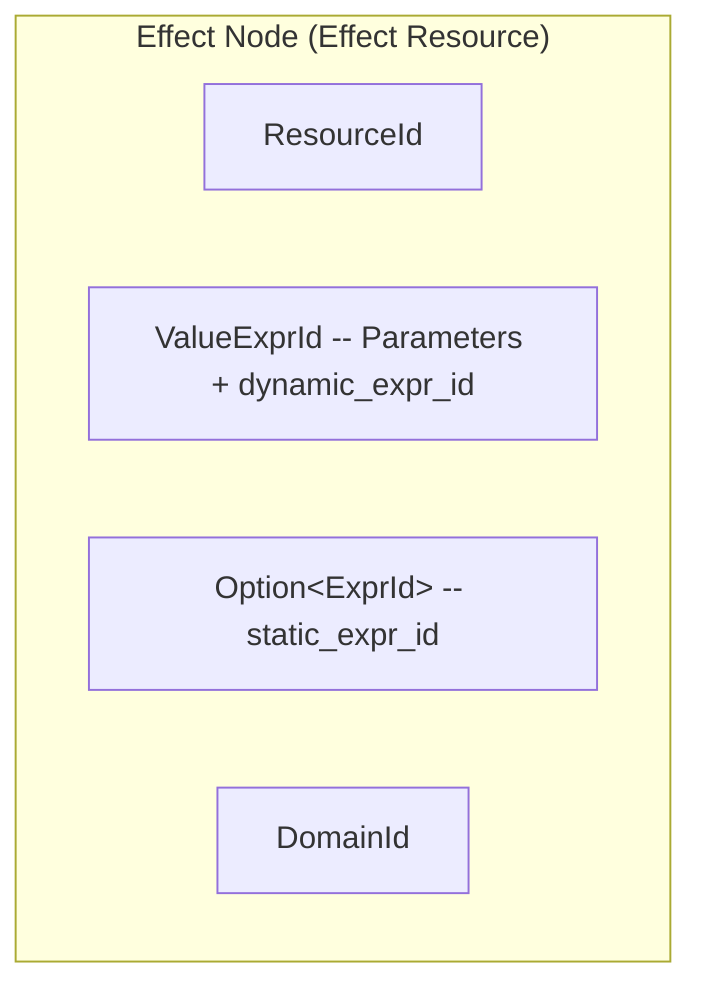
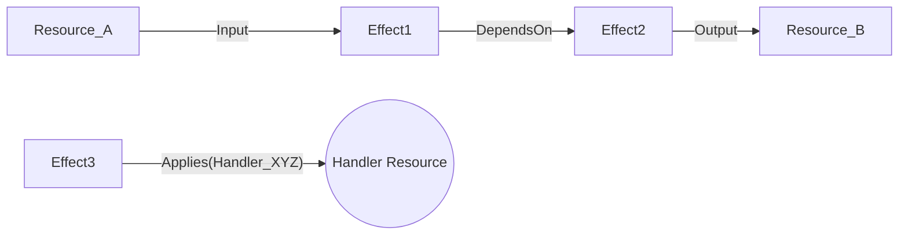

# TEL Graph Specification for OCaml DSL Implementers

This document provides a comprehensive specification for the Temporal Effect Language (TEL) graph. It is intended to guide OCaml DSL implementers in constructing the compile target correctly, representing essential structures and evaluation, and understanding how various system components interact with the TEL graph.

The Causality system uses the TEL graph as a central data structure for representing and executing effectful computations in a verifiable and deterministic manner.

## 1. Core Concepts of the TEL Graph

The TEL graph is a directed acyclic graph (DAG) where:

-   **Nodes represent Effects**: An Effect is an intention to perform an operation or achieve a state transformation. Effects are instances of "Effect Resources."
-   **Edges represent Relationships and Control Flow**: Edges define the dependencies, sequencing, and semantic relationships between Effects. They guide the evaluation process.
-   **Handlers define Logic Execution**: Handlers are specific pieces of logic (often "Handler Resources") that are responsible for processing or "interpreting" Effects based on the graph structure.

The entire graph, being composed of content-addressed components (Resources, `Expr`s, `ValueExpr`s), allows for verifiable computation. The process of evaluating the graph is deterministic.

## 2. Graph Components

### 2.1. Effects (Nodes)

An Effect is the fundamental unit of computation represented in the graph.

-   **Structure**:
    -   Is an **Effect Resource**. Recall from `docs/lisp/new_intro_system.md` that a Resource has an `id` (`ResourceId`), `value` (`ValueExprId`), `static_expr` (`Option<ExprId>`), and `domain`.
    -   The `value` of an Effect Resource often contains parameters for the effect and, crucially, may encapsulate a `dynamic_expr: ExprId`. This `dynamic_expr` represents the core logic to be executed for this Effect, often by a Handler.
    -   The `static_expr` of an Effect Resource is used for off-chain validation of the Effect's own structure and parameters.
-   **Role in Graph**:
    -   Represents a specific computation, state change, or interaction.
    -   Can consume input Resources and produce output Resources or new Effects.
-   **OCaml DSL Target**:
    -   Your DSL should allow users to define Effects, specifying their parameters (which will form the `ValueExpr`) and optionally their `dynamic_expr` and `static_expr`.
    -   The DSL should facilitate the creation of structures that can be serialized into the `Resource` format, particularly for Effect Resources.



### 2.2. Edges

Edges connect Effect nodes and define the structure and semantics of the computation.

-   **Structure**:
    -   Directed, connecting a source Effect to a target Effect or a source Effect to a Handler.
    -   Annotated with an `EdgeKind` that specifies the relationship.
-   **Key `EdgeKind` Types**:
    -   `Applies(HandlerId)`: Indicates that the `HandlerResource` identified by `HandlerId` should be applied to the source Effect node. The Handler's logic then processes the Effect.
    -   `DependsOn(EffectId)`: A simple dependency indicating that the source Effect cannot be processed until the target Effect (identified by `EffectId`) is completed.
    -   `ScopedBy(ScopeId)`: Indicates that the source Effect executes within a particular scope (e.g., a transactional scope, a capability scope).
    -   `Input(ResourceId, InputSemantic)`: Specifies a Resource that is an input to an Effect. `InputSemantic` could define how the input is used (e.g., `Consumed`, `ReadOnly`).
    -   `Output(ResourceId, OutputSemantic)`: Specifies a Resource that is an output of an Effect.
-   **Role in Graph**:
    -   Define control flow and data flow.
    -   Guide the Effect Graph Interpreter during evaluation.
-   **OCaml DSL Target**:
    -   Allow users to specify these relationships between Effects they define.
    -   Provide constructs for creating different `EdgeKind`s, especially `Applies` to link Effects to their Handlers, and `DependsOn` for sequencing.



### 2.3. Handlers (Handler Resources)

Handlers contain the executable logic that processes Effects.

-   **Structure**:
    -   Are **Handler Resources**.
    -   The `value` (`ValueExprId`) of a Handler Resource contains its configuration (e.g., which Effect types or domains it applies to) and, most importantly, a `dynamic_expr: ExprId`. This `dynamic_expr` is the Lisp code that implements the Handler's logic.
    -   The `static_expr` of a Handler Resource validates the Handler's own configuration.
-   **Role in Graph**:
    -   When an `Applies(HandlerId)` edge points from an Effect to a Handler, the Effect Graph Interpreter retrieves the Handler's `dynamic_expr`.
    -   This `dynamic_expr` is then evaluated by the `causality-lisp` interpreter within a context prepared by the Effect Graph Interpreter. This context includes details from the Effect being processed.
-   **OCaml DSL Target**:
    -   Enable the definition of Handlers, including their configuration and their core `dynamic_expr` logic.
    -   The DSL should facilitate the creation of Handler Resources.

## 3. Graph Evaluation (Effect Graph Interpreter)

The Effect Graph Interpreter is a component within `causality-runtime` responsible for traversing and reducing the TEL graph.

-   **Process**:
    1.  Starts from initial Effect nodes (those with no unresolved incoming dependencies).
    2.  Traverses the graph based on Edge semantics.
    3.  When it encounters an Effect node connected to a Handler via an `Applies` edge:
        a.  It prepares an execution context (see Section 4).
        b.  It invokes the `causality-lisp` interpreter to evaluate the Handler's `dynamic_expr` (or sometimes the Effect's own `dynamic_expr` if the model dictates direct execution).
    4.  The result of this Lisp evaluation can lead to:
        -   Creation of new Resources.
        -   Consumption/Nullification of existing Resources.
        -   Creation of new Effect nodes and Edges, extending the graph.
        -   Completion of the current Effect node.
    5.  The process continues until no more Effects can be processed.
-   **`InterpreterMode`**: The Effect Graph Interpreter can operate in different modes (e.g., `Evaluate`, `Validate`, `Prove`), which can affect:
    -   The set of available host functions for Lisp.
    -   Whether state changes are committed or simulated.
    -   Generation of witness data for ZK proofs.
-   **OCaml DSL Considerations**:
    -   While the OCaml DSL defines the graph structure, the evaluation is primarily a Rust runtime concern.
    -   However, understanding this process helps in designing `dynamic_expr` logic that interacts correctly with the expected evaluation context and produces meaningful results for graph reduction.

## 4. Context Provision for `Expr` Evaluation

When the Effect Graph Interpreter decides to evaluate an `Expr` (typically a Handler's `dynamic_expr` or an Effect's `dynamic_expr`), it uses the `causality-lisp` interpreter. This Lisp evaluation happens within a specific context.

-   **`LispHostEnvironment` (`causality-runtime`)**:
    -   Implements host functions (atomic combinators) accessible from Lisp.
    -   Provides access to runtime services like the `StateManager` (for Resource access).
-   **`ExprContextual` Trait (`causality-lisp`)**:
    -   The interface the Lisp interpreter expects from its environment.
    -   Provides `get_symbol` and `try_call_host_function`.
    -   `TelLispAdapter` in `causality-runtime` adapts `LispHostEnvironment` to this trait.
-   **`LispContextConfig` (`causality-runtime`)**:
    -   Configures the Lisp execution environment for each call.
    -   Specifies:
        -   **Host Function Profile**: Restricts or allows certain host functions (e.g., `"static_validation"` profile vs. a more permissive one).
        -   **Initial Bindings**: Pre-defined Lisp symbols.
            -   `*self-resource*`: Often bound to the `ValueExpr` of the Resource whose `Expr` (e.g., `static_expr`) is being evaluated. When a Handler's `dynamic_expr` is run, this might refer to the Handler Resource itself.
            -   `*effect-under-test*` (or similar): Could bind the `ValueExpr` of the Effect being processed by a Handler.
            -   `*args*`: General arguments passed to the Lisp evaluation.
-   **Influence of Effect Graph Interpreter's `Context`**:
    -   The broader context maintained by the Effect Graph Interpreter (e.g., currently visible/accessible Resources, active Scopes, completed Effects along the current path) heavily influences the `LispContextConfig` and the data retrievable via host functions.
-   **OCaml DSL Considerations for `dynamic_expr`**:
    -   When writing Lisp code for `dynamic_expr` (e.g., in Handlers), anticipate the kind of data that will be available via `(get-context-value "key")` or specific bindings like `*effect-under-test*`.
    -   The combinators available (e.g., for fetching Resources, checking effect completion) will depend on the host function profile active during graph evaluation. Refer to `docs/lisp/new_lisp_interpreter_combinators.md` for available combinators.

## 5. Resource Model Interaction

The TEL graph is deeply intertwined with the Resource model.

-   **`static_expr` Evaluation**:
    -   As defined in `docs/lisp/new_lisp_runtime_integration.md`, a Resource's `static_expr` is evaluated (typically off-chain, by `TelInterpreter` in `causality-runtime`) to validate the Resource's state (`ValueExpr`).
    -   This happens *before* a Resource is usually considered in the TEL graph or when its state is proposed for an update.
    -   The evaluation context is typically restricted, with `*self-resource*` bound to the Resource's `ValueExpr`.
-   **`dynamic_expr` Evaluation**:
    -   The `dynamic_expr` of an Effect or Handler Resource is evaluated *during* TEL graph processing by the Effect Graph Interpreter (using the `causality-lisp` interpreter).
    -   This logic drives the actual computation and transformation within the graph.
    -   The context is richer, potentially including data from the Effect being processed, other visible Resources, etc.
-   **Content-Addressing**:
    -   All components (`ResourceId`, `ValueExprId`, `ExprId`) are content-addressed. This ensures that any `Expr` (e.g., a `dynamic_expr`) defined by your OCaml DSL, once serialized and hashed to an `ExprId`, refers to an immutable piece of logic.
-   **OCaml DSL Target**:
    -   Your DSL must allow users to define both `static_expr` (for validation logic) and `dynamic_expr` (for runtime/graph logic) for the Resources they model (Effects, Handlers).
    -   The output of the DSL should be structures that can be serialized to `Expr` ASTs (and subsequently `ExprId`s) and `ValueExpr`s (and `ValueExprId`s).

## 6. Guidance for OCaml DSL Implementers

For OCaml developers creating a DSL that targets this TEL graph specification, consider the following:

-   **Representing Graph Components**: Determine how your DSL constructs will map to Effects (Effect Resources), Edges (and their `EdgeKind`), and Handlers (Handler Resources).
-   **Constructing `Expr`**: Your DSL will need to facilitate the creation of Lisp `Expr` structures, outputting them as S-expressions for `static_expr` and `dynamic_expr` fields. These S-expressions are then ingested by `causality-compiler`.
    -   This involves defining OCaml types that can represent the Lisp AST, as detailed in `ml_work/ocaml_dsl_harmonization.md`.
-   **Serialization and IDs**: A key aspect is how OCaml-defined logic (as S-expressions) integrates with the Rust-based runtime. The `causality-compiler` plays a crucial role:
    -   It ingests Lisp S-expressions generated by the OCaml DSL.
    -   It parses these into the canonical Rust `Expr` data structures and assigns them their definitive content-addressed `ExprId`s (using ssz serialization and hashing, as per `ml_work/serialization.md`).
    -   These `ExprId`s (and similarly derived `ResourceId`s, `ValueExprId`s) are what the TEL graph interpreter in `causality-runtime` uses.
    -   While the OCaml DSL might use S-expression based hashing for local content addressing during development, the runtime system relies on the ssz-derived IDs for all canonical graph components.
-   **Context Provision**: Understand how the `LispHostEnvironment` and `ExprContextual` traits will provide context to the Lisp `Expr`s your DSL generates. This might influence how users of your DSL declare dependencies or access state.
-   **Minimality and Expressiveness**: Aim for a DSL that is expressive yet minimal, allowing users to define complex TEL graph interactions without unnecessary verbosity.
-   **Mapping Documentation**: Ensure the mapping from your DSL constructs to the underlying TEL graph components (Effects, Edges, Handlers, and their associated `Expr`s and `ValueExpr`s) is clear and well-documented.

### 6.1. Illustrative OCaml DSL Example

This conceptual example shows how an OCaml DSL might leverage OCaml's native effect system to define operations that map to the TEL graph. The goal is to provide a high-level, idiomatic OCaml interface for users, which the DSL then translates into TEL graph structures.

```ocaml
(* --- OCaml DSL User Perspective --- *)

(* 1. Defining an Effect Resource (via an OCaml Effect Type) *)
(* This represents the user's intent, e.g., to transfer tokens. *)

type _ Effect.t += TransferToken : { from_account: string; to_account: string; amount: int } -> unit Effect.t

(* DSL TRANSLATION INSIGHT for the 'TransferToken' Effect Resource:

   When a user performs an instance of 'TransferToken' (e.g., Effect.perform (TransferToken {...})),
   the DSL translates this into the creation of an 'Effect Resource' in the TEL graph.

   - 'ResourceId': Derived from its content. This content, once represented as canonical Rust
     structures (likely after processing by `causality-compiler`), will have its definitive
     `ResourceId` (a ssz-derived hash) established by the Rust system.

   - 'ValueExpr': The parameters { from_account; to_account; amount } form its 'ValueExpr'.
     (e.g., a Lisp record: `(record (from_account "alice") (to_account "bob") (amount 100))`).

   - 'static_expr: Option<ExprId>':
     This Lisp expression validates the Effect's 'ValueExpr'. The OCaml DSL would allow
     defining this by writing an OCaml function. The DSL then translates this OCaml
     function into the corresponding Lisp S-expression for the `static_expr`.

     (* Assume the DSL provides a way to get a typed view of the Effect's parameters *)
     type transfer_token_params_view = { from_account: string; to_account: string; amount: int }

     let validate_transfer_params (params: transfer_token_params_view) : bool =
       (* The DSL provides OCaml functions that map to Lisp validation primitives *)
       Dsl.ExprAPI.is_valid_account_id params.from_account &&
       Dsl.ExprAPI.is_valid_account_id params.to_account &&
       Dsl.ExprAPI.is_positive_integer params.amount

     (* DSL TRANSLATION: The 'validate_transfer_params' OCaml function is compiled by
        the DSL into a Lisp S-expression, e.g.:
        (lambda (params_val) ; params_val is the ValueExpr of the Effect
          (and (is-valid-account-id (get-field params_val 'from_account))
               (is-valid-account-id (get-field params_val 'to_account))
               (is-positive-integer (get-field params_val 'amount))))
        This S-expression is then processed by `causality-compiler` to get an `ExprId`.
        The Lisp functions `is-valid-account-id`, `is-positive-integer`, `get-field` would
        be available in the static evaluation context.

        'dynamic_expr: Option<ExprId>':
            This Lisp expression defines the Effect's own runtime logic, if any.
            For 'TransferToken', this might be minimal if it primarily relies on a Handler.
            However, an Effect *could* have its own dynamic_expr. Example for a simpler Effect,
            again defined by writing an OCaml function that the DSL then translates:
     *)

      type _ Effect.t += SimpleLog : { message: string } -> unit Effect.t

      type simple_log_params_view = { message: string }

      let execute_simple_log (params: simple_log_params_view) : unit =
        (* DSL provides OCaml functions mapping to runtime Lisp operations *)
        Dsl.RuntimeAPI.log_message params.message

      (* DSL TRANSLATION: The 'execute_simple_log' OCaml function is compiled by the DSL
         into a Lisp S-expression, e.g.:
         (lambda (params_val) (runtime-log-operation (get-field params_val 'message)))
         This S-expression is then processed by `causality-compiler` to get an `ExprId`.
         'runtime-log-operation' would be a Lisp function available in the dynamic
         evaluation context, interacting with the StateManager or a logging service.

      (* For 'TransferToken', if its logic is fully delegated to a Handler, its own 'dynamic_expr'
         might be `None` or a no-op.
      *)

(* 2. Defining a Handler Resource (via OCaml logic and DSL registration) *)
(* This defines how 'TransferToken' effects are processed. *)

let token_transfer_logic ({ from_account; to_account; amount } : { from_account: string; to_account: string; amount: int }) : unit Lwt.t =
  (* This OCaml function represents the high-level logic. *)
  Lwt_io.printf "Attempting to transfer %d from %s to %s\n" amount from_account to_account
  >>= fun () ->
  Lwt_io.printf "Transfer successful (simulated).\n"
  >>= fun () ->
  Lwt.return_unit

(* DSL TRANSLATION INSIGHT for the Handler Resource processing 'TransferToken':

   The 'token_transfer_logic' OCaml function's intent is translated by the DSL into the
   'dynamic_expr' of a 'Handler Resource'.

   - 'ResourceId': Derived from the Handler's definition content.

   - 'ValueExpr': Could contain configuration for the Handler itself (e.g., supported networks,
     transaction fee rates). For this example, let's assume it's minimal or empty if the
     Handler is not further configurable beyond its core logic.

   - 'static_expr: Option<ExprId>':
     Validates the Handler's own 'ValueExpr' (its configuration). Example:

     type token_handler_config_view = { network_config: string; fee_rate_bps: int }

     let validate_handler_config (config: token_handler_config_view) : bool =
       Dsl.ExprAPI.is_valid_network_config config.network_config &&
       Dsl.ExprAPI.is_non_negative_integer config.fee_rate_bps

     (* DSL TRANSLATION: Similar to the Effect's static_expr, this OCaml function
        is compiled by the DSL into a Lisp S-expression for validation.
        E.g.: (lambda (config_val) (and ...))

        'dynamic_expr: ExprId':
            This is the core logic. The OCaml 'token_transfer_logic' function (shown earlier)
            is translated by the DSL into a Lisp S-expression.
            This S-expression is then processed by `causality-compiler` to get an `ExprId`.
            This Lisp `Expr` (identified by its `ExprId`) uses Lisp combinators to interact with the
            StateManager, access/update account Resources, and produce new Effects, mirroring the
            OCaml logic's intent.
            A conceptual, highly simplified Lisp S-expression snippet derived from `token_transfer_logic`
            might look like:

     (sequence
        (let ((from (get-resource (effect-param 'from_account)))
              (to (get-resource (effect-param 'to_account)))
              (amount (effect-param 'amount)))
          (comment "... Lisp logic to check balances, update resources, create new versions ...")
          (update-resource (calculate-new-from-account from amount))
          (update-resource (calculate-new-to-account to amount))
          (emit-effect 'TransferReceipt (record (from_orig from) (to_orig to) (amount_val amount)))))

     (Note: `effect-param` would be a way to access the parameters of the Effect being handled.)
*)

(* Registering the handler for the effect type with the DSL *)
(* The DSL would provide a mechanism like this, associating the OCaml effect type
   with the OCaml logic whose translation becomes the Handler's dynamic_expr: *)
(* dsl_register_handler TransferToken token_transfer_logic; *)

(* 3. Using the Effect in a Computation *)
(* This is how a user of the OCaml DSL would typically write their business logic,
   performing effects as defined by the DSL. *)

let my_business_logic () : unit Lwt.t =
  Lwt_io.printf "Starting business logic execution...\n"
  >>= fun () ->
  (* User performs the high-level OCaml effect, e.g., to transfer tokens *)
  Effect.perform (TransferToken { from_account = "Alice"; to_account = "Bob"; amount = 100 });
  Lwt_io.printf "First TransferToken effect performed. Continuing...\n"
  >>= fun () ->
  Effect.perform (SimpleLog { message = "Processed first transfer" });
  Lwt_io.printf "SimpleLog effect performed.\n"
  >>= fun () ->
  Effect.perform (TransferToken { from_account = "Charlie"; to_account = "Dave"; amount = 50 });
  Lwt_io.printf "Second TransferToken effect performed. Logic complete.\n"
  >>= fun () ->
  Lwt.return_unit

(* 4. DSL Runtime: Intercepting and Translating OCaml Effects to TEL Graph Operations *)

(* The OCaml DSL implementer would provide a way to run user computations
   such that the DSL's defined OCaml effects are intercepted and processed.
   This typically involves using OCaml's effect handlers. *)

let run_computation_with_dsl_handling (computation: unit -> unit Lwt.t) : unit Lwt.t =
  Effect.Deep.match_with computation () {
    retc = Lwt.return; (* How to handle the final return value of the computation *)
    exnc = Lwt.fail;   (* How to handle exceptions from the computation *)

    effc = fun (type a) (eff: a Effect.t) (k: (a, unit Lwt.t) Effect.Deep.continuation) ->
      match eff with
      | TransferToken ({ from_account; to_account; amount } as payload) ->
          (* DSL INTERCEPTION & TEL GRAPH INTERACTION INSIGHT:
             When the OCaml 'TransferToken' effect is performed by user code:

             1. DSL Interception: This 'effc' handler (part of the DSL's runtime)
                intercepts the OCaml effect.

             2. Effect Resource Creation/Identification:
                - The DSL translates this specific 'TransferToken' instance (with its payload)
                  into a TEL 'Effect Resource'.
                - Its 'ValueExpr' would encapsulate { from_account; to_account; amount }.
                - Its 'static_expr' (if defined, like 'validate_transfer_params') would be
                  associated for validation.
                - A 'ResourceId' is determined (e.g., content-addressed hash of its ValueExpr
                  and static_expr, eventually canonicalized by the Rust side).

             3. Handler Identification & 'Applies' Edge:
                - The DSL identifies the 'Handler Resource' responsible for 'TransferToken'
                  effects (e.g., based on a prior 'dsl_register_handler' call that associated
                  the 'TransferToken' OCaml effect type with the OCaml 'token_transfer_logic').
                - This implies an 'Applies(HandlerResourceId)' edge in the TEL graph, linking
                  this new Effect Resource to the identified Handler Resource.

             4. Triggering Handler's 'dynamic_expr':
                - The TEL graph interpreter (in causailty-runtime) eventually processes this
                  Effect Resource. Noticing the 'Applies' edge, it retrieves the 'dynamic_expr'
                  (the Lisp code translated from 'token_transfer_logic') of the Handler Resource.
                - This Lisp 'dynamic_expr' is then evaluated. The `payload` of the Effect
                  is made available to this Lisp code (e.g., via a special `*effect-under-test*`
                  binding or `(effect-param ...)` combinators).

             5. Execution and State Change:
                - The Handler's Lisp code executes, interacting with the StateManager (via host
                  functions) to perform the actual state changes (e.g., updating account balances
                  by creating new Resource versions for accounts) and potentially producing
                  new Effects (like a 'TransferReceipt' effect).

             For this illustrative example, we'll simulate the DSL's action by logging and then
             calling the OCaml logic directly. In a real DSL, this point is where the hand-off
             to the TEL graph representation and eventually the Rust runtime occurs.
          *)
          Some (Effect.Deep.continue k (fun () ->
            Lwt_io.printf "[DSL Runtime] Intercepted TransferToken: From %s to %s, Amount %d. Handing off to TEL graph processing (simulated by calling OCaml logic).\n"
              from_account to_account amount
            >>= fun () ->
            (* In a real system, the TEL graph interpreter runs the Handler's Lisp dynamic_expr.
               Here, we directly call the OCaml function for simplicity of this OCaml-focused example. *)
            token_transfer_logic payload
          ))

      | SimpleLog { message } ->
          (* DSL INTERCEPTION & TEL GRAPH INTERACTION INSIGHT for SimpleLog:
             1. DSL Interception: Catches 'SimpleLog'.
             2. Effect Resource Creation: Translates into a TEL 'Effect Resource' for 'SimpleLog'.
                - 'ValueExpr' contains { message }.
                - Its 'dynamic_expr' (translated from 'execute_simple_log') is associated.
             3. Direct Execution (Potentially): If this Effect has its own 'dynamic_expr' and
                doesn't rely on a separate Handler (i.e., no 'Applies' edge to a distinct
                Handler Resource specifically for SimpleLog), the TEL graph interpreter might
                evaluate this Effect's *own* 'dynamic_expr'.
          *)
          Some (Effect.Deep.continue k (fun () ->
            Lwt_io.printf "[DSL Runtime] Intercepted SimpleLog: '%s'. Handing off to TEL graph processing (simulated).\n" message
            >>= fun () ->
            let params_view = { message } in (* Construct the view for the OCaml function *)
            execute_simple_log params_view; (* OCaml function call for simulation *)
            Lwt.return_unit
          ))
      | _ -> None (* Pass other effects up the handler chain, or error if unhandled *)
  }

(* Example of how the user's computation would be run by the DSL implementer's framework: *)
(*
let () =
  Lwt_main.run (run_computation_with_dsl_handling my_business_logic)
*)
```

## 4. OCaml Algebraic Effects and the TEL Graph

OCaml's native algebraic effect system provides a powerful way to manage side-effects by separating the specification of effectful operations from their handling. This aligns well with the TEL graph's philosophy of representing effects and their interpretations explicitly. For OCaml DSL implementers, understanding this mapping is key to translating OCaml code into well-structured and verifiable TEL graphs.

### 4.1. From OCaml `perform` to TEL Effect Resources

In OCaml, an effect is performed using `Effect.perform <MyEffectConstructor>`. This action signals an intent to carry out an operation.

-   **Mapping to TEL**: Each `Effect.perform` instance translates directly into the creation of an **Effect Resource** node in the TEL graph.
    -   The OCaml effect constructor (e.g., `TransferToken { from_account; to_account; amount }`) and its arguments become the `value` (specifically, the `ValueExprId` pointing to the parameters) of the TEL Effect Resource.
    -   The `static_expr` of this Effect Resource can be derived from any static validation logic associated with the OCaml effect definition.
    -   If the OCaml effect has self-contained logic (less common when a dedicated handler is expected), this logic can be compiled into the `dynamic_expr` of the Effect Resource itself.

### 4.2. OCaml Effect Handlers and TEL Handler Resources

OCaml effect handlers (`Effect.Deep.match_with` or similar constructs) define how specific effects are to be processed. They typically include cases for normal return values (`retc`), exceptions (`exnc`), and specific effect operations (`effc`).

-   **Mapping to TEL**: An OCaml effect handler corresponds to one or more **Handler Resources** in the TEL graph.
    -   The `effc` case in an OCaml handler, which contains the logic for a specific effect (e.g., `TransferToken`), is translated by the DSL into the `dynamic_expr` of a TEL Handler Resource. This Lisp expression embodies the core execution logic.
    -   The `static_expr` of the Handler Resource can validate the handler's configuration or any static properties.
    -   The DSL's mechanism for registering a handler for a particular OCaml effect type (e.g., `dsl_register_handler MyEffectType my_handler_logic`) is responsible for creating the appropriate Handler Resource and establishing an `Applies(HandlerId)` edge (or similar relationship) in the TEL graph, linking the Effect type (or instances) to this Handler.

### 4.3. Continuations and TEL Graph Evaluation

A key feature of OCaml's algebraic effects is the concept of **continuations** (the `k` in `effc`). When an effect is performed, the execution pauses, and the handler receives the effect along with a continuation representing the rest of the computation. The handler can then choose to resume the computation using `continue k value`, or abort it using `discontinue k exception`.

A crucial aspect of OCaml (version 5.x) continuations is their **linearity**: each captured continuation must be resumed (via `continue` or `discontinue`) **exactly once**. Attempting to resume a continuation multiple times will result in a runtime error (e.g., `Continuation_already_resumed`), and failing to resume it can lead to resource leaks. This linearity is a design choice in OCaml, partly for performance (avoiding stack copying) and for managing linear resources like file descriptors more predictably.

-   **Mapping to TEL**:
    -   The TEL graph's evaluation model inherently supports a form of controlled continuation. When an Effect node is processed, its `dynamic_expr` (or that of its designated Handler) is evaluated.
    -   This Lisp evaluation occurs within a context that allows interaction with the state manager and the ability to trigger further effects (i.e., follow edges or create new Effect nodes).
    -   While the TEL graph doesn't expose raw OCaml-style continuations directly within its Lisp dialect, the sequence of effect evaluation, handler invocation, and state updates orchestrated by the TEL interpreter effectively manages the flow of computation. This mirrors how continuations direct control flow in OCaml.
    -   The DSL implementer's primary concern is to ensure that the OCaml handler logic (which uses continuations) is translated into a Lisp `dynamic_expr` that correctly implements the intended state changes and subsequent operations, respecting the **single, linear execution path** implied by OCaml's continuation model for any given effect instance. This might involve structuring the Lisp code to mimic sequential steps, conditional logic (based on the effect's payload), or further effect emissions, all corresponding to the single resumption of the OCaml continuation.

### 4.4. Typed Effects and DSL Design

The lecture highlights OCaml's typed effect system, where function signatures can declare the effects they might perform (e.g., `unit -> int [Get : string -> int]`). This provides static guarantees about what effects a piece of code might raise.

-   **Implications for DSL and TEL Graph**:
    -   While the TEL graph itself is not directly typed in the OCaml sense, the OCaml DSL can leverage this type information.
    -   The DSL can use OCaml's effect types to guide the translation process, ensuring that the correct Effect Resources and Handler Resources are instantiated and linked.
    -   For example, if an OCaml function is typed to perform `TransferTokenEffect`, the DSL knows to create a TEL Effect Resource corresponding to `TransferToken`.
    -   The clarity provided by OCaml's effect signatures helps in defining clear boundaries and responsibilities for different parts of the computation, which should be reflected in the modularity of the generated TEL graph (e.g., distinct Handler Resources for distinct OCaml effects).
    -   The goal is not to replicate OCaml's type system within the TEL graph's Lisp, but rather to use the static information from OCaml to construct a more robust, predictable, and verifiable TEL graph.

By understanding these mappings, DSL implementers can more effectively bridge the expressive power of OCaml's algebraic effects with the deterministic and verifiable execution model of the TEL graph.

### Summary for OCaml DSL Implementer:
- Your DSL provides OCaml functions/types for users to define their operations (like `TransferToken` Effect type) and their parameters.
- Users write OCaml functions for static validation (e.g., `validate_transfer_params`) and for dynamic runtime logic (e.g., `token_transfer_logic` for a Handler, or `execute_simple_log` for an Effect's own logic).
- Your DSL is responsible for translating:
  - OCaml effect performances (e.g., `Effect.perform (TransferToken {...})`) into TEL 'Effect Resources', including their `ValueExpr` and associated `static_expr` / `dynamic_expr` (as `ExprId`s).
  - OCaml validation functions into Lisp S-expressions for the `static_expr` of Resources.
  - OCaml handler logic functions (like `token_transfer_logic`) into Lisp S-expressions for the `dynamic_expr` of 'Handler Resources'.
  - OCaml functions for an Effect's own logic (like `execute_simple_log`) into Lisp S-expressions for the `dynamic_expr` of 'Effect Resources'.
  - The association between an OCaml effect type and its OCaml handler logic (e.g., via `dsl_register_handler`) into 'Applies(HandlerId)' edges in the TEL graph.
- The `causality-compiler` ingests these S-expressions, converting them to Rust `Expr` structures and assigning definitive `ExprId`s.
- The actual execution of the core logic (token transfers, state changes) happens when the TEL graph interpreter (in `causality-runtime`) evaluates the Lisp `dynamic_expr` of the relevant Handler or Effect Resource, within a context that provides access to state and other effects.

By adhering to this specification, OCaml DSL implementers can ensure that the TEL graphs they help users construct are compatible with the Causality system's runtime, evaluation model, and verifiability requirements.