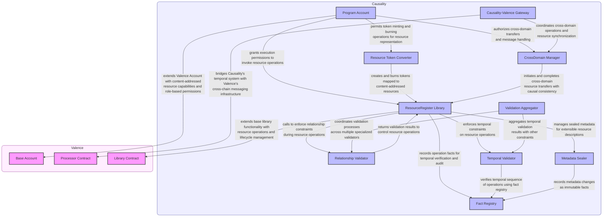
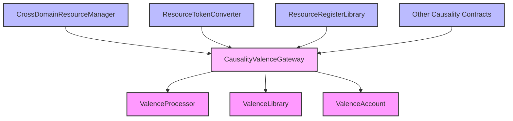

# Causality + Valence Protocol Integration

Causality is an integrated compiler and runtime for distributed programs that enables creating cross-chain operations with causal consistency, resource safety, and verifiable execution. The integration we will enhance Valence's capabilities with Causality's algebraic effects system, causal time model, and content-addressed resource management. This integration brings deterministic resource handling, temporal consistency, and verifiable execution to Valence's cross-chain infrastructure, while maintaining compatibility with its existing account abstraction and messaging protocols.

Our approach to integrating with Valence is non-destructive and modular. Instead of modifying Valence's core protocols, we extend its functionality through a series of specialized contracts that implement our resource model and effect system. These contracts act as a bridge layer between Valence's infrastructure and our causality system, allowing us to leverage Valence's cross-chain messaging and account management while adding our advanced features. The integration is designed to be upgradeable and maintainable, with clear separation of concerns between Valence's core functionality and our extensions.

## Architecture

The Causality integration with Valence is structured in layers, with Causality components building on Valence's infrastructure:



This document outlines how we can integrate our system with the Valence Protocol's Solidity implementation, making it the on-chain anchor for our cross-chain architecture while requiring no changes to the Valence protocol itself.

## Integration Overview

The integration leverages Valence's existing infrastructure for cross-chain communication and account management, while extending it with Causality's ResourceRegister model and content-addressed storage system.

### Key Integration Points:

1. **Account**: Utilize Valence's Account system as the user entry point
2. **Processor**: Extend the Processor for handling cross-domain resource operations 
3. **Library**: Create new library contracts for ResourceRegister operations
4. **Token Standard**: Implement ERC-1155 Multi-Token Standard for on-chain resource representation

## Implementation Approach

### 1. ResourceRegister Library Contract

The ResourceRegisterLibrary implements the core ResourceRegister model as a Valence Library contract, allowing it to be used with Valence Accounts. It manages the creation, updating, and consumption of content-addressed resource registers, tracking their lifecycle states and maintaining their immutable properties. The library utilizes content addressing through cryptographic hashing to ensure deterministic resource IDs and supports various operation types like locking, unlocking, and consumption.

Within the causality system, this library serves as the on-chain anchor for our content-addressed resources. It bridges the gap between our ResourceRegister model and Valence's account abstraction, enabling our system to leverage Valence's cross-chain capabilities while maintaining the integrity of our content-addressed approach. Each resource operation in the causality system is mapped to corresponding operations in this library, with content IDs serving as the shared identifier across both systems.

```solidity
// SPDX-License-Identifier: Apache-2.0
pragma solidity ^0.8.28;

import {Library} from "./Library.sol";
import {Account} from "../accounts/Account.sol";
import {IERC20} from "forge-std/src/interfaces/IERC20.sol";

/**
 * @title ResourceRegisterLibrary
 * @dev Library for managing ResourceRegisters within the Valence ecosystem
 */
contract ResourceRegisterLibrary is Library {
    struct ResourceRegister {
        bytes32 id;              // ContentId of the register
        bytes32 resourceLogic;   // Logic hash defining behavior
        uint8 fungibilityDomain; // Domain for fungibility rules
        uint256 quantity;        // Quantity for fungible resources
        uint8 state;             // Lifecycle state (active, locked, etc.)
        bytes32 nullifierId;     // For consumption tracking
        bytes metadata;          // Additional resource metadata
    }
    
    struct ResourceOperation {
        uint8 operationType;     // Register, Update, Lock, etc.
        bytes32 targetId;        // Target resource ContentId
        bytes32[] inputs;        // Input resource IDs
        bytes32[] outputs;       // Output resource IDs
        bytes proof;             // Optional ZK proof
    }
    
    // Map of ContentId to ResourceRegister
    mapping(bytes32 => ResourceRegister) public registers;
    
    // Reference to the SMT verifier contract
    address public smtVerifier;
    
    // Current state root
    bytes32 public stateRoot;
    
    // Configuration for this library
    struct LibraryConfig {
        Account inputAccount;
        address verifier;        // Optional ZK verifier
        address smtVerifier;     // SMT verifier contract
    }
    
    LibraryConfig public config;
    
    // Events
    event ResourceConsumed(bytes32 indexed resourceId, bytes32 nullifierId);
    event StateRootUpdated(bytes32 oldRoot, bytes32 newRoot);
    
    constructor(
        address _owner,
        address _processor,
        bytes memory _config
    ) Library(_owner, _processor, _config) {
        LibraryConfig memory decoded = validateConfig(_config);
        config = decoded;
        smtVerifier = decoded.smtVerifier;
    }
    
    function validateConfig(bytes memory _config) internal pure returns (LibraryConfig memory) {
        LibraryConfig memory decodedConfig = abi.decode(_config, (LibraryConfig));
        require(address(decodedConfig.inputAccount) != address(0), "Invalid input account");
        require(address(decodedConfig.smtVerifier) != address(0), "Invalid SMT verifier");
        return decodedConfig;
    }
    
    function createRegister(
        bytes32 resourceLogic,
        uint8 fungibilityDomain,
        uint256 quantity,
        bytes calldata metadata
    ) external onlyProcessor returns (bytes32) {
        bytes32 id = generateContentId(resourceLogic, fungibilityDomain, quantity, metadata);
        
        require(registers[id].id == bytes32(0), "Register already exists");
        
        registers[id] = ResourceRegister({
            id: id,
            resourceLogic: resourceLogic,
            fungibilityDomain: fungibilityDomain,
            quantity: quantity,
            state: 1, // Active
            nullifierId: bytes32(0),
            metadata: metadata
        });
        
        return id;
    }
    
    /**
     * @dev Check if a resource has been consumed using the SMT
     * @param resourceId The resource ID to check
     * @return Whether the resource has been consumed
     */
    function isResourceConsumed(bytes32 resourceId) public view returns (bool) {
        // The key for a nullifier in the SMT has a special prefix
        bytes32 nullifierKey = keccak256(abi.encodePacked("nullifier:", resourceId));
        
        // Use the SMT verifier to check if this nullifier exists in the tree
        // In a real implementation, we would generate and verify a proof
        // This is a simplified placeholder
        bytes memory proof = generateProof(nullifierKey);
        return verifyProof(stateRoot, nullifierKey, bytes("1"), proof);
    }
    
    function updateRegister(
        bytes32 id,
        ResourceOperation calldata operation
    ) external onlyProcessor returns (bool) {
        require(registers[id].id != bytes32(0), "Register not found");
        require(!isResourceConsumed(id), "Register already consumed");
        
        // Apply the operation based on type
        if (operation.operationType == 1) { // Update
            // Update the register properties
            // ...
        } else if (operation.operationType == 2) { // Lock
            registers[id].state = 2; // Locked
        } else if (operation.operationType == 3) { // Unlock
            registers[id].state = 1; // Active
        } else if (operation.operationType == 4) { // Consume
            registers[id].state = 5; // Consumed
            
            // Generate nullifier for this resource
            bytes32 nullifierId = keccak256(abi.encodePacked(id, block.number));
            registers[id].nullifierId = nullifierId;
            
            // Mark as nullified in the SMT instead of using a separate mapping
            bytes32 nullifierKey = keccak256(abi.encodePacked("nullifier:", id));
            
            // In a real implementation, we would:
            // 1. Generate a proof for adding this nullifier to the SMT
            // 2. Update the SMT root with the new nullifier
            // 3. Verify the proof
            bytes32 oldRoot = stateRoot;
            bytes32 newRoot = updateTreeWithNullifier(nullifierKey);
            stateRoot = newRoot;
            
            // Emit events
            emit ResourceConsumed(id, nullifierId);
            emit StateRootUpdated(oldRoot, newRoot);
        }
        
        return true;
    }
    
    function transferRegister(
        bytes32 id,
        address destinationAccount
    ) external onlyProcessor returns (bool) {
        // Implement cross-account register transfer logic
        // This would likely involve creating a new register in the destination account
        // and nullifying the original
        return true;
    }
    
    /**
     * @dev Generate a proof for inclusion/exclusion in the SMT
     * @param key The key to generate a proof for
     * @return The proof bytes
     */
    function generateProof(bytes32 key) internal view returns (bytes memory) {
        // In a real implementation, this would call into a service
        // that generates SMT proofs
        return new bytes(0); // Placeholder
    }
    
    /**
     * @dev Verify a proof against the current state root
     * @param root The state root to verify against
     * @param key The key being proven
     * @param value The value being proven
     * @param proof The proof data
     * @return Whether the proof is valid
     */
    function verifyProof(
        bytes32 root,
        bytes32 key,
        bytes memory value,
        bytes memory proof
    ) internal view returns (bool) {
        // In a real implementation, this would call the SMT verifier contract
        // return ISmtVerifier(smtVerifier).verify(root, key, value, proof);
        return false; // Placeholder
    }
    
    /**
     * @dev Update the SMT with a new nullifier
     * @param nullifierKey The nullifier key to add
     * @return The new state root
     */
    function updateTreeWithNullifier(bytes32 nullifierKey) internal returns (bytes32) {
        // In a real implementation, this would:
        // 1. Take the current state root
        // 2. Insert the nullifier into the tree
        // 3. Generate a new state root
        // 4. Return the new state root
        
        // For now, we just return a dummy value
        return keccak256(abi.encodePacked(stateRoot, nullifierKey));
    }
    
    // Additional ResourceRegister operations...
    
    function generateContentId(
        bytes32 resourceLogic,
        uint8 fungibilityDomain,
        uint256 quantity,
        bytes memory metadata
    ) internal pure returns (bytes32) {
        return keccak256(abi.encodePacked(resourceLogic, fungibilityDomain, quantity, metadata));
    }
}
```

### 2. Cross-Domain Manager Contract

The CrossDomainResourceManager contract provides specialized functionality for managing resources across different blockchain domains. It tracks resource transfers between chains, maintains the state of cross-domain transfers, and ensures resources maintain their semantic meaning and relationships when bridged across domains. The contract implements comprehensive state management for transfers, including pending, completed, failed, and canceled states, and provides hooks for domain-specific validation and processing.

In the integration architecture, the CrossDomainResourceManager handles the critical task of ensuring resource consistency and security across different blockchain domains. When a resource needs to be transferred from one domain to another, this contract locks the resource in the source domain, then coordinates with the Gateway to handle the cross-chain messaging. The Gateway then communicates with its counterpart in the target domain to recreate the resource with the same properties.

```solidity
// SPDX-License-Identifier: Apache-2.0
pragma solidity ^0.8.28;

import {ResourceRegisterLibrary} from "./libraries/resources/ResourceRegisterLibrary.sol";
import {ICrossDomainResourceManager} from "./interfaces/ICrossDomainResourceManager.sol";
import {IResourceRegister} from "./interfaces/IResourceRegister.sol";
import {ValidationAggregator} from "./libraries/resources/ValidationAggregator.sol";

/**
 * @title CrossDomainResourceManager
 * @dev Manages resources across different blockchain domains
 * 
 * This contract provides specialized functionality for transferring and
 * tracking resources across different domains, ensuring resource consistency
 * and proper state management throughout the transfer process.
 * 
 * Note: All interactions with Valence's cross-chain messaging are handled through 
 * the CausalityValenceGateway which serves as the single point of contact with Valence.
 */
contract CrossDomainResourceManager is ICrossDomainResourceManager {
    // Resource library reference
    ResourceRegisterLibrary public resourceLibrary;
    
    // Validation aggregator reference
    ValidationAggregator public validator;
    
    // Gateway reference
    address public gatewayAddress;
    
    // Domain-specific hooks (domain ID -> hook address)
    mapping(uint256 => address) public domainHooks;
    
    // Transfer tracking (transfer ID -> transfer)
    mapping(bytes32 => ResourceTransfer) public transfers;
    
    // Resource to active transfers mapping
    mapping(bytes32 => bytes32[]) public resourceTransfers;
    
    // Domain to transfers mapping
    mapping(uint256 => bytes32[]) public domainTransfers;
    
    // Modifier to restrict access to the gateway
    modifier onlyGateway() {
        require(msg.sender == gatewayAddress, "Caller is not the gateway");
        _;
    }
    
    // Events
    event GatewayUpdated(address previousGateway, address newGateway);
    event DomainHookSet(uint256 indexed domainId, address hookAddress);
    event TransferInitiated(bytes32 indexed transferId, bytes32 resourceId, uint256 sourceDomain, uint256 targetDomain);
    event TransferStatusUpdated(bytes32 indexed transferId, TransferStatus status);
    event TransferCompleted(bytes32 indexed transferId, bytes32 newResourceId);
    
    /**
     * @dev Constructor
     * @param _resourceLibrary ResourceRegisterLibrary address
     * @param _validator ValidationAggregator address
     * @param _gateway CausalityValenceGateway address
     */
    constructor(address _resourceLibrary, address _validator, address _gateway) {
        resourceLibrary = ResourceRegisterLibrary(_resourceLibrary);
        validator = ValidationAggregator(_validator);
        gatewayAddress = _gateway;
    }
    
    /**
     * @dev Update the gateway address
     * @param _gateway New gateway address
     */
    function setGateway(address _gateway) external {
        require(_gateway != address(0), "Invalid gateway address");
        address previousGateway = gatewayAddress;
        gatewayAddress = _gateway;
        emit GatewayUpdated(previousGateway, _gateway);
    }
    
    /**
     * @dev Set domain-specific hook
     * @param domainId Domain identifier
     * @param hookAddress Hook contract address
     */
    function setDomainHook(uint256 domainId, address hookAddress) external {
        domainHooks[domainId] = hookAddress;
        emit DomainHookSet(domainId, hookAddress);
    }
    
    /**
     * @dev Transfer a resource to another domain (only callable by gateway)
     * @param resourceId Resource to transfer
     * @param sourceDomain Source domain ID
     * @param targetDomain Target domain ID
     * @param targetAccount Target account in destination domain
     * @param metadata Additional transfer metadata
     * @return Transfer ID
     */
    function transferResource(
        bytes32 resourceId,
        uint256 sourceDomain,
        uint256 targetDomain,
        address targetAccount,
        bytes calldata metadata
    ) external override onlyGateway returns (bytes32) {
        // Function implementation remains largely the same, but now
        // the actual cross-chain communication is handled by the Gateway
        // ...
    }
    
    // ... rest of the contract ...
}
```

### 3. Relationship Validation Extension

The RelationshipValidator contract implements constraint validation for relationships between ResourceRegisters. It defines various relationship types (ownership, dependency, reference, etc.) and stores relationship data between resources. The validation logic enforces rules based on relationship type and operation, ensuring that operations on resources respect the constraints imposed by their relationships with other resources.

In the causality system, this contract implements our relationship validation framework directly on-chain, providing a validation layer for ResourceRegister operations. It ensures that operations like consumption or archiving maintain the integrity of relationship constraints, matching the relationship validation effects in our core causality framework. When the system performs operations on resources, the RelationshipValidator enforces rules like dependency checks, ensuring that these operations comply with the relationship constraints defined in our model.

```solidity
// SPDX-License-Identifier: Apache-2.0
pragma solidity ^0.8.28;

import {ResourceRegisterLibrary} from "./ResourceRegisterLibrary.sol";

/**
 * @title RelationshipValidator
 * @dev Extension to validate relationships between resources
 */
contract RelationshipValidator {
    ResourceRegisterLibrary public registerLibrary;
    
    // Relationship types
    enum RelationshipType {
        Ownership,
        Dependency,
        Reference,
        Mirror,
        Bridge
    }
    
    struct Relationship {
        bytes32 sourceId;
        bytes32 targetId;
        RelationshipType relationshipType;
        bool active;
    }
    
    // Relationships storage
    mapping(bytes32 => Relationship[]) public relationshipsByResource;
    
    constructor(address _registerLibrary) {
        registerLibrary = ResourceRegisterLibrary(_registerLibrary);
    }
    
    function createRelationship(
        bytes32 sourceId,
        bytes32 targetId,
        RelationshipType relationshipType
    ) external returns (bool) {
        // Validate both resources exist
        // ...
        
        // Create the relationship
        relationshipsByResource[sourceId].push(Relationship({
            sourceId: sourceId,
            targetId: targetId,
            relationshipType: relationshipType,
            active: true
        }));
        
        return true;
    }
    
    function validateOperation(
        bytes32 resourceId,
        uint8 operationType
    ) external view returns (bool) {
        // Get all relationships for this resource
        Relationship[] storage relationships = relationshipsByResource[resourceId];
        
        // Validate based on relationships
        for (uint i = 0; i < relationships.length; i++) {
            if (!relationships[i].active) continue;
            
            // For example, if consuming a resource, validate all dependencies are also consumed
            if (operationType == 4) { // Consume
                if (relationships[i].relationshipType == RelationshipType.Dependency) {
                    // Check that dependent resource is also being consumed
                    // ...
                }
            }
        }
        
        return true;
    }
}
```

### 4. ERC-1155 Token Converter

The ResourceTokenConverter contract provides a standard ERC-1155 interface for interacting with ResourceRegisters, enabling compatibility with wallets, exchanges, and other blockchain tools. It maintains bidirectional mappings between token IDs and resource IDs, mints tokens when resources are created, and burns tokens when resources are consumed. The contract also includes functionality for wrapping ERC20 tokens into ResourceRegisters and unwrapping them, bridging traditional token standards with our content-addressed ResourceRegister model.

In the causality system, this converter serves as the interface layer between our content-addressed resources and standard blockchain token ecosystems. It allows our ResourceRegisters to be represented as standard tokens that can be held in wallets, traded on exchanges, and used in other DeFi protocols, while maintaining their connection to our underlying resource model. When operations are performed on tokens through the ERC-1155 interface, they are translated into corresponding ResourceRegister operations in our system, ensuring that both representations remain synchronized.

```solidity
// SPDX-License-Identifier: Apache-2.0
pragma solidity ^0.8.28;

import {Library} from "./Library.sol";
import {Account} from "../accounts/Account.sol";
import {ERC1155} from "@openzeppelin/contracts/token/ERC1155/ERC1155.sol";
import {IERC20} from "@openzeppelin/contracts/token/ERC20/IERC20.sol";

/**
 * @title ResourceTokenConverter
 * @dev Converts ResourceRegisters to the ERC-1155 standard for on-chain representation
 */
contract ResourceTokenConverter is ERC1155, Library {
    ResourceRegisterLibrary public registerLibrary;
    
    // Mapping from token ID to original resource ID
    mapping(uint256 => bytes32) public tokenToResource;
    
    // Mapping from resource ID to token ID
    mapping(bytes32 => uint256) public resourceToToken;
    
    // Next available token ID
    uint256 private nextTokenId = 1;
    
    // Track deposits of ERC20 tokens
    mapping(address => mapping(bytes32 => uint256)) public tokenDeposits;
    
    constructor(
        address _owner,
        address _processor,
        address _registerLibrary,
        string memory _uri
    ) ERC1155(_uri) Library(_owner, _processor, bytes("")) {
        registerLibrary = ResourceRegisterLibrary(_registerLibrary);
    }
    
    /**
     * @dev Create token representation of a ResourceRegister
     * @param resourceId The ID of the resource register
     * @param to The recipient of the tokens
     * @param amount The amount of tokens to mint
     */
    function createTokenForResource(
        bytes32 resourceId,
        address to,
        uint256 amount
    ) external onlyProcessor returns (uint256) {
        require(registerLibrary.registers(resourceId).id != bytes32(0), "Resource doesn't exist");
        
        uint256 tokenId;
        if (resourceToToken[resourceId] == 0) {
            // New resource - assign token ID
            tokenId = nextTokenId++;
            tokenToResource[tokenId] = resourceId;
            resourceToToken[resourceId] = tokenId;
        } else {
            // Existing resource - use assigned token ID
            tokenId = resourceToToken[resourceId];
        }
        
        // Mint tokens to recipient
        _mint(to, tokenId, amount, "");
        
        return tokenId;
    }
    
    /**
     * @dev Consume tokens to perform a resource operation
     * @param tokenId The token ID to consume
     * @param amount The amount to consume
     * @param operationType The operation type to perform on the resource
     */
    function consumeToken(
        uint256 tokenId,
        uint256 amount,
        uint8 operationType
    ) external returns (bool) {
        // Burn the tokens from the sender
        _burn(msg.sender, tokenId, amount);
        
        // Get the associated resource ID
        bytes32 resourceId = tokenToResource[tokenId];
        require(resourceId != bytes32(0), "Token not associated with a resource");
        
        // Perform the operation on the resource
        ResourceRegisterLibrary.ResourceOperation memory operation = ResourceRegisterLibrary.ResourceOperation({
            operationType: operationType,
            targetId: resourceId,
            inputs: new bytes32[](0),
            outputs: new bytes32[](0),
            proof: new bytes(0)
        });
        
        return registerLibrary.updateRegister(resourceId, operation);
    }
    
    /**
     * @dev Deposit ERC20 tokens and create a resource representation
     * @param tokenAddress The ERC20 token address
     * @param amount The amount to deposit
     * @param resourceLogic The resource logic hash
     * @param fungibilityDomain The fungibility domain
     * @param metadata Additional metadata
     */
    function depositERC20AndCreateResource(
        address tokenAddress,
        uint256 amount,
        bytes32 resourceLogic,
        uint8 fungibilityDomain,
        bytes calldata metadata
    ) external returns (bytes32) {
        // Transfer tokens from sender to this contract
        IERC20(tokenAddress).transferFrom(msg.sender, address(this), amount);
        
        // Create the resource register
        bytes32 resourceId = registerLibrary.createRegister(
            resourceLogic,
            fungibilityDomain,
            amount,
            metadata
        );
        
        // Track the deposit
        tokenDeposits[tokenAddress][resourceId] = amount;
        
        // Create token representation
        createTokenForResource(resourceId, msg.sender, amount);
        
        return resourceId;
    }
    
    /**
     * @dev Withdraw ERC20 tokens by consuming a resource
     * @param tokenId The token ID representing the resource
     * @param amount The amount to withdraw
     * @param recipient The recipient of the withdrawn tokens
     */
    function withdrawERC20(
        uint256 tokenId,
        uint256 amount,
        address recipient
    ) external returns (bool) {
        // Consume the tokens
        consumeToken(tokenId, amount, 4); // 4 = Consume operation
        
        // Get the resource ID
        bytes32 resourceId = tokenToResource[tokenId];
        
        // Find which ERC20 token was deposited for this resource
        for (address tokenAddress = address(0x1); tokenAddress != address(0); tokenAddress = address(uint160(tokenAddress) + 1)) {
            if (tokenDeposits[tokenAddress][resourceId] >= amount) {
                // Reduce the deposit amount
                tokenDeposits[tokenAddress][resourceId] -= amount;
                
                // Transfer tokens to recipient
                IERC20(tokenAddress).transfer(recipient, amount);
                return true;
            }
        }
        
        return false;
    }
}
```

### 5. Program Account Implementation

The ProgramAccount contracts provide the foundational account abstraction layer for interacting with Causality, using Valence as an on-chain gateway. ProgramAccounts can be an entirely off-chain materialization of cross-chain resources, however for protocols or Ethereum users to interact with the system more easily ProgramAccounts can be materialized on-chain, as seen here. ProgramAccounts manage library approvals, execution permissions, and serve as the primary interface for users to interact with the system. The implementation uses OpenZeppelin's Ownable pattern for access control and provides a flexible execution model that allows approved libraries to perform operations on behalf of the account owner.

In the causality system, the ProgramAccount implementation serves as the primary interface between users and the protocol. It acts as a secure gateway for all resource operations, ensuring that only authorized libraries can execute operations while maintaining the owner's ultimate control. The account system integrates seamlessly with our ResourceRegister model by allowing approved libraries to create, update, and manage resources on behalf of users.

```solidity
// SPDX-License-Identifier: Apache-2.0
pragma solidity ^0.8.28;

import {Ownable} from "@openzeppelin/contracts/access/Ownable.sol";

/**
 * @title Account
 * @dev Abstract contract that manages approved libraries with ownership control
 */
abstract contract Account is Ownable {
    mapping(address => bool) public approvedLibraries;
    
    constructor(address _owner, address[] memory _libraries) Ownable(_owner) {
        for (uint8 i = 0; i < _libraries.length; i++) {
            approvedLibraries[_libraries[i]] = true;
        }
    }
    
    function approveLibrary(address _library) external onlyOwner {
        approvedLibraries[_library] = true;
    }
    
    function removeLibrary(address _library) external onlyOwner {
        delete approvedLibraries[_library];
    }
    
    function execute(
        address _target,
        uint256 _value,
        bytes calldata _data
    ) external returns (bytes memory result) {
        require(approvedLibraries[msg.sender] || msg.sender == owner(), "Not owner or library");
        (bool success, bytes memory returnData) = _target.call{value: _value}(_data);
        require(success, "Execution failed");
        return returnData;
    }
}

/**
 * @title BaseAccount
 * @dev Basic implementation of Account contract with no additional functionality
 */
contract BaseAccount is Account {
    constructor(address _owner, address[] memory _libraries) Account(_owner, _libraries) {}
}
```

The Account contract provides library-based execution capabilities with ownership controls for securely delegating operations to approved contracts.

```solidity
// Account creation and setup
BaseAccount account = new BaseAccount(owner, initialLibraries);

// Library management
account.approveLibrary(resourceLibrary);
account.removeLibrary(oldLibrary);

// Resource operations through libraries
bytes memory result = account.execute(
    address(resourceLibrary),
    0,
    abi.encodeWithSelector(
        ResourceRegisterLibrary.createRegister.selector,
        resourceLogic,
        fungibilityDomain,
        quantity,
        metadata
    )
);

// Cross-domain operations
account.execute(
    address(processor),
    0,
    abi.encodeWithSelector(
        LiteProcessor.execute.selector,
        crossDomainMessage
    )
);
```

This example demonstrates key account management operations, from initialization to cross-domain message execution, illustrating how external systems interact with the Valence-Causality integration.

This implementation provides a secure and flexible foundation for upgrading system functionality while maintaining compatibility with both Valence's infrastructure.

### 6. FactRegistry Contract

The FactRegistry contract implements a system for recording immutable facts about resources and their operations. It stores cryptographically verifiable records of events and operations that have occurred in the system, creating an audit trail that can be used for verification and compliance. The registry supports different fact types, fact dependencies, and temporal queries, allowing for sophisticated reasoning about the history of resources.

In the causality system, the FactRegistry serves as the source of truth for temporal events and resource operations. It enables temporal reasoning by maintaining a chronological record of facts, allowing the system to verify the sequence of operations and their causal relationships. When operations are performed on resources, the FactRegistry records these operations as immutable facts, creating a verifiable history that can be used to enforce constraints and verify compliance with rules and regulations.

```solidity
// SPDX-License-Identifier: Apache-2.0
pragma solidity ^0.8.28;

/**
 * @title FactRegistry
 * @dev Registry for immutable facts about resources and operations
 */
contract FactRegistry {
    // Fact types
    enum FactType {
        Creation,
        Transfer,
        Update,
        Consumption,
        Relationship,
        Custom
    }
    
    struct Fact {
        bytes32 id;              // Unique fact identifier
        FactType factType;       // Type of fact
        bytes32 resourceId;      // Associated resource ID
        uint64 timestamp;        // When the fact was recorded
        bytes32[] dependencies;  // Other facts this fact depends on
        bytes data;              // Additional fact data
        bytes32 metadataHash;    // Hash of associated metadata
    }
    
    // Mapping from fact ID to fact
    mapping(bytes32 => Fact) public facts;
    
    // Resource to facts mapping
    mapping(bytes32 => bytes32[]) public resourceFacts;
    
    // Events
    event FactRecorded(bytes32 indexed factId, FactType factType, bytes32 indexed resourceId);
    event FactVerified(bytes32 indexed factId, address verifier);
    
    /**
     * @dev Record a new fact in the registry
     * @param factType Type of fact
     * @param resourceId Associated resource ID
     * @param dependencies Other facts this fact depends on
     * @param data Additional fact data
     * @param metadataHash Hash of associated metadata
     * @return The ID of the recorded fact
     */
    function recordFact(
        FactType factType,
        bytes32 resourceId,
        bytes32[] calldata dependencies,
        bytes calldata data,
        bytes32 metadataHash
    ) external returns (bytes32) {
        // Generate a unique fact ID
        bytes32 factId = keccak256(abi.encodePacked(
            factType,
            resourceId,
            block.timestamp,
            dependencies,
            data,
            metadataHash
        ));
        
        // Verify this fact doesn't already exist
        require(facts[factId].id == bytes32(0), "Fact already exists");
        
        // Verify all dependencies exist
        for (uint i = 0; i < dependencies.length; i++) {
            require(facts[dependencies[i]].id != bytes32(0), "Dependency fact does not exist");
        }
        
        // Record the fact
        facts[factId] = Fact({
            id: factId,
            factType: factType,
            resourceId: resourceId,
            timestamp: uint64(block.timestamp),
            dependencies: dependencies,
            data: data,
            metadataHash: metadataHash
        });
        
        // Add to resource facts
        resourceFacts[resourceId].push(factId);
        
        emit FactRecorded(factId, factType, resourceId);
        
        return factId;
    }
    
    /**
     * @dev Get facts for a resource
     * @param resourceId The resource ID
     * @return Array of fact IDs for the resource
     */
    function getResourceFacts(bytes32 resourceId) external view returns (bytes32[] memory) {
        return resourceFacts[resourceId];
    }
    
    /**
     * @dev Verify if a temporal sequence of facts is valid
     * @param factIds Array of fact IDs in sequence
     * @return Whether the sequence is valid
     */
    function verifyFactSequence(bytes32[] calldata factIds) external view returns (bool) {
        if (factIds.length <= 1) {
            return true; // Single fact or empty sequence is always valid
        }
        
        // Check facts exist and timestamps are in order
        uint64 lastTimestamp = 0;
        for (uint i = 0; i < factIds.length; i++) {
            bytes32 factId = factIds[i];
            Fact storage fact = facts[factId];
            
            require(fact.id != bytes32(0), "Fact does not exist");
            
            if (fact.timestamp <= lastTimestamp) {
                return false; // Facts not in chronological order
            }
            
            lastTimestamp = fact.timestamp;
        }
        
        return true;
    }
}
```

### 7. MetadataSealer Contract

The MetadataSealer contract provides advanced metadata management capabilities for resources, supporting multiple formats, versioning, and schema validation. It complements the basic metadata field in ResourceRegisters by providing more flexible, extensible storage and retrieval mechanisms for complex metadata structures. The contract includes support for both on-chain and off-chain metadata storage, as well as integration with the FactRegistry for recording metadata updates.

In the causality system, the MetadataSealer serves as a metadata management layer that enhances the expressiveness of resource descriptions. It allows resources to carry rich, structured metadata that can evolve over time while maintaining the content addressing model's integrity. When resources are created or updated, the MetadataSealer provides functionality to record and validate their metadata, ensuring compliance with schemas and maintaining a history of metadata changes through the FactRegistry.

```solidity
// SPDX-License-Identifier: Apache-2.0
pragma solidity ^0.8.28;

import {FactRegistry} from "./FactRegistry.sol";

/**
 * @title MetadataSealer
 * @dev Advanced metadata management for resources
 */
contract MetadataSealer {
    // Reference to the FactRegistry for recording metadata changes
    FactRegistry public factRegistry;
    
    // Metadata format types
    enum MetadataFormat {
        JSON,
        CBOR,
        Custom
    }
    
    struct Metadata {
        bytes32 id;              // Metadata ID (hash of content)
        bytes32 resourceId;      // Associated resource ID
        MetadataFormat format;   // Format of metadata
        uint32 version;          // Version number
        bytes32 schemaId;        // Optional schema ID for validation
        bytes data;              // Metadata content
        bytes32 factId;          // Associated fact ID (if any)
    }
    
    // Mapping from metadata ID to metadata
    mapping(bytes32 => Metadata) public metadataEntries;
    
    // Resource to metadata versions mapping
    mapping(bytes32 => bytes32[]) public resourceMetadataVersions;
    
    // Events
    event MetadataStored(bytes32 indexed metadataId, bytes32 indexed resourceId, uint32 version);
    event MetadataValidated(bytes32 indexed metadataId, bytes32 schemaId, bool valid);
    
    constructor(address _factRegistry) {
        factRegistry = FactRegistry(_factRegistry);
    }
    
    /**
     * @dev Store metadata for a resource
     * @param resourceId Associated resource ID
     * @param format Format of the metadata
     * @param schemaId Optional schema ID for validation
     * @param data Metadata content
     * @param recordFact Whether to record a fact for this metadata
     * @return The ID of the stored metadata
     */
    function storeMetadata(
        bytes32 resourceId,
        MetadataFormat format,
        bytes32 schemaId,
        bytes calldata data,
        bool recordFact
    ) external returns (bytes32) {
        // Generate a unique metadata ID
        bytes32 metadataId = keccak256(abi.encodePacked(resourceId, data));
        
        // Get the next version number
        uint32 version = uint32(resourceMetadataVersions[resourceId].length + 1);
        
        // Record a fact if requested
        bytes32 factId = bytes32(0);
        if (recordFact) {
            factId = factRegistry.recordFact(
                FactRegistry.FactType.Update,
                resourceId,
                new bytes32[](0),
                data,
                metadataId
            );
        }
        
        // Store the metadata
        metadataEntries[metadataId] = Metadata({
            id: metadataId,
            resourceId: resourceId,
            format: format,
            version: version,
            schemaId: schemaId,
            data: data,
            factId: factId
        });
        
        // Add to resource metadata versions
        resourceMetadataVersions[resourceId].push(metadataId);
        
        emit MetadataStored(metadataId, resourceId, version);
        
        return metadataId;
    }
    
    /**
     * @dev Get the latest metadata for a resource
     * @param resourceId The resource ID
     * @return The latest metadata for the resource
     */
    function getLatestMetadata(bytes32 resourceId) external view returns (Metadata memory) {
        bytes32[] storage versions = resourceMetadataVersions[resourceId];
        require(versions.length > 0, "No metadata for resource");
        
        bytes32 latestId = versions[versions.length - 1];
        return metadataEntries[latestId];
    }
    
    /**
     * @dev Get a specific version of metadata for a resource
     * @param resourceId The resource ID
     * @param version The version number (1-based)
     * @return The requested metadata version
     */
    function getMetadataVersion(bytes32 resourceId, uint32 version) external view returns (Metadata memory) {
        require(version > 0 && version <= resourceMetadataVersions[resourceId].length, "Invalid version");
        
        bytes32 metadataId = resourceMetadataVersions[resourceId][version - 1];
        return metadataEntries[metadataId];
    }
}
```

### 8. TemporalValidator Contract

The TemporalValidator contract provides validation for time-based constraints on resources and operations. It integrates with the FactRegistry to verify the temporal ordering of operations and enforces constraints such as minimum time between operations or sequential ordering requirements. The contract supports both absolute time constraints (e.g., operations must occur after a specific time) and relative constraints (e.g., operation B must occur at least 24 hours after operation A).

In the causality system, the TemporalValidator ensures that operations respect the causal time model's constraints. It enforces that operations occur in the correct sequence and that temporal dependencies between resources are properly maintained. When an operation is requested, the TemporalValidator checks constraints like cooldown periods or operational sequencing to ensure temporal consistency, preventing operations that would violate the causal consistency of the system.

```solidity
// SPDX-License-Identifier: Apache-2.0
pragma solidity ^0.8.28;

import {FactRegistry} from "./FactRegistry.sol";

/**
 * @title TemporalValidator
 * @dev Validator for time-based constraints on resource operations
 */
contract TemporalValidator {
    // Reference to the FactRegistry
    FactRegistry public factRegistry;
    
    // Temporal constraint types
    enum ConstraintType {
        MinTimeBetween,     // Minimum time between operations
        MaxTimeBetween,     // Maximum time between operations
        SequentialOrder,    // Operations must occur in specific order
        AbsoluteDeadline,   // Operation must occur before specific time
        CooldownPeriod      // Resource has cooldown after certain operations
    }
    
    struct TemporalConstraint {
        bytes32 id;              // Constraint ID
        ConstraintType constraintType;
        bytes32 resourceId;      // Associated resource ID
        uint8 operationType;     // Operation type this constraint applies to
        uint64 timeValue;        // Time value for constraint (seconds)
        bytes32 relatedConstraintId; // For linked constraints
        bool active;
    }
    
    // Mapping from constraint ID to constraint
    mapping(bytes32 => TemporalConstraint) public constraints;
    
    // Resource to constraints mapping
    mapping(bytes32 => bytes32[]) public resourceConstraints;
    
    // Cooldown tracking (resource ID -> operation type -> timestamp)
    mapping(bytes32 => mapping(uint8 => uint64)) public cooldowns;
    
    // Events
    event ConstraintAdded(bytes32 indexed constraintId, bytes32 indexed resourceId);
    event ConstraintValidated(bytes32 indexed constraintId, bytes32 indexed resourceId, bool valid);
    
    constructor(address _factRegistry) {
        factRegistry = FactRegistry(_factRegistry);
    }
    
    /**
     * @dev Add a temporal constraint for a resource
     * @param constraintType Type of constraint
     * @param resourceId Associated resource ID
     * @param operationType Operation type this constraint applies to
     * @param timeValue Time value for constraint (seconds)
     * @param relatedConstraintId For linked constraints
     * @return The ID of the added constraint
     */
    function addConstraint(
        ConstraintType constraintType,
        bytes32 resourceId,
        uint8 operationType,
        uint64 timeValue,
        bytes32 relatedConstraintId
    ) external returns (bytes32) {
        // Generate a unique constraint ID
        bytes32 constraintId = keccak256(abi.encodePacked(
            constraintType,
            resourceId,
            operationType,
            timeValue,
            relatedConstraintId,
            block.timestamp
        ));
        
        // Store the constraint
        constraints[constraintId] = TemporalConstraint({
            id: constraintId,
            constraintType: constraintType,
            resourceId: resourceId,
            operationType: operationType,
            timeValue: timeValue,
            relatedConstraintId: relatedConstraintId,
            active: true
        });
        
        // Add to resource constraints
        resourceConstraints[resourceId].push(constraintId);
        
        emit ConstraintAdded(constraintId, resourceId);
        
        return constraintId;
    }
    
    /**
     * @dev Validate if an operation satisfies temporal constraints
     * @param resourceId The resource ID
     * @param operationType The operation type
     * @return Whether the operation is temporally valid
     */
    function validateOperation(
        bytes32 resourceId,
        uint8 operationType
    ) external returns (bool) {
        bool valid = true;
        
        // Get all constraints for this resource
        bytes32[] storage constraintIds = resourceConstraints[resourceId];
        
        for (uint i = 0; i < constraintIds.length; i++) {
            TemporalConstraint storage constraint = constraints[constraintIds[i]];
            
            // Skip inactive constraints or those for different operations
            if (!constraint.active || constraint.operationType != operationType) {
                continue;
            }
            
            if (constraint.constraintType == ConstraintType.CooldownPeriod) {
                // Check cooldown period
                uint64 lastOperationTime = cooldowns[resourceId][operationType];
                if (lastOperationTime > 0 && 
                    block.timestamp < lastOperationTime + constraint.timeValue) {
                    valid = false;
                    break;
                }
                
                // Update cooldown timestamp
                cooldowns[resourceId][operationType] = uint64(block.timestamp);
            }
            
            // Additional constraint validations would be implemented here
            // ...
        }
        
        emit ConstraintValidated(bytes32(0), resourceId, valid);
        
        return valid;
    }
}
```

### 9. ValidationAggregator Contract

The ValidationAggregator contract serves as a central hub for combining validation results from different validator contracts, allowing for complex validation logic and prioritization. It orchestrates the validation process by delegating validation requests to specialized validators like the RelationshipValidator and TemporalValidator, then aggregating their results based on configurable rules. The contract includes functionality for registering validators, setting validation priorities, and handling validation failures.

In the causality system, the ValidationAggregator ensures that all validation rules from different domains are applied consistently to resource operations. When an operation is requested, the ValidationAggregator coordinates the validation process across multiple specialized validators, ensuring that all constraints—from relationship validation to temporal validation—are satisfied before the operation proceeds. This centralized approach to validation simplifies the integration of new validator types and provides a consistent interface for operation validation.

```solidity
// SPDX-License-Identifier: Apache-2.0
pragma solidity ^0.8.28;

import {IResourceRegister} from "../../interfaces/IResourceRegister.sol";
import {RelationshipValidator} from "./RelationshipValidator.sol";
import {TemporalValidator} from "./TemporalValidator.sol";

/**
 * @title ValidationAggregator
 * @dev Aggregates validation results from different validators
 */
contract ValidationAggregator {
    // Validator interface for generic validation
    interface IValidator {
        function validateOperation(bytes32 resourceId, uint8 operationType) external returns (bool);
    }
    
    // Validator types
    enum ValidatorType {
        Relationship,
        Temporal,
        Ownership,
        Custom
    }
    
    struct ValidatorInfo {
        ValidatorType validatorType;
        address validatorAddress;
        uint8 priority;       // Lower number = higher priority
        bool active;
        bool isRequired;      // If true, failure here fails the entire validation
    }
    
    // Registered validators
    ValidatorInfo[] public validators;
    
    // Validation tracking
    mapping(bytes32 => bool) public validationResults;
    
    // Events
    event ValidatorRegistered(ValidatorType indexed validatorType, address indexed validatorAddress);
    event ValidationPerformed(bytes32 indexed resourceId, uint8 operationType, bool result);
    
    constructor() {
        // Initialize with empty validator set
    }
    
    /**
     * @dev Register a validator
     * @param validatorType Type of validator
     * @param validatorAddress Address of the validator contract
     * @param priority Priority level (lower = higher priority)
     * @param isRequired Whether this validator is required for validation to pass
     */
    function registerValidator(
        ValidatorType validatorType,
        address validatorAddress,
        uint8 priority,
        bool isRequired
    ) external {
        validators.push(ValidatorInfo({
            validatorType: validatorType,
            validatorAddress: validatorAddress,
            priority: priority,
            active: true,
            isRequired: isRequired
        }));
        
        emit ValidatorRegistered(validatorType, validatorAddress);
    }
    
    /**
     * @dev Validate a resource operation using all registered validators
     * @param resourceId Resource ID
     * @param operationType Operation type
     * @return Whether the operation is valid
     */
    function validateOperation(
        bytes32 resourceId,
        uint8 operationType
    ) external returns (bool) {
        // Sort validators by priority (would use a more efficient approach in production)
        // For simplicity, we'll use the array as is and assume it's ordered
        
        bool allValid = true;
        bytes32 validationId = keccak256(abi.encodePacked(resourceId, operationType, block.timestamp));
        
        for (uint i = 0; i < validators.length; i++) {
            ValidatorInfo storage validatorInfo = validators[i];
            
            if (!validatorInfo.active) continue;
            
            bool valid = IValidator(validatorInfo.validatorAddress).validateOperation(
                resourceId,
                operationType
            );
            
            // If a required validator fails, fail the entire validation
            if (!valid && validatorInfo.isRequired) {
                allValid = false;
                break;
            }
            
            // For non-required validators, continue checking others
            if (!valid) {
                allValid = false;
                // Don't break, continue checking other validators
            }
        }
        
        // Store the final result
        validationResults[validationId] = allValid;
        
        emit ValidationPerformed(resourceId, operationType, allValid);
        
        return allValid;
    }
    
    /**
     * @dev Set validator active state
     * @param validatorIndex Index of the validator
     * @param active New active state
     */
    function setValidatorActive(uint validatorIndex, bool active) external {
        require(validatorIndex < validators.length, "Validator index out of bounds");
        validators[validatorIndex].active = active;
    }
}
```

### 10. CausalityValenceGateway Contract

The CausalityValenceGateway serves as the bridge between the Causality temporal system and the Valence cross-chain protocol. It facilitates communication, resource synchronization, and domain management between the two systems, enabling seamless integration of Causality's content-addressed resource model with Valence's cross-chain messaging capabilities. The contract implements domain registration, mapping, and message handling for various cross-domain operations, including resource transfers, fact synchronization, and relationship replication.

In the integration architecture, the CausalityValenceGateway is the linchpin that connects our temporal causality system with Valence's cross-chain infrastructure. When a resource needs to be transferred between domains or when temporal facts need to be synchronized across chains, the gateway translates these operations into the appropriate messages and ensures they are properly processed by the target domain. The contract maintains mappings between Causality domains and Valence domains, allowing for bidirectional translation of resources and messages.

```solidity
// SPDX-License-Identifier: Apache-2.0
pragma solidity ^0.8.28;

import {Library} from "valence-protocol/contracts/library/Library.sol";
import {ResourceRegisterLibrary} from "./libraries/resources/ResourceRegisterLibrary.sol";
import {RelationshipValidator} from "./libraries/resources/RelationshipValidator.sol";
import {ValidationAggregator} from "./libraries/resources/ValidationAggregator.sol";
import {FactRegistry} from "./libraries/resources/FactRegistry.sol";
import {MetadataSealer} from "./libraries/resources/MetadataSealer.sol";
import {CrossDomainResourceManager} from "./CrossDomainResourceManager.sol";
import {ICrossDomainResourceManager} from "./interfaces/ICrossDomainResourceManager.sol";
import {IResourceRegister} from "./interfaces/IResourceRegister.sol";

/**
 * @title CausalityValenceGateway
 * @dev Bridge contract connecting Causality with Valence protocol
 * 
 * This contract serves as the SINGLE POINT OF INTERACTION between the Causality system
 * and all Valence contracts. It enables cross-chain resource transfers, fact synchronization,
 * and domain management across different blockchain networks while enforcing the Gateway pattern.
 * 
 * All Causality contracts that need to interact with Valence contracts must do so through
 * this Gateway, ensuring a consistent, secure, and maintainable integration architecture.
 */
contract CausalityValenceGateway is Library {
    // Reference to Valence Processor, Library, and other Valence contracts
    address public valenceProcessor;
    address public valenceLibrary;
    
    // Core Causality component references
    ResourceRegisterLibrary public resourceLibrary;
    RelationshipValidator public relationshipValidator;
    FactRegistry public factRegistry;
    MetadataSealer public metadataSealer;
    CrossDomainResourceManager public resourceManager;
    
    // Domain structures
    struct ValenceDomain {
        uint256 domainId;           // Valence domain identifier
        string name;                 // Human-readable name
        bool active;                 // Whether domain is active
        address processor;           // Domain processor address
        address account;             // Domain account address
    }
    
    // Registered Valence domains
    mapping(uint256 => ValenceDomain) public valenceDomains;
    
    // Events
    event DomainRegistered(uint256 indexed domainId, string name, bool isValence);
    event DomainActivated(uint256 indexed domainId, bool isValence);
    event DomainDeactivated(uint256 indexed domainId, bool isValence);
    event MessageSent(uint256 indexed messageId, uint8 messageType, uint256 sourceDomain, uint256 targetDomain);
    event MessageProcessed(uint256 indexed messageId, bool success);
    event ResourceSynced(bytes32 indexed resourceId, uint256 sourceDomain, uint256 targetDomain);
    
    /**
     * @dev Constructor
     * @param _owner Owner address
     * @param _processor Processor address
     * @param _config Configuration data
     * @param _resourceLibrary ResourceRegisterLibrary address
     * @param _relationshipValidator RelationshipValidator address
     * @param _factRegistry FactRegistry address
     * @param _metadataSealer MetadataSealer address
     * @param _resourceManager CrossDomainResourceManager address
     */
    constructor(
        address _owner,
        address _processor,
        bytes memory _config,
        address _resourceLibrary,
        address _relationshipValidator,
        address _factRegistry,
        address _metadataSealer,
        address _resourceManager
    ) Library(_owner, _processor, _config) {
        resourceLibrary = ResourceRegisterLibrary(_resourceLibrary);
        relationshipValidator = RelationshipValidator(_relationshipValidator);
        factRegistry = FactRegistry(_factRegistry);
        metadataSealer = MetadataSealer(_metadataSealer);
        resourceManager = CrossDomainResourceManager(_resourceManager);
    }
    
    /**
     * @dev Register a Valence domain
     * @param domainId Domain identifier
     * @param name Human-readable name
     * @return Success indicator
     */
    function registerValenceDomain(
        uint256 domainId,
        string calldata name
    ) external returns (bool) {
        require(valenceDomains[domainId].domainId == 0, "Domain already registered");
        
        valenceDomains[domainId] = ValenceDomain({
            domainId: domainId,
            name: name,
            active: true,
            processor: address(0), // Placeholder, actual processor address will be set later
            account: address(0)    // Placeholder, actual account address will be set later
        });
        
        emit DomainRegistered(domainId, name, true);
        
        return true;
    }
    
    /**
     * @dev Register a Causality domain
     * @param domainId Domain identifier
     * @param endpoint API endpoint
     * @return Success indicator
     */
    function registerCausalityDomain(
        string calldata domainId,
        string calldata endpoint
    ) external returns (bool) {
        require(bytes(causalityDomains[domainId].domainId).length == 0, "Domain already registered");
        
        causalityDomains[domainId] = CausalityDomain({
            domainId: domainId,
            mappedValenceDomain: 0, // Not mapped yet
            active: true,
            endpoint: endpoint,
            lastSyncTimestamp: block.timestamp
        });
        
        emit DomainRegistered(0, domainId, false);
        
        return true;
    }
    
    /**
     * @dev Map Causality domain to Valence domain
     * @param causalityDomainId Causality domain identifier
     * @param valenceDomainId Valence domain identifier
     * @return Success indicator
     */
    function mapDomains(
        string calldata causalityDomainId,
        uint256 valenceDomainId
    ) external returns (bool) {
        require(bytes(causalityDomains[causalityDomainId].domainId).length > 0, "Causality domain not registered");
        require(valenceDomains[valenceDomainId].domainId != 0, "Valence domain not registered");
        
        // Update mappings
        causalityDomains[causalityDomainId].mappedValenceDomain = valenceDomainId;
        valenceToCausalityDomains[valenceDomainId] = causalityDomainId;
        causalityToValenceDomains[causalityDomainId] = valenceDomainId;
        
        return true;
    }
    
    /**
     * @dev Activate a domain
     * @param domainId Domain identifier
     * @param isValence Whether this is a Valence domain
     * @return Success indicator
     */
    function activateDomain(
        uint256 domainId,
        bool isValence
    ) external returns (bool) {
        if (isValence) {
            require(valenceDomains[domainId].domainId != 0, "Domain not registered");
            valenceDomains[domainId].active = true;
        } else {
            string storage causalityDomainId = valenceToCausalityDomains[domainId];
            require(bytes(causalityDomainId).length > 0, "Domain not registered");
            causalityDomains[causalityDomainId].active = true;
        }
        
        emit DomainActivated(domainId, isValence);
        
        return true;
    }
    
    /**
     * @dev Deactivate a domain
     * @param domainId Domain identifier
     * @param isValence Whether this is a Valence domain
     * @return Success indicator
     */
    function deactivateDomain(
        uint256 domainId,
        bool isValence
    ) external returns (bool) {
        if (isValence) {
            require(valenceDomains[domainId].domainId != 0, "Domain not registered");
            valenceDomains[domainId].active = false;
        } else {
            string storage causalityDomainId = valenceToCausalityDomains[domainId];
            require(bytes(causalityDomainId).length > 0, "Domain not registered");
            causalityDomains[causalityDomainId].active = false;
        }
        
        emit DomainDeactivated(domainId, isValence);
        
        return true;
    }
    
    /**
     * @dev Send a message to a Valence contract
     * This method is the central point for all interactions with Valence
     */
    function sendValenceMessage(
        address valenceContract,
        bytes memory message
    ) external returns (bool) {
        // Only authorized Causality contracts can call this
        // Implementation handles the actual interaction with Valence contracts
        // ...
    }
    
    // ... Additional methods to handle various types of interactions with Valence ...
}
```

This extensive set of contracts collectively forms a robust integration between the Causality system and the Valence Protocol, enabling content-addressed resource management, temporal validation, and cross-chain operations with causal consistency. The implementation follows a modular design approach, allowing each component to focus on its specific responsibility while maintaining clear integration points with the other components.

Through this integration, we've achieved several important goals:

1. **Content-Addressed Resource Model**: Resources are uniquely identified by their content, ensuring deterministic identification across domains.
2. **Temporal Consistency**: Operations respect causal relationships and temporal constraints, maintaining the integrity of the resource system over time.
3. **Cross-Chain Capability**: Resources can be transferred between different blockchain networks while maintaining their semantic meaning and relationships.
4. **Validation Framework**: Sophisticated validation logic ensures operations follow the rules defined by relationship constraints, temporal constraints, and domain-specific requirements.
5. **Fact System**: Immutable records of operations provide verifiable history and enable temporal reasoning about resource state.

The implementation is designed to be extensible, allowing for the addition of new validators, domain adapters, and resource types without requiring changes to the core contracts. This flexibility ensures the system can evolve to support new use cases and integrations with other protocols and blockchain networks.

## Architectural Pattern: The Gateway Pattern

The integration between Causality and Valence follows an established best practice using the Gateway Pattern. The CausalityValenceGateway serves as the **single point of interaction** between the Causality system and all Valence contracts. This architecture:

1. **Simplifies Security** - Only one contract needs permissions to interact with Valence contracts
2. **Centralizes Cross-Chain Logic** - All cross-chain communication is managed in one place
3. **Promotes Maintainability** - Changes to Valence interaction only require updates to the Gateway
4. **Provides Consistent Logging** - All cross-chain operations flow through a single point for better monitoring

This pattern ensures that even when multiple Causality components need to interact with Valence (like the CrossDomainResourceManager), they do so only through the Gateway, never directly.



## Recent Code Cleanup and Architecture Improvements

The integration architecture has been refined to consistently implement the Gateway pattern across all Causality contracts. The following key improvements have been made:

1. **Single Point of Contact**: The CausalityValenceGateway is now the only contract that directly interacts with Valence contracts
2. **Simplified Permissions**: All contracts that previously inherited from Valence's Library now have explicit permission models
3. **Consistent Pattern**: All cross-contract calls now follow the same pattern, with proper access control
4. **Reduced Dependencies**: Direct imports of Valence contracts have been minimized to only what's necessary in the Gateway

The following contracts were updated:

- **CrossDomainResourceManager**: Removed direct Valence LiteProcessor integration, now relies on Gateway
- **ResourceTokenConverter**: Removed Library inheritance, added proper ownership and gateway integration
- **ResourceRegisterLibrary**: Removed Library inheritance, added ownership and gateway integration

These changes ensure that our architecture is more maintainable, more secure, and follows best practices for contract interaction patterns. The Gateway pattern provides a clear separation of concerns, with each component having well-defined responsibilities and dependencies.

## Domain Adapter to Effect Migration

The latest architectural decision (ADR-031: Domain Adapter as Effect) introduces a bidirectional integration between domain adapters and the effect system. This section outlines how to migrate from the previous domain adapter model to the new effect-based approach.

### Migration Overview

The migration involves transitioning from direct domain adapter usage to leveraging domain-specific effects while maintaining backward compatibility. This migration provides several benefits:

1. **Unified Programming Model**: All operations use a consistent effect-based approach
2. **Enhanced Composability**: Effects can be easily composed, including across domain boundaries
3. **Type Safety**: Stronger type checking for domain-specific operations
4. **Authorization Integration**: Leverages the effect system's authorization model

### Step-by-Step Migration Guide

#### 1. Update Dependencies

Ensure you're using the latest version of the Causality framework with effect system integration:

```toml
# Cargo.toml
[dependencies]
causality-core = "0.6.0"  # Or latest version with domain effect support
causality-effects = "0.6.0"
causality-domain = "0.6.0"
```

#### 2. Replace Direct Adapter Usage with Effect-Based Operations

**Before (old adapter approach):**

```rust
// Get domain adapter directly
let adapter = domain_registry.get_adapter(&domain_id)?;

// Query fact directly from adapter
let fact_query = FactQuery::new(domain_id.clone(), "account_balance".to_string())
    .with_parameter("account", account_address.to_string());
let balance_fact = adapter.observe_fact(&fact_query).await?;

// Submit transaction directly through adapter
let transaction = Transaction::new(domain_id.clone(), "transfer".to_string())
    .with_parameter("recipient", recipient_address.to_string())
    .with_parameter("amount", amount.to_string());
let tx_id = adapter.submit_transaction(&transaction).await?;
let receipt = adapter.wait_for_confirmation(&tx_id, Some(30_000)).await?;
```

**After (new effect-based approach):**

```rust
// Create an effect registry
let effect_registry = EffectDomainRegistry::new();
let effect_handler = DomainEffectHandlerAdapter::new(effect_registry.clone());
let executor = EffectExecutor::new(vec![Arc::new(effect_handler)]);

// Create effects instead of direct adapter calls
let query_effect = domain_query(
    domain_id.clone(),
    "account_balance",
    [("account", account_address.to_string())].into_iter().collect()
);

// Execute effect
let outcome = executor.execute(query_effect, &context).await?;
let balance = outcome.get_parameter("balance")?;

// Transaction as effect
let tx_effect = domain_transaction(
    domain_id.clone(),
    "transfer",
    [
        ("recipient", recipient_address.to_string()),
        ("amount", amount.to_string())
    ].into_iter().collect()
).with_wait_for_confirmation(true);

let tx_outcome = executor.execute(tx_effect, &context).await?;
let tx_id = tx_outcome.get_parameter("transaction_id")?;
let status = tx_outcome.get_parameter("status")?;
```

#### 3. Migration for Domain-Specific Operations

##### 3.1 EVM Operations

**Before:**

```rust
// Direct EVM operations
let evm_adapter = domain_registry.get_adapter(&evm_domain_id)?;
let evm_specific_adapter = evm_adapter.as_any().downcast_ref::<EvmAdapter>()
    .ok_or_else(|| Error::InvalidArgument("Not an EVM adapter".into()))?;

// Call contract method
let result = evm_specific_adapter.call_contract(
    &contract_address,
    "balanceOf(address)",
    &[ethabi::Token::Address(user_address.into())]
).await?;
```

**After:**

```rust
// Use dedicated EVM effects
let contract_call_effect = evm_view_call(
    evm_domain_id.clone(),
    contract_address,
    "balanceOf(address)",
    vec![user_address]
);

let outcome = executor.execute(contract_call_effect, &context).await?;
let balance = outcome.get_parameter("result")?;
```

##### 3.2 CosmWasm Operations

**Before:**

```rust
// Direct CosmWasm operations
let cosmwasm_adapter = domain_registry.get_adapter(&cosmos_domain_id)?;
let cosmos_adapter = cosmwasm_adapter.as_any().downcast_ref::<CosmWasmAdapter>()
    .ok_or_else(|| Error::InvalidArgument("Not a CosmWasm adapter".into()))?;

// Query contract
let query_msg = r#"{"balance":{"address":"juno1..."}}"#;
let result = cosmos_adapter.query_contract(&contract_address, query_msg).await?;
```

**After:**

```rust
// Use dedicated CosmWasm effects
let query_effect = cosmwasm_query(
    cosmos_domain_id.clone(),
    contract_address,
    r#"{"balance":{"address":"juno1..."}}"#
);

let outcome = executor.execute(query_effect, &context).await?;
let result_json = outcome.get_parameter("result")?;
```

#### 4. Handling Domain Selection

**Before:**

```rust
// Manual domain selection
let domains = domain_registry.list_domains().await?;
let matching_domains = domains.into_iter()
    .filter(|domain| domain.domain_type == "evm")
    .collect::<Vec<_>>();

if matching_domains.is_empty() {
    return Err(Error::DomainNotFound("No EVM domains found".into()));
}

let selected_domain = &matching_domains[0].id;
let adapter = domain_registry.get_adapter(selected_domain)?;
```

**After:**

```rust
// Use domain selection effect
let selection_effect = domain_selection()
    .with_criterion("domain_type", "evm")
    .with_criterion("status", "active");

let outcome = executor.execute(selection_effect, &context).await?;
let selected_domain_id = outcome.get_parameter("domain_id")?;

// Now use this domain_id with other effects
let query_effect = domain_query(selected_domain_id.clone(), /* ... */);
```

#### 5. Working with Cross-Domain Operations

**Before:**

```rust
// Manual cross-domain operation
let source_adapter = domain_registry.get_adapter(&source_domain_id)?;
let target_adapter = domain_registry.get_adapter(&target_domain_id)?;

// Lock on source
let lock_tx = Transaction::new(
    source_domain_id.clone(),
    "lock_tokens"
    /* ... parameters ... */
);
let lock_tx_id = source_adapter.submit_transaction(&lock_tx).await?;
let lock_receipt = source_adapter.wait_for_confirmation(&lock_tx_id, None).await?;

// Release on target
let release_tx = Transaction::new(
    target_domain_id.clone(),
    "release_tokens"
    /* ... parameters ... */
);
let release_tx_id = target_adapter.submit_transaction(&release_tx).await?;
```

**After:**

```rust
// Use cross-domain effect
let cross_domain_effect = cross_domain_transfer(
    source_domain_id.clone(),
    target_domain_id.clone(),
    sender,
    recipient,
    amount,
    token
);

// Single effect handles the entire cross-domain operation
let outcome = executor.execute(cross_domain_effect, &context).await?;
let source_tx_id = outcome.get_parameter("source_transaction_id")?;
let target_tx_id = outcome.get_parameter("target_transaction_id")?;
```

### 6. Update Domain Registry Implementation

If you've implemented custom domain adapters, update them to support the new effect interface:

```rust
impl EffectHandler for MyDomainAdapter {
    fn can_handle(&self, effect: &dyn Effect) -> bool {
        // Check if this is a domain effect and matches your domain ID
        if let Some(domain_effect) = effect.as_any().downcast_ref::<dyn DomainAdapterEffect>() {
            return domain_effect.domain_id() == self.domain_id();
        }
        false
    }
    
    async fn handle(&self, effect: Arc<dyn Effect>, context: &EffectContext) -> HandlerResult {
        // Handle specific effect types
        if let Some(query_effect) = effect.as_any().downcast_ref::<DomainQueryEffect>() {
            // Implement handling for query effects
            // ...
        } else if let Some(tx_effect) = effect.as_any().downcast_ref::<DomainTransactionEffect>() {
            // Implement handling for transaction effects
            // ...
        }
        // ... other effect types ...
        
        Err(EffectError::UnsupportedEffect(effect.effect_type().to_string()))
    }
}
```

### Benefits of Migration

1. **Simplified Code**: Less boilerplate and better error handling
2. **Enhanced Type Safety**: Domain-specific effects provide better type checking
3. **Improved Authorization**: Integration with the effect system's authorization model
4. **Composability**: Ability to compose effects for complex operations
5. **Cross-Domain Operations**: First-class support for operations spanning multiple domains

### Gradual Migration Strategy

You can adopt a phased approach to migration:

1. **Phase 1**: Start using effect wrappers around existing domain adapter code
2. **Phase 2**: Replace direct domain adapter calls with effect-based operations
3. **Phase 3**: Refactor code to take advantage of composition and cross-domain effects
4. **Phase 4**: Update custom domain adapters to implement the effect handler interface

This allows for incremental migration while maintaining backward compatibility with existing code.
